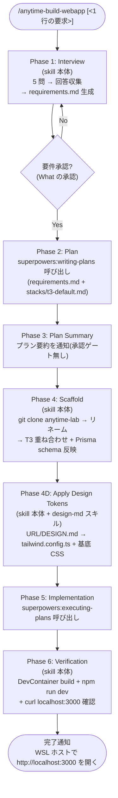

# anytime-build-webapp スキル設計書


## 1. 目的


`/anytime-build-webapp` は、ユーザの自然言語要求から **T3 Stack ベースのフルスタック Web アプリ MVP** を WSL + Dev Container 上に生成する汎用オーケストレータスキルである。

既存 superpowers（`brainstorming` / `writing-plans` / `executing-plans`）を順に呼び出す薄い藣介として実装し、Web 構築特有の制御（5 問インタビュー・デフォルトスタック固定・DevContainer 雛形）だけを skill 本体に持つ。

完了条件は **`npm run dev` が起ち、ブラウザで `http://localhost:<APP_PORT>` が表示される**こと。デプロイ・CI/CD は対象外。

動作モードは 2 種類:

| モード | 想定環境 | プロジェクトルート | Phase 6 |
| --- | --- | --- | --- |
| **in-place（デフォルト）** | Dev Container 内（既に Claude Code が動作している作業ディレクトリ） | CWD 自体 | `npm install && npm run dev` を直接実行 |
| **--new-dir** | WSL ホスト（Docker daemon 利用可、空ディレクトリ） | `CWD/<project-name>/` | `docker compose ...` で Dev Container をビルドして起動 |


## 2. 確定要件


| # | 項目 | 決定 |
| --- | --- | --- |
| 1 | ゴール | 要求 → フルスタック Web 構築（汎用） |
| 2 | 出力スコープ | 動く MVP まで一気通貫 |
| 3 | スタック方針 | デフォルト固定 + 上書き可 |
| 4 | デフォルトスタック | T3 Stack（`Next.js` + `tRPC` + `Prisma` + `Tailwind` + `NextAuth`） |
| 5 | 起動形式 | `/anytime-build-webapp` 対話型 + 上限 5 問 |
| 6 | superpowers 連携 | 藣介型（`brainstorming` → `writing-plans` → `executing-plans`） |
| 7 | 完了ライン | Dev Container 内で `npm run dev` がブラウザから見える |
| 8 | 配置先 | `.claude/skills/anytime-build-webapp/` |
| 9 | 開発 DB | Postgres を `docker-compose.yml` で同梱 |
| 10 | ベースリポジトリ | `git@github.com:anytime-trial/anytime-lab.git` をクローンしてリネーム、T3 を重ね合わせる |


## 3. ファイル構成


```text
.claude/skills/anytime-build-webapp/
├── SKILL.md                    # メインスキル (YAML frontmatter + 手順本文)
├── DESIGN.ja.md                # 本設計書
├── DESIGN.python-be.ja.md      # Python BE 拡張設計書
├── questions.md                # 5 問インタビュー定義
├── requirements-template.md    # writing-plans に渡す要件 md のテンプレ
├── stacks/
│   ├── _frontend-next.md       # フロント共通 (Next.js + Tailwind + Auth.js + openapi-ts)
│   ├── t3-default.md           # T3 固有差分 (tRPC + Prisma + Postgres + Dockerfile)
│   ├── python-be.md            # Python BE (FastAPI + SQLAlchemy + Alembic)
│   └── overrides.md            # 「Python BE で」等の上書き分岐ルール
└── scaffold/
    ├── base-repo.md            # ベースリポ仕様（クローン元・リネーム規則）
    ├── rename-map.json         # T3 用文字列置換マップ
    ├── rename-map-python-be.json # Python BE 用文字列置換マップ
    └── python-be-files/        # Python BE テンプレファイル群 (backend/*.tmpl)
```


### 3.1. 各ファイルの責務


| ファイル | 責務 |
| --- | --- |
| `SKILL.md` | YAML frontmatter（`name`・`description`）+ Phase 1〜6 の手順本文 |
| `questions.md` | 5 問テンプレと打ち切り条件 |
| `requirements-template.md` | インタビュー回答を埋め込んで `writing-plans` に渡す要件 md の雛形 |
| `stacks/t3-default.md` | デフォルトスタックの構成定義（追加するパッケージ・Prisma schema・tRPC 雛形） |
| `stacks/overrides.md` | 上書き指示の分岐ルール（`Python BE で` → FastAPI 雛形へ等） |
| `scaffold/base-repo.md` | ベースリポジトリ（`anytime-lab`）の仕様と取得手順 |
| `scaffold/rename-map.json` | クローン後に置換する文字列マッピング |


### 3.2. ベースリポジトリと T3 重ね合わせ


T3 アプリは **既存リポジトリ `git@github.com:anytime-trial/anytime-lab.git` をクローン → リネーム → T3 を重ね合わせ** で構成する。`create-t3-app` は使わない。

理由は以下の通り。

- `anytime-lab` には WSL + Dev Container + Dockerfile + docker-compose + Node 24 + Claude Code CLI が事前構成済みで、毎回の Dev Container 自作より再現性が高い
- ユーザ環境（`~/.ssh` / `~/.claude` / `~/Shared` のホストマウント等）の運用前提が既に組み込まれている
- `create-t3-app` は Dev Container を持たないため、結局両者をマージする工数が発生する
- ベースリポを 1 箇所に集約することで、Dev Container 改善が全プロジェクトへ波及する


### 3.3. ベースリポ仕様（`scaffold/base-repo.md` に記述）


| 項目 | 値 |
| --- | --- |
| クローン元 | `git@github.com:anytime-trial/anytime-lab.git` |
| 取得方法 | `git clone --depth 1` |
| クローン後の処理 | `.git` 削除 → `rename-map.json` で置換 → `git init` |
| 主要構成 | `.devcontainer/devcontainer.json` / `Dockerfile`（`node:24-slim`）/ `docker-compose.yml` / `package.json`（workspace 設定済み・依存空） |


### 3.4. リネーム規則（`scaffold/rename-map.json`）


```json
{
  "replacements": [
    { "find": "anytime-lab", "replace": "<project-name>" }
  ],
  "targets": [
    "package.json",
    "docker-compose.yml",
    ".devcontainer/devcontainer.json",
    "README.md"
  ]
}
```


### 3.5. T3 重ね合わせ手順


クローン + リネーム後、`stacks/t3-default.md` の指示に従い以下を実施する。

- `npm install next react react-dom @trpc/server @trpc/client @trpc/react-query @trpc/next prisma @prisma/client tailwindcss @next-auth/prisma-adapter next-auth zod`
- `npx prisma init --datasource-provider postgresql`
- `npx tailwindcss init -p`
- `src/`・`prisma/`・`tailwind.config.ts`・`postcss.config.js` を `stacks/t3-default.md` 記載のミニマル雛形で生成
- `package.json` に `dev` / `build` / `start` / `lint` / `db:push` / `db:seed` スクリプトを追記


## 4. SKILL.md のフロントマター


```yaml
---
name: anytime-build-webapp
description: 要求から T3 Stack フルスタック Web アプリの MVP を WSL + Dev Container 上に生成する汎用スキル。/anytime-build-webapp で起動し、5 問インタビュー → 要件書生成 → writing-plans → executing-plans を順に呼ぶオーケストレータ。画面デザインは参考 URL または DESIGN.md ファイル指定で適用可能。
---
```

`description` を厚めに書くのは superpowers 流儀。Claude Code のスキル選択ロジックが `description` を判断材料にするため、トリガーキーワード（`/anytime-build-webapp`・`フルスタック`・`T3`・`Next.js`・`MVP`）を自然文に含める。


## 5. 5 問インタビュー


OpenHands `/onboard` 方式に従い、質問数 5 で打ち切り、各 ≤ 2 文、選択肢提示優先。

| # | 質問 | デフォルト |
| --- | --- | --- |
| Q1 | 何を作る? 1 文で（例: 顧客管理ツール / 在庫管理 / ブログ） | （必須・デフォルト無し） |
| Q2 | 主要エンティティ 3 つ以下（例: `User`, `Customer`, `Order`） | （必須・デフォルト無し） |
| Q3 | 認証の要否（無し / メールパスワード / OAuth: Google） | メールパスワード |
| Q4 | スタック上書き有無（無し → T3 / Python BE / Hono BE 等） | T3 デフォルト |
| Q5 | 画面デザインの参照源（無し / 参考 URL / DESIGN.md ファイルパス） | 無し（標準 Tailwind スタイル） |


主要画面の構成は Q2 の主要エンティティから自動生成する（一覧 / 詳細 / 新規作成）。

Q5 の回答により Phase 4D（Apply Design Tokens）の挙動が分岐する（第 8 章参照）。


### 5.1. 打ち切り条件


- Q1〜Q3 が明確で Q4 が「無し」かつ Q5 が CLI 引数で指定済みなら、対話質問はそこまでで打ち切る
- 1 問で 3 つ以上の情報が出てきた場合、次質問をスキップする
- 5 問終了時点で曖昧な点があれば「想定 X で進めます。違えば指示してください」と表明して継続する


### 5.2. CLI 引数による事前指定


対話前にコマンドライン引数で要件を渡せる。

```text
/anytime-build-webapp <1行の要求> [--design-url <URL>] [--design-file <path>]
```

`--design-url` または `--design-file` 指定時は Q5 をスキップし、Phase 4D で参照源として使用する。


## 6. 実行フロー





### 6.1. 各 Phase の責務


| Phase | 実装場所 | 主要処理 |
| --- | --- | --- |
| 1. Interview | skill 本体 | `questions.md` を読み込み 5 問実施、回答を `requirements.md` に整形し**要件承認（What の承認）**を取る |
| 2. Plan | `superpowers:writing-plans` 呼び出し | 要件 md とスタック定義を渡して実装プラン生成 |
| 3. Plan Summary | skill 本体 | プラン要約を通知（承認は Phase 1 の要件承認で済み・ゲート無し） |
| 4. Scaffold | skill 本体 | `anytime-lab` クローン + リネーム + T3 重ね合わせ + Prisma schema 反映 |
| 4D. Apply Design Tokens | skill 本体 + `design-md` | URL / DESIGN.md からデザイントークン抽出、`tailwind.config.ts` と `globals.css` に反映 |
| 5. Implementation | `superpowers:executing-plans` 呼び出し | プランを順次実行、tRPC ルータ・画面・テスト実装 |
| 6. Verification | skill 本体 | DevContainer 起動 → `npm run dev` → `curl` 200 確認 |


### 6.2. Phase 4D デザイントークン適用の詳細


Q5 / CLI 引数の値で参照源を判定し、`design-md` スキルを介してデザイントークンを抽出・適用する。


#### 6.2.1. 入力 3 パターンと処理経路


| Q5 / CLI 引数 | 経路 | 処理 |
| --- | --- | --- |
| 無し | スキップ | T3 デフォルトの Tailwind 設定のまま続行 |
| 参考 URL（`--design-url <URL>`） | URL → DESIGN.md → 適用 | `design-md` スキルに URL を渡して DESIGN.md を生成、`<project>/docs/DESIGN.md` に保存後、次の DESIGN.md 経路へ合流 |
| DESIGN.md ファイル（`--design-file <path>`） | ファイル直読み込み → 適用 | 指定パスを Read し、デザイントークンを抽出して反映 |


#### 6.2.2. 抽出するデザイントークン


| 種別 | 反映先 |
| --- | --- |
| カラー（`primary` / `secondary` / `accent` / `bg` / `text` 等） | `tailwind.config.ts` の `theme.extend.colors` |
| タイポグラフィ（`font-family` / 段階） | `tailwind.config.ts` の `theme.extend.fontFamily` + `globals.css` の base |
| スペーシング（基本単位 4px / 8px 等） | `tailwind.config.ts` の `theme.extend.spacing` |
| 角丸（`radius-sm` / `radius-md` 等） | `tailwind.config.ts` の `theme.extend.borderRadius` |
| シャドウ | `tailwind.config.ts` の `theme.extend.boxShadow` |
| ダーク / ライト両対応 | `globals.css` の `:root` と `.dark` セレクタ |


#### 6.2.3. 適用失敗時の挙動


- URL 取得失敗 → 警告表示、T3 デフォルトで続行（ユーザ確認）
- DESIGN.md 解析失敗 → エラー詳細表示、修正案を提示してユーザ選択
- トークン適用後 `tailwind.config.ts` の TypeScript チェック失敗 → 直前の設定にロールバック


## 7. Dev Container 構成（`anytime-lab` 由来）


### 7.1. ファイル構成


クローン直後の `anytime-lab` が以下を提供する。本スキルは生成しない。

```text
<project-root>/
├── .devcontainer/
│   └── devcontainer.json    # VS Code Remote-Containers 設定（forwardPorts 等）
├── Dockerfile               # node:24-slim ベース + git / gh / sqlite3 / tmux / Claude Code CLI
├── docker-compose.yml       # サービス定義 + ~/.ssh / ~/.claude / ~/Shared マウント
└── .env                     # APP_PORT 等（Git 管理外、サンプル提供）
```


### 7.2. 本スキルで追加・変更する点


| ファイル | 変更内容 |
| --- | --- |
| `docker-compose.yml` | Postgres サービス（`postgres:17-alpine`）を追加、app サービスに `DATABASE_URL` を注入 |
| `.devcontainer/devcontainer.json` | `forwardPorts` に Postgres（`5432`）追加、`postCreateCommand` に `npm install && npx prisma migrate dev` を追記 |
| `Dockerfile` | `prisma` CLI / `postgresql-client` を追加インストール |
| `package.json` | Phase 4 で T3 関連の dependencies と scripts を追記 |


### 7.3. 追加する docker-compose.yml 抜粋（Postgres 部分のみ）


```yaml
services:
  db:
    image: postgres:17-alpine
    environment:
      POSTGRES_USER: app
      POSTGRES_PASSWORD: app
      POSTGRES_DB: app
    volumes:
      - pgdata:/var/lib/postgresql/data
volumes:
  pgdata:
```


### 7.4. リネーム作業（`scaffold/rename-map.json` 適用）


`anytime-lab` を含むファイルを `<project-name>` に一括置換する。\
対象は `package.json` / `docker-compose.yml`（service 名・workspace path）/ `.devcontainer/devcontainer.json`（workspaceFolder）/ `README.md`。


## 8. スタック上書き機構


### 8.1. 判定ロジック


Q4 の回答を `stacks/overrides.md` のルールに照らして分岐する。

| Q4 回答 | 分岐先 | 適用変更 |
| --- | --- | --- |
| 無し | `stacks/t3-default.md` + `stacks/_frontend-next.md` | 変更無し |
| `Python BE` | `stacks/python-be.md` + `stacks/_frontend-next.md` | frontend/ + backend/ 並列、FastAPI + SQLAlchemy + Alembic、Auth.js + JWT 検証 (詳細は `DESIGN.python-be.ja.md`) |
| `Hono BE` | `stacks/hono-be.md`（将来追加） | tRPC を Hono REST に差し替え |
| その他 | 警告して T3 デフォルトで続行 | ユーザに「未対応スタックです。T3 デフォルトで進めますか?」確認 |


### 8.2. 初期リリース範囲


本設計の初期リリースでは `t3-default` と `python-be` を実装する。`hono-be` は使用実績が出てから追加する（YAGNI）。\
`python-be` の詳細は `DESIGN.python-be.ja.md` を参照。


## 9. エラーハンドリングと不可逆操作


### 9.1. 失敗時の挙動


| 事象 | 対応 | 責任 Phase |
| --- | --- | --- |
| `npm install` 失敗 | ログをチャットに表示、ユーザに再試行か中断を確認 | Phase 6（skill 本体） |
| `docker compose up` 失敗 | Docker daemon 起動状態を診断、案内表示 | Phase 6（skill 本体） |
| Prisma migration 失敗 | schema の妥当性を確認、ユーザに schema 修正案を提示 | Phase 6（skill 本体） |
| `curl localhost:3000` が 200 以外 | ログを表示、`npm run dev` の出力もダンプ | Phase 6（skill 本体） |
| Phase 5 実装中のテスト失敗 | プラン内のリトライ手順に従う | Phase 5（`executing-plans`） |
| `git clone anytime-lab` 失敗 | SSH 鍵設定・GitHub 到達性を診断、案内表示 | Phase 4（skill 本体） |
| リネーム置換失敗（対象ファイル不存在等） | 中断してユーザに `anytime-lab` 構成変更の有無を確認 | Phase 4（skill 本体） |


### 9.1.1. リトライ責任の分界


- **Phase 5（`executing-plans`）の責任**: プラン記載タスクの実行中エラー（型エラー・lint・unit test 失敗等）はプラン内ロジックでリトライする
- **Phase 6（skill 本体）の責任**: 実装完了後の起動・統合検証（`docker compose up` / `npm run dev` / `curl` 確認）が失敗した場合、skill 本体が原因切り分けとリトライを主導する
- **Phase 5 → Phase 6 遷移**: `executing-plans` が「プラン全タスク完了」を返した時点で Phase 6 に移行する。`executing-plans` 自身が起動検証を持たないため、skill 本体側で別途検証を実行する


### 9.2. 不可逆操作の防御


- **既存ファイル上書きガード**: `--new-dir` 指定時のみ CWD 空チェックを行う。in-place モードでは既存 `.devcontainer/devcontainer.json` を破壊しない（`inPlaceExcludes` で保護）
- **Git 自動 commit 禁止**: 初期 commit のみ作成し、push は一切行わない
- **`main` 直 push 禁止**: 仮に push 指示があっても `master` / `main` 直 push はガード
- **Docker daemon 存在チェック**: `--new-dir` 指定時のみ `docker info` で接続確認。in-place モードは skip（Dev Container 内では Docker daemon 非到達のため）


## 10. テスト戦略


### 10.1. スキル自体のテスト


- **手動 E2E**: 空ディレクトリで `/anytime-build-webapp 顧客管理ツール` を流し、6 Phase 全通過と `http://localhost:3000` 表示を確認する
- **回帰テスト**: 5 問の質問順・打ち切り条件をスキル更新時に再実行で検証


### 10.2. 生成プロジェクトのテスト


- 生成された T3 プロジェクトには `Vitest` + `Playwright` の最小テストを含める
- Phase 6 で `npm test` をスキップせず実行し、失敗時はユーザに通知


## 11. 非機能要件


| 項目 | 要件 |
| --- | --- |
| 実行時間 | 5 問インタビュー含めて 1 セッション 30 分以内（インタビュー + 要件承認 10 分 + 実装 20 分） |
| LLM トークン | 1 回の `/anytime-build-webapp` で 200K トークン以内 |
| 並列性 | 同時起動 1 セッション（CWD 衝突防止のため） |
| 依存 | Node 24（`anytime-lab` Dockerfile 由来）/ Docker / WSL2 Ubuntu / VS Code Remote-Containers 拡張 / `design-md` スキル（URL 入力時）/ `git@github.com:anytime-trial/anytime-lab.git` への SSH read 権限 |


## 12. 将来拡張


本リリースには含めないが、設計上余地を残す項目。

- スタック追加（`hono-be` / `rails-hotwire`）。`python-be` は対応済み (`DESIGN.python-be.ja.md` 参照)
- デプロイ自動化（`vercel deploy` / `wrangler deploy`）まで Phase 7 として追加
- 既存リポジトリへの追加機能生成（新規プロジェクトでなく `add-feature` モード）
- 多言語化（質問・出力を英語切替）


## 13. 設計の明確さ評価


| 観点 | 評価 |
| --- | --- |
| 総合 clarity | **90 / 100** |

### 13.1. 評価理由


高評価要因（+）。

- ゴール・出力スコープ・スタック・起動形式・配置先・完了ライン・DB・ベースリポの 10 要件が確定済み
- ベースリポを `anytime-lab` に固定したことで Dev Container を毎回自作せずに済み、再現性とメンテ性が向上
- デザイントークン参照源（URL / DESIGN.md / なし）が 3 経路で明示され、`design-md` スキルとの責任分界も明確
- 既存 superpowers との連携点（Phase 2 と Phase 5）と `design-md` 連携点（Phase 4D）が明確に分離されている
- Phase 5 と Phase 6 のリトライ責任分界を明示済み（9.1.1）
- OpenHands `agent-builder.md` / `/onboard` で実証済みパターンを踏襲しているため設計リスクが低い

減点要因（−）。

- スタック上書き機構（Q4）の具体的な分岐ルールは「将来追加」で先送り、初期実装は `t3-default` のみ
- 5 問の文面（日本語 / 英語の切替条件）が未確定
- デザイントークン抽出の精度は `design-md` スキルの品質に依存（本スキルでは制御不可）
- ベースリポ `anytime-lab` の構成変更（ファイル名・ディレクトリ構造）が起きた場合のリネーム置換失敗時の自動回復は未設計（中断 + 手動対処）
