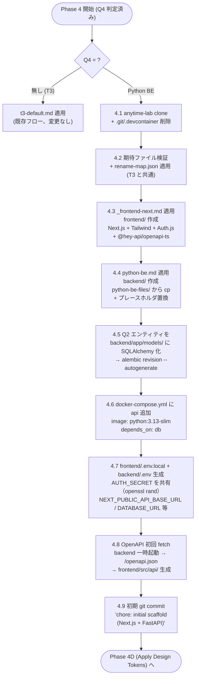
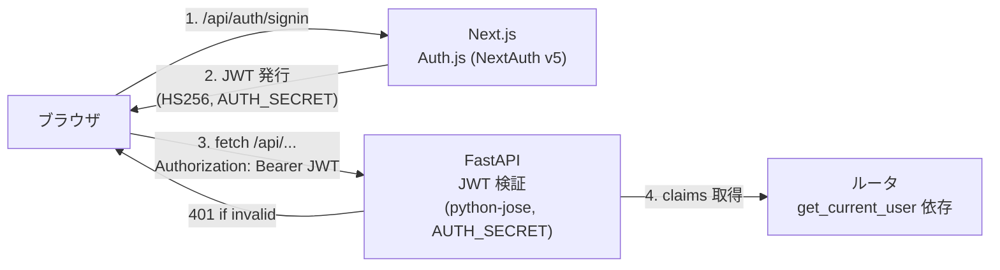

# anytime-build-webapp スキル Python BE 対応 設計書


## 1. 目的


`anytime-build-webapp` スキルの 5 問インタビュー Q4 で `Python BE` を選んだとき、T3 デフォルト構成から **Next.js + FastAPI 構成** へ差し替える機能拡張。

現状の `stacks/overrides.md` では `Python BE` は「初期リリース未対応」となっており、選択すると Phase 1.5 で「T3 デフォルトで進めるか / 中断するか」を確認するだけで終わる。本設計でこれを正式対応に昇格させる。

完了条件は **`(cd frontend && npm run dev)` と `(cd backend && uvicorn app.main:app)` の両方が起動し、Next.js から FastAPI 経由でエンティティ一覧（空配列）を取得できる**こと。\
デプロイ・CI/CD は対象外（既存スキルと同じく MVP まで）。


## 2. 設計判断サマリ


| 項目 | 決定 | 代替案 | 選択理由 |
| --- | --- | --- | --- |
| Python フレームワーク | **FastAPI** | Django+DRF / Flask / Litestar | 型安全・OpenAPI 自動生成・コミュニティ規模・現代的 SPA 背面と相性最良 |
| 配置 | **`frontend/` + `backend/` 並列** | `apps/web/` + `apps/api/` モノレポ / ルート Next.js + `api/` サブ | サービス境界が見やすく、初期設定が軽い |
| ORM / migrate | **SQLAlchemy 2.0 + Alembic** | SQLModel / Prisma Python / Tortoise | FastAPI デファクト、コミュニティ規模最大、Alembic で他者によるエンティティ追加にも対応 |
| FE \| BE 通信 | **OpenAPI → TS クライアント自動生成 (`@hey-api/openapi-ts`)** | 手書き fetch / tRPC-py 風 BFF | BE 変更時の型ずれを build 時検出、`openapi-typescript-codegen` 後継でメンテ活発 |
| 認証 | **Auth.js (NextAuth v5) + FastAPI 側 JWT 検証 (`python-jose`)** | fastapi-users / 全 BE 集約 | Q3 の 3 ケース（無し / メールパスワード / Google OAuth）を統一インタフェースで実装、t3-default と運用感統一 |
| 共通化 | **`stacks/_frontend-next.md` 抽出** | python-be.md 内に重複記述 / 差分記述 | 保守一元化、drift 防止 |
| Python 環境管理 | **`uv`** | `python -m venv` + `pip` / `poetry` | 高速・lockfile 標準化・FastAPI 公式チュートリアルでも採用増加 |
| TS クライアント生成 | **`@hey-api/openapi-ts`** | `openapi-typescript-codegen` / `orval` / `openapi-fetch` | `openapi-typescript-codegen` は 2024 年からメンテ停滞、後継として品質高い |


## 3. ファイル変更マップ


anytime-build-webapp スキル配下で触るファイル全リスト。


### 3.1. 新規追加（6 ファイル）


| パス | 内容 |
| --- | --- |
| `stacks/python-be.md` | FastAPI + SQLAlchemy + Alembic スタック定義。`_frontend-next.md` を参照、BE 部分を独自記述 |
| `stacks/_frontend-next.md` | Next.js + Tailwind + Auth.js 共通パーツ（先頭 `_` で「単独使用不可・参照専用」を示す） |
| `scaffold/rename-map-python-be.json` | Python BE 用の置換マップ（targets に `backend/pyproject.toml`・`backend/docker/Dockerfile` 等を追加） |
| `scaffold/python-be-files/backend/pyproject.toml.tmpl` | FastAPI + SQLAlchemy + Alembic + python-jose 依存定義（`<project-name>` プレースホルダ） |
| `scaffold/python-be-files/backend/app/main.py.tmpl` | FastAPI アプリ初期化・`/healthz`・CORS・JWT 検証ミドルウェア雛形 |
| `scaffold/python-be-files/backend/alembic.ini.tmpl` + `backend/alembic/env.py.tmpl` | Alembic 初期構成 |

> [!NOTE]
> `python-be-files/` は **テンプレファイル群**として scaffold 配下に置く。\
> Phase 4 で `cp` + プレースホルダ置換するだけにし、ヒューリスティック生成は避ける。


### 3.2. 既存ファイル修正（5 ファイル）


| パス | 修正内容 |
| --- | --- |
| `SKILL.md` | Phase 1.5 判定で Python BE を対応スタックに昇格 / Phase 4 分岐に Q4 = Python BE 経路を追加 / Phase 6 検証に `curl http://localhost:8000/healthz` 追加 |
| `stacks/overrides.md` | 判定マトリクスの `Python BE で` 行を「◯ 対応」に更新、`scaffold/rename-map-python-be.json` への参照を追記 |
| `stacks/t3-default.md` | 冒頭に「Next.js + Tailwind + Auth.js 部分は `_frontend-next.md` を参照」と記載し、共通パーツを `_frontend-next.md` に移動 |
| `requirements-template.md` | `{{Q4_STACK_NAME}}` の値に `Next.js + FastAPI (Python BE)` を追加、`{{Q4_STACK_DETAIL}}` の表現を BE 別で出し分けるサンプルを記載 |
| `DESIGN.ja.md` | 第 8 章（スタック上書き機構）の判定マトリクスを更新、第 12 章（将来拡張）から `python-be` 行を削除し本 spec への参照を追記 |


### 3.3. 触らない


| ファイル | 理由 |
| --- | --- |
| `scaffold/base-repo.md` | anytime-lab クローン手順は共通 |
| `scaffold/rename-map.json` | T3 用は現状維持。Python BE は別 JSON で分ける |
| `questions.md` | 5 問の質問文・選択肢は変更なし（Q4 「Python BE」が「未対応」から「対応」に意味的に変わるだけ） |
| `PLAN.ja.md` | 過去の skill 構築プラン、参照専用 |


### 3.4. 合計


| 種別 | ファイル数 |
| --- | --- |
| 新規追加 | 6 |
| 既存修正 | 5 |
| **合計** | **11** |


## 4. ディレクトリ構成


### 4.1. プロジェクトルート（Python BE 適用後）


```text
<project-root>/
├── .devcontainer/devcontainer.json     # 既存（in-place モードでは温存）
├── Dockerfile                          # 既存（Node ベース）+ Python BE 用 apt パッケージ・uv をインライン追記
├── docker-compose.yml                  # 修正: db + api サービス追加
├── frontend/                           # 新規: Next.js + Tailwind + Auth.js
│   ├── package.json
│   ├── next.config.mjs
│   ├── tailwind.config.ts
│   ├── src/
│   │   ├── app/                        # App Router
│   │   ├── api/                        # 自動生成 TS クライアント (gen:api 出力)
│   │   └── lib/auth.ts                 # Auth.js (NextAuth v5) 設定
│   └── .env.local                      # NEXT_PUBLIC_API_BASE_URL, AUTH_SECRET 等
├── backend/                            # 新規: FastAPI + SQLAlchemy + Alembic
│   ├── pyproject.toml
│   ├── uv.lock
│   ├── alembic.ini
│   ├── alembic/
│   │   ├── env.py
│   │   └── versions/<hash>_init.py
│   ├── app/
│   │   ├── main.py                     # FastAPI app, /healthz, CORS, JWT mw
│   │   ├── db.py                       # SQLAlchemy engine + session
│   │   ├── models/<entity>.py          # SQLAlchemy 2.0 Mapped[T]
│   │   ├── schemas/<entity>.py         # Pydantic v2
│   │   ├── routers/<entity>.py         # CRUD ルータ
│   │   └── deps.py                     # get_db, get_current_user
│   └── tests/test_<entity>.py          # pytest + httpx
└── requirements.md                     # Phase 1 出力（既存通り）
```


### 4.2. `stacks/_frontend-next.md` の責務範囲


共通フロントエンド構成として以下を所有する。

- Next.js 15 + React 19 のインストールと `next.config.mjs`
- Tailwind 3 の `tailwind.config.ts`・`postcss.config.js`・`globals.css`
- Auth.js (NextAuth v5) の `src/lib/auth.ts`・`api/auth/[...nextauth]/route.ts`
- `@hey-api/openapi-ts` 設定 (`openapi-ts.config.ts`) と `npm run gen:api` スクリプト
- `frontend/src/app/<entity>/page.tsx` 等の画面雛形

> [!IMPORTANT]
> `_frontend-next.md` は **t3-default.md** と **python-be.md** の両方から参照される。\
> 単独適用は禁止（ファイル冒頭で明示）。


## 5. Phase 4 (Scaffold) 処理フロー


Q4 = Python BE のときの Phase 4 ステップ。





### 5.1. 各ステップの責任分界


| Step | 実装場所 | 入力 | 出力 |
| --- | --- | --- | --- |
| 4.1 | `SKILL.md` | anytime-lab SSH | プロジェクトルートに anytime-lab 展開 |
| 4.2 | `SKILL.md` + `rename-map.json` | `<project-name>` | `package.json` 等のリネーム反映 |
| 4.3 | `SKILL.md` + `_frontend-next.md` | Q3（認証）・Q5（デザイン） | `frontend/` 配下 |
| 4.4 | `SKILL.md` + `python-be.md` + `python-be-files/*.tmpl` | `<project-name>`・Q2 エンティティ | `backend/` 配下 |
| 4.5 | `SKILL.md` + `python-be.md` | Q2 エンティティ | `backend/app/models/<entity>.py`・`backend/alembic/versions/<hash>_init.py` |
| 4.6 | `SKILL.md` + `python-be.md` | （固定） | `docker-compose.yml` 更新 |
| 4.7 | `SKILL.md` | （固定） | `frontend/.env.local` + `backend/.env`（AUTH_SECRET 共有） |
| 4.8 | `SKILL.md` + `_frontend-next.md` | backend の OpenAPI | `frontend/src/api/` |
| 4.9 | `SKILL.md` | （固定） | 初期 commit |


### 5.2. 既存 Phase 4 との差分


| 観点 | T3 デフォルト | Python BE |
| --- | --- | --- |
| 出力ディレクトリ | プロジェクトルート直下に `src/` | `frontend/` + `backend/` 並列 |
| migrate 初期化 | `prisma migrate dev --name init`（Phase 6 で実行） | `alembic upgrade head`（Phase 6 で実行）。Phase 4 では revision 生成まで |
| API クライアント | tRPC で自動的に型共有 | `@hey-api/openapi-ts` を **Phase 4.8 で実行** |
| compose 追加サービス | `db` のみ | `db` + `api`（FastAPI） |
| 初期 commit メッセージ | `chore: initial scaffold from anytime-lab + T3 Stack` | `chore: initial scaffold from anytime-lab + Next.js + FastAPI` |


### 5.3. Phase 4.8 OpenAPI 初回 fetch の詳細


backend を一時起動して `/openapi.json` を fetch する。モードによって手段が異なる。

| モード | 手段 | 終了処理 |
| --- | --- | --- |
| in-place | `(cd backend && nohup .venv/bin/uvicorn app.main:app --port 8000 > /tmp/uvicorn-bootstrap.log 2>&1 &)` → 30 秒ポーリング → fetch → `kill $PID` | PID ファイルで管理、確実に kill |
| --new-dir | `docker compose up -d api` → 60 秒ポーリング → fetch → `docker compose stop api` | コンテナで隔離、stop で終了 |

fetch 結果を `frontend/openapi.json` に保存し、`@hey-api/openapi-ts` で `frontend/src/api/` に TS クライアント生成。


## 6. Phase 6 (Verification) 検証手順


### 6.1. in-place モード（Docker 不可前提）


| Step | コマンド | 期待結果 | 失敗時 |
| --- | --- | --- | --- |
| 6.1 BE 依存解決 | `(cd backend && uv venv && uv sync)` | exit 0 | uv エラーをダンプして中断 |
| 6.2 FE 依存解決 | `(cd frontend && npm install)` | exit 0 | npm エラーをダンプして中断 |
| 6.3 DB マイグレ | `(cd backend && uv run alembic upgrade head)` | exit 0、`alembic_version` テーブル作成 | `DATABASE_URL` 不正なら `.env` 修正案内 |
| 6.4 BE 起動 | `(cd backend && nohup uv run uvicorn app.main:app --port 8000 &)` | バックグラウンド起動 | uvicorn ログをダンプ |
| 6.5 BE healthz | `curl -sS -o /dev/null -w "%{http_code}" http://localhost:8000/healthz`（60s timeout） | `200` | BE プロセス kill + ログダンプ |
| 6.6 OpenAPI 再生成 | `(cd frontend && npm run gen:api)` | `frontend/src/api/` 更新、git diff なし | diff があれば「BE と FE の型ずれ」を警告 |
| 6.7 FE 起動 | `(cd frontend && APP_PORT=${APP_PORT:-3000} npm run dev &)` | バックグラウンド起動 | `next dev` ログをダンプ |
| 6.8 FE 疎通 | `curl -sS -o /dev/null -w "%{http_code}" http://localhost:${APP_PORT}` | `200` | `next dev` ログをダンプ |
| 6.9 BE→DB 疎通 | `curl -sS http://localhost:8000/api/<entity> \| jq -e 'type == "array"'` | 空配列 `[]` | DB マイグレ済み確認 |
| 6.10 テスト実行 | `(cd backend && uv run pytest)` + `(cd frontend && npm test)` | exit 0 推奨 | 失敗はユーザ通知のみ（中断しない） |


### 6.2. --new-dir モード（Docker 使用）


| Step | コマンド | 期待結果 |
| --- | --- | --- |
| 6.1 build | `docker compose build` | exit 0 |
| 6.2 起動 | `docker compose up -d db api app` | 全サービス healthy |
| 6.3 migration | `docker compose exec api alembic upgrade head` | exit 0 |
| 6.4 BE healthz | `curl http://localhost:8000/healthz` | `200` |
| 6.5 FE 疎通 | `curl http://localhost:3000` | `200` |
| 6.6 BE→DB 疎通 | `curl http://localhost:8000/api/<entity>` | `[]` |
| 6.7 テスト | `docker compose exec api pytest` + `docker compose exec app npm test` | 通知のみ |


### 6.3. 完了通知メッセージ（in-place 例）


```text
[anytime-build-webapp] 完了（in-place モード / Python BE）
- プロジェクトルート: <CWD>
- スタック: Next.js (frontend/) + FastAPI (backend/) + SQLAlchemy + Alembic
- 起動状態:
  - frontend: http://localhost:<APP_PORT> (HTTP 200)
  - backend:  http://localhost:8000/healthz (HTTP 200)
- 型共有: OpenAPI → frontend/src/api/ (npm run gen:api で再生成)

次の手順:
1. ブラウザで http://localhost:<APP_PORT> を開いてください
2. backend 開発時は別ターミナルで:
   cd backend && uv run uvicorn app.main:app --reload --port 8000
3. スキーマ変更時:
   cd backend && uv run alembic revision --autogenerate -m "<msg>"
   cd backend && uv run alembic upgrade head
   cd frontend && npm run gen:api
```


### 6.4. requirements-template.md 側の完了条件追記


既存の `## 6. 完了条件` に Python BE 経路を追記する。

```markdown


## 6. 完了条件

T3 経路:
- [ ] `npm run dev` が起動し http://localhost:3000 が表示される
- [ ] `npx prisma migrate dev --name init` 成功
- [ ] 全エンティティの一覧画面が空状態で表示される

Python BE 経路:
- [ ] `(cd backend && alembic upgrade head)` 成功
- [ ] `(cd backend && uvicorn app.main:app)` 起動し http://localhost:8000/healthz が 200
- [ ] `(cd frontend && npm run dev)` 起動し http://localhost:3000 が表示される
- [ ] `(cd frontend && npm run gen:api)` で型生成成功、git diff なし
- [ ] 全エンティティの一覧画面が空状態で表示される（FastAPI から空配列を受信）

共通:
- [ ] `npm run lint` / `(cd backend && ruff check)` 通過
- [ ] 最小スモークテスト通過
```


## 7. 認証実装


### 7.1. アーキテクチャ





### 7.2. Q3 別の実装パターン


| Q3 | Next.js (Auth.js) | FastAPI |
| --- | --- | --- |
| 無し | Auth.js を install しない、全画面パブリック | JWT ミドルウェア無効、`get_current_user` 依存を import しない |
| メールパスワード | Credentials Provider 設定、DB 検証は API 側に委譲（`POST /api/auth/login` を FastAPI が提供） | `POST /api/auth/login` で bcrypt 検証 → JWT 発行。`User` テーブルを SQLAlchemy で持つ。Phase 4.4 で `python-be-files/auth/` テンプレ群を Q3 条件で展開 |
| Google OAuth | Google Provider 設定、Auth.js が token 取得・session 作成 | JWT 検証のみ。`User` テーブルは Auth.js の `email` を upsert |


### 7.3. JWT 検証ミドルウェア（FastAPI 側）


`backend/app/deps.py` で `get_current_user` を定義し、認証必須エンドポイントで `Depends(get_current_user)` する。\
`backend/app/main.py` の起動時に `AUTH_SECRET` 環境変数の存在を確認、無ければ起動失敗（Q3 = 無し のときはこのチェックも skip）。


## 8. 環境変数管理


### 8.1. ファイル分離


| ファイル | 用途 | 主要キー |
| --- | --- | --- |
| `frontend/.env.local` | Next.js 用、Git 管理外 | `NEXT_PUBLIC_API_BASE_URL`・`AUTH_SECRET`・`NEXTAUTH_URL`・`GOOGLE_CLIENT_ID`（Q3 別） |
| `backend/.env` | FastAPI 用、Git 管理外 | `DATABASE_URL`・`AUTH_SECRET`・`CORS_ALLOWED_ORIGINS` |
| `.env.example` | リポジトリ管理、サンプル | 上記の値を `(必須)` / `(省略可)` と注記、実値は含めない |
| ルート `.env` | docker-compose 用 | `APP_PORT`・`DB_PORT` 等のホスト側ポート |


### 8.2. AUTH_SECRET の共有


Auth.js (HS256) と FastAPI (python-jose) で **同じ秘密鍵**を使う必要がある。

- `.env.example` に `AUTH_SECRET=<openssl rand -base64 32 で生成>` の手順を記載
- Phase 4.7 で `openssl rand -base64 32` を実行して両 `.env` に書き込む
- Q3 = 無し のときは設定しない


### 8.3. CORS


FastAPI 側で `CORSMiddleware(allow_origins=[NEXT_PUBLIC_ORIGIN])` を設定。\
`NEXT_PUBLIC_ORIGIN` は `frontend/.env.local` で `http://localhost:3000`、`backend/.env` の `CORS_ALLOWED_ORIGINS` でも同値を参照。


## 9. SKILL.md 修正詳細


### 9.1. Phase 1.5 修正


現状の判定:

| Q4 回答 | 動作 |
| --- | --- |
| 無し / T3 | そのまま続行 |
| Python BE | 「未対応」確認 → T3 続行 or 中断 |
| その他 | 「未対応」確認 → T3 続行 or 中断 |

修正後:

| Q4 回答 | 動作 |
| --- | --- |
| 無し / T3 | そのまま続行 |
| **Python BE** | **そのまま続行（python-be 経路へ）** |
| Hono BE / Rails 等 | 「未対応」確認 → T3 続行 or 中断 |


### 9.2. Phase 4 分岐追加


現状の Phase 4 は T3 単一フロー。修正後は Q4 で分岐する。

```text
Phase 4: Scaffold
├── 4.1 anytime-lab clone (共通)
├── 4.2 期待ファイル検証 + rename-map.json 適用 (共通)
└── 4.3〜 Q4 で分岐
    ├── Q4 = 無し: t3-default.md 適用
    └── Q4 = Python BE: _frontend-next.md + python-be.md 適用
```


### 9.3. Phase 6 検証分岐


| Q4 | 検証内容 |
| --- | --- |
| 無し | 既存通り（`npm run dev` + curl localhost:3000） |
| Python BE | 本設計 6.1 / 6.2 の手順 |


## 10. リスクと未確定事項


### 10.1. 解決済み


- TS クライアント生成ツール: `@hey-api/openapi-ts` で確定
- Python 環境管理: `uv` で確定
- 認証鍵共有: HS256 + AUTH_SECRET 共有で確定
- CORS: FastAPI 側 `CORSMiddleware` で確定


### 10.2. YAGNI（初期リリースに含めない）


| 項目 | 理由 |
| --- | --- |
| BE のホットリロード型生成（FE が変更検知して再生成） | 手動 `npm run gen:api` で十分。watcher は将来追加 |
| GraphQL / WebSocket | OpenAPI で MVP には不要 |
| Celery 等の非同期タスクキュー | MVP 対象外 |
| pytest-cov / coverage 計測 | 最小スモークテストのみ |
| Black / Ruff format の自動実行 hook | `ruff check` だけ入れる |


### 10.3. 残課題（実装中に判明したらユーザ確認）


| # | 項目 | トリガ |
| --- | --- | --- |
| 1 | Q5 デザイントークンの BE 影響 | 影響なし（backend は API 提供のみ）。実装で逸脱があれば確認 |
| 2 | Q2 エンティティ → SQLAlchemy model の自動生成精度 | Prisma 側と同じく Phase 5（`executing-plans`）に任せる。実装プランで型の整合性を再確認 |
| 3 | in-place モードでの uvicorn バックグラウンド起動 | `nohup` + PID ファイル管理。Phase 6 失敗時はログをダンプして手動起動を案内 |
| 4 | anytime-lab の構成変更耐性 | `base-repo.md` の期待ファイル検証で検出。中断 + 手動対処 |
| 5 | Phase 4.8 で backend 一時起動失敗 | OpenAPI fetch 不能 → fallback として空テンプレ TS クライアント生成、警告表示 |


## 11. 依存バージョン固定方針


`python-be.md` でも exact 固定（CLAUDE.md「実装時 → パッケージの追加・更新は exact 固定優先」に準拠）。

| パッケージ | バージョン |
| --- | --- |
| FastAPI | `^0.115` |
| SQLAlchemy | `^2.0` |
| Alembic | `^1.13` |
| python-jose[cryptography] | `^3.3` |
| pydantic | `^2.9` |
| uvicorn[standard] | `^0.32` |
| ruff | `^0.7` |
| pytest | `^8.3` |
| httpx | `^0.27` |
| uv | `>=0.5` |
| `@hey-api/openapi-ts` | `^0.64` |


## 12. 完了条件（本設計の検証）


本設計を実装した anytime-build-webapp スキルが以下を満たすこと。

- [ ] `/anytime-build-webapp <要求>` 起動 → Q4 で「Python BE」選択 → Phase 1.5 で中断せず Phase 2 へ進む
- [ ] Phase 2 の writing-plans が python-be.md + _frontend-next.md を参照したプランを生成する
- [ ] Phase 4 完了時、`<project-root>/frontend/` と `<project-root>/backend/` が並列で生成される
- [ ] Phase 4.8 で `frontend/src/api/` に TS クライアントが生成される
- [ ] Phase 6 in-place モードで `backend healthz` `200` + `frontend` `200` + `BE→DB 疎通` 空配列が確認できる
- [ ] Q3 = 無し のとき、Auth.js と JWT 検証が両方スキップされる
- [ ] Q3 = メールパスワード or Google OAuth のとき、JWT 経由のフロー全体が動作する
- [ ] T3 経路（既存）が回帰せず動作する


## 13. 将来拡張


本設計には含めないが、余地を残す項目。

- BE 別パッケージ（Django / Litestar / Hono）も同様の `_frontend-next.md` + `<be-name>.md` 構造で追加可能
- BE 側のテストカバレッジ計測（`pytest-cov`）
- BE 側の型生成自動化（FE → BE への型ずれを CI で検出）
- Auth.js Database Adapter で User/Session を FastAPI に集約


## 14. 設計の明確さ評価


| 観点 | 評価 |
| --- | --- |
| 総合 clarity | **88 / 100** |


### 14.1. 評価理由


高評価要因（+）。

- 設計判断 8 項目（フレームワーク・配置・ORM・通信・認証・共通化・Python 環境・TS 生成）が確定済み
- ファイル変更マップが新規 6 + 既存修正 5 + 触らない明示で完全網羅
- Phase 4 のフロー図・各ステップの責任分界・既存 Phase 4 との差分表が揃っている
- Phase 6 の in-place / --new-dir モード両方の検証手順が具体的コマンドレベルで記述
- Q3 別の認証実装パターンが 3 ケース全て明示
- 環境変数の AUTH_SECRET 共有方針が具体的
- 既存スキル（t3-default 経路）の回帰回避が完了条件に含まれる

減点要因（−）。

- `python-be-files/*.tmpl` の具体的内容（FastAPI ルータの実装パターン・SQLAlchemy 2.0 の Mapped 構文等）は本 spec ではテンプレ参照に留め、Phase 5 の writing-plans 内で詰める
- Q2 エンティティを SQLAlchemy model に落とす変換ロジック（命名規則・リレーション推定）は仕様化未了
- Phase 5 の writing-plans が python-be 構成を理解できるかは未検証（実装中にプロンプトの再調整が必要な可能性）
- in-place モードでの uvicorn バックグラウンド起動の信頼性（再起動・ゾンビ化）は実装時の検証に依存
