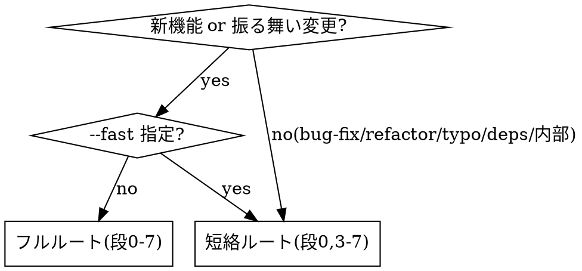

# anytime-dev-cycle — 開発フロー オーケストレータ

更新日: 2026-07-04

提案 → (任意)機能仕様書 → 実装計画 → 実装 → 設計書更新 → マージ前レビュー → develop マージ を**順に**回す。本スキルは**呼び出し順とゲートだけ**を持ち、各工程の中身は既存スキルに委譲する。工程ロジックを本体に複製しない。

> [!IMPORTANT]
> このスキルの正味の価値は、よく抜け落ちる **3 ゲート**を強制すること: ① 新機能で提案書を飛ばさない ② 機能仕様書（component spec）を明示指示時に必ず author する ③ 実装完了時に設計書を確定更新する。 plan / review / merge の規律は global `~/.claude/CLAUDE.md` が既に定義済み。再教育せず委譲する。

`--help` / `help` で本書を表示する。

## 起動形式

```text
/anytime-dev-cycle <1行の要求> [--fast] [--with-spec] [--base <branch>]
```

| フラグ | 意味 |
| --- | --- |
| `--fast` | 軽微変更ルート。提案書と機能仕様書を省略し 計画→実装→更新→レビュー→マージ に短絡 |
| `--with-spec` | 機能仕様書（段2）を明示的に有効化。未指定でも会話中にユーザーが指示すれば段2を実施 |
| `--base <branch>` | マージ前レビューの diff base（既定 `develop`） |

## ルートの選択



- 迷ったらフルルート。ただし段1（提案書）は軽微なら省略可と本人が判断したらユーザーに一言確認する。
- 短絡ルートでも段0（ブランチ確認）・段5（設計書更新）・段6（レビュー）は省略しない。

## 工程

| 段 | 内容 | 委譲先 / 成果物 | ゲート（次段の前提） |
| --- | --- | --- | --- |
| 0 | ブランチ確認（必須） | — | master/main 上なら develop から `feature/`/`fix/` 作成済み |
| 1 | 提案書（Why/What） | `anytime-proposal` → `/Shared/anytime-markdown-docs/proposal/<date>-<topic>.ja.md` | 提案書ファイルが存在し、ユーザーが `ok`/承認 |
| 2 | 機能仕様書【明示指示時のみ】 | `anytime-spec-lookup`＋`anytime-markdown-output` → 該当 component spec 配下の `.ja.md` | 仕様書ファイルが存在し、ユーザーが `ok`/承認 |
| 3 | 実装計画（How） | `superpowers:writing-plans` → `/Shared/anytime-markdown-docs/plan/<date>-<topic>.ja.md` | 計画ファイルが存在し、ユーザーが `ok`/承認 |
| 4 | 実装 | `subagent-driven-development`＋`anytime-agent-rotation`／`executing-plans`／`codex-delegation` | 実装後テストを**出口から導出**（`anytime-impl-test-design`）・ユニット＋`tsc --noEmit`＋必要なら統合通過・web-app の user flow を触ったら e2e（`npm run e2e -w packages/web-app`）通過・`npm run build -w <対象パッケージ>` 成功 |
| 5 | 設計書更新（必須） | 段2の仕様書／該当 component spec を確定仕様へ更新 | 振る舞い変更が spec に反映済み**かつコミット済み**（混在ファイルの申し送りを除く） |
| 6 | マージ前レビュー | `superpowers:requesting-code-review` または `anytime-cross-review` | error/warn 解消・テスト/ビルド再確認 |
| 7 | マージ | develop へローカルマージ | push/リリースは別の明示指示時のみ |

## ゲートの判定方式（重要）

ゲートは**アーティファクトの存在＋ユーザーの明示** `ok` で判定する。

- 前段の成果物ファイルが存在しなければ次段に進まない。存在チェックは実ファイル（`proposal/`・`plan/`・component spec・`review/`）で行う。
- `APPROVED=true` のような**テキスト状態フラグを発明しない**（セッション跨ぎで誤判定・ループ停止の原因）。承認はその場のユーザー発話（`ok`/`承認`/`進めて`）で取る。
- 各承認は `AskUserQuestion` で取得し、選択肢に「修正する（前段へ戻る）」「中断する」を含める。

## 各段の要点

### 段 0: ブランチ確認
`git branch --show-current`。master/main なら develop から作業ブランチを作成してから着手（プラン実行指示はブランチ選択への同意ではない）。並行セッション検知は project `CLAUDE.md` の status ファイル確認に従う。

### 段 1: 提案書
`anytime-proposal` を `Skill` ツールで起動。出力は **docs リポの** `/Shared/anytime-markdown-docs/proposal/`（コード repo `/anytime-markdown/` 内には置かない。AGENTS.md L11/L20）、`clarity` をチャット通知。軽微変更（bug-fix/refactor/typo/deps）は省略可だが、省略判断はユーザーに一言確認する。

### 段 2: 機能仕様書（明示指示時のみ）
1. `anytime-spec-lookup` で対象 component spec フォルダを特定（例: markdown 系はネスト構造 `spec/30.markdown/01.vscode-markdown-extension`・`spec/30.markdown/02.markdown-viewer` 等）。
2. `anytime-markdown-output` 規約で**前向き**に author。frontmatter は既存前例（`spec/30.markdown/01.vscode-markdown-extension/vscode-markdown-extension.ja.md`・`spec/30.markdown/02.markdown-viewer/markdown-viewer.ja.md`）に倣う:
   - `type: spec` / `category: 機能設計` / `c4Scope:`（対象パッケージ）
   - `related:` に `part-of`→パッケージ設計書、`implements`→段1の提案書
3. 逆生成 `spec/01.basic-design/03.feature-detail`（`anytime-reverse-spec` がコードから再生成）には**直接書かない**。手書きが上書きされるため component spec 側に置く。
4. **UI／振る舞いを持つ機能はテスト成果物も author する**: 機能仕様書（`<pkg>.ja.md`）に加え、同フォルダの **E2E シナリオ正本（**`<pkg>-e2e.ja.md`**・前提/操作/期待結果）と試験設計書（`anytime-doc-authoring` §5）** を作成・更新する。試験設計書は 7 ペルソナ観点＋ISO/IEC 25010＋技法でケースを設計し、**自動 e2e と人手のみの試験を区別**する（AI は設計者・実行/判定は人間）。純ロジック lib（end-user UI なし）は不要。

### 段 3: 実装計画
`superpowers:writing-plans` を起動。出力は **docs リポの** `/Shared/anytime-markdown-docs/plan/`（コード repo 内には置かない。AGENTS.md L11/L18）、`related: implements`→提案書（段2があれば `refines`→仕様書も）。**検証コマンドは対象** `package.json` **の** `scripts` **と** `devDependencies` **を事前確認**して書く。3ファイル以上は承認後に実装。`clarity` を通知。

> 出力先は**観測した未追跡 dir で推測しない**。`/anytime-markdown/plan/` 等が git status に `??` で見えても、それは誤配置の可能性がある。正本パスは AGENTS.md（L11「`/anytime-markdown/` 内には出力しない」・L18-20）で確認し、`superpowers:writing-plans` の既定 `docs/superpowers/plans/` も上書きして docs リポへ出力する。Write は docs リポの絶対パスで行う。

### 段 4: 実装
計画のタスク順に実施。サブエージェントへ委譲する複数ステップ実装では `anytime-agent-rotation` のポリシーでトークンを抑える（下記「トークン効率」）。機械的・定型実装は `codex-delegation`。純粋関数の新規は TDD（実装前にユニットテスト）。各論理単位でコミット（コミット前 3 点確認・広域 add 禁止）。

**実装後テストは出口から導出する（必須）**: 純粋ロジックのユニットだけでは配線/mount/型/i18n の回帰を止められず、過去に**ユニット green のまま出口だけ消える移行漏れ**が繰り返し出荷された（minimap・Ctrl+S 配線・ポップアップ・選択パネル・i18n 生キー）。`anytime-impl-test-design` で**変更の出口を列挙 → 各出口にテスト手段を割り当て**る。host 配線は純粋ヘルパ抽出で testMatch、mount は実 element の統合テスト、i18n/型は `tsc --noEmit` 別途。**書き換え/移行（脱React vanilla 化等）は機能パリティ照合**（旧ベース commit の出口インベントリをリテラル grep で配線まで照合・symbol 追跡に頼らない）を実施する。

### 段 5: 設計書更新（必須）
実装で確定した振る舞いを spec に反映する。

- 段2を実施した場合: 同じ機能仕様書を確定内容へ更新し frontmatter `updated:` を当日へ。
- 段2を省略した場合でも、振る舞い・I/F・画面・データモデルが変わったら該当 component spec を更新する。変更が内部実装のみ（外部から観測できる振る舞い不変）なら更新不要。
- **テスト成果物も同期する（必須）**: ユーザーから観測できるシナリオ（操作・期待結果・新規/廃止機能）が変わったら、機能仕様書だけで止めず **E2E シナリオ正本（**`<pkg>-e2e.ja.md`**）と試験設計書（`anytime-doc-authoring` §5）** を同じ確定内容へ更新する。実装済みなのに正本に無いシナリオ（自動 e2e に在るが未記載）も追記し、仕様と実テストを一致させる。人手のみの試験（実機/IME/印刷/外部）も漏らさない。
- 更新後 `bash ~/.claude/scripts/validate-markdown.sh <file>` で検証（`anytime-markdown-check`）。
- spec を追加・更新・改名・削除したら**同フォルダの索引を必ず再生成**する（`npm run spec:index` 等。`anytime-markdown-output`）。
- **列挙のミラー・スイープ（必須）**: 設定値・enum・プリセット等の**列挙集合**を変更したら、該当 component spec で止めず、同じ列挙を冗長に持つ**全ミラー**を更新する。発見は変更した値でなく**既存の兄弟値リテラル**で横断 grep する（シンボル/型参照追跡は下流消費者しか出ず、並行宣言＝config schema・i18n・設計書の表を漏らす）。例: `grep -rn '"wide"\|広い' packages <docs>/spec`。ミラー先は典型的に ①TS union/ラベル ②i18n(ja/en) ③`<pkg>/package.json` の VS Code 設定 `enum`/`enumDescriptions` ④`package.nls{,.ja}.json` ⑤設計書（デザインシステム正本 `design.md`・`feature-matrix`・`e2e`・隣接パッケージ spec）。`anytimeMarkdown.*` 設定がある値は ③④を**実装側で同時改修**（段4 のスコープにも含める）。
- **設計書も必ずコミットする（必須）**: 更新・検証・索引再生成した spec は段5 内でコミットまで完了する（ディスク編集のまま未コミットで放置しない）。spec 正本は別リポ（`/Shared/anytime-markdown-docs`・ブランチ `main`）にあることが多く、**そのリポで**自分が触ったファイルを**パス明示**でコミットする（`git add .`/`-A` 禁止）。コミット前 3 点確認（`branch --show-current`／`status`／`diff --cached`）。同一ファイルに**他セッションの未コミット差分が混在**する場合は、その混在ファイルだけ commit せずユーザーに申し送り（広域 add・差分混入を避ける。`git add -p` での分離は環境非対応）。索引を再生成したら索引ファイルも同じコミットに含める。コミットメッセージは `docs(<scope>): ...`。

### 段 6: マージ前レビュー
`superpowers:requesting-code-review`（`code-reviewer` subagent・記録に残る）。二者検証が要るときは `anytime-cross-review`。error/warn を解消し、テスト通過・`npm run build -w <対象パッケージ>` を再確認（`superpowers:verification-before-completion`）。**ユニット green を完了根拠にしない**: `tsc --noEmit`（ts-jest は型エラーを見逃す）と、配線/mount を触ったなら統合テストまたは実機（VS Code 拡張は compile→Extension Host Reload）で裏取りする（検知ギャップは `anytime-impl-test-design`）。テスト網羅に不安があれば `pr-test-analyzer`（振る舞いカバレッジ監査・pr-review-toolkit）を起動する。

### 段 7: マージ
develop へ**ローカルマージのみ**。「develop にマージ」指示は push を含まない。push・本番リリースは `production-release` スキルでのみ、かつ明示指示時に実施。

## 完了通知

```text
[anytime-dev-cycle] 完了
- ブランチ: <feature/...> → develop（ローカルマージ）
- ルート: フル / 短絡
- 成果物（全て docs リポ /Shared/anytime-markdown-docs 配下）: proposal/<...>（任意）/ <component spec>（任意）/ plan/<...> / review/<...>
- 設計書更新: <更新した spec のパスとコミット(<repo>@<sha>)、または「振る舞い不変につき更新不要」。混在で未コミットのファイルがあれば申し送り>
- 検証（**実出力**・主張でなくコマンド出力）: tsc <Found 0 errors> / jest <N/N passed> / e2e <N/N passed or 不要(理由)> / build <exit 0> / 実機 <観測 or **未実施なら理由必須**>（`anytime-impl-test-design`「エビデンスの残し方」）
次の手順: push が必要なら「push して」、本番リリースは production-release スキル
```

## トークン効率

段4 など**サブエージェント委譲が重い工程**では `anytime-agent-rotation` のポリシーでトークンを抑える。実コストの主因は文脈の再読込（`cache_read` 乗数）なので「文脈サイズ × 再読込回数」を圧縮する。

- **独立タスクは always-fresh**: 計画の独立タスクは毎回 fresh サブエージェントで実行する（同一ワーカー継続は累積文脈を毎ステップ再読込し ≈28K/step の税）。小さい独立タスクは 1 サブエージェントにバッチ化して起動の床コスト（≈37K/回）を償却する。
- **継続チェーンは閾値で回転**: 状態を引き継ぐ連続作業は、ワーカーが肥大（目安 ≈90–100K）したら `anytime-agent-rotation` の compact-seed で fresh へ回転させる。`subagent_tokens` は per-call 報告なので自前で合算して閾値判断する。
- **モデル階層化**: 調査・Grep・ログ解析・フォーマット確認＝haiku、定型実装・ドキュメント生成・Git 操作＝sonnet、設計判断を伴う複雑実装＝opus。委譲時に `model` を必ず明示する（省略すると親 Opus 継承でコスト超過）。
- **effort 調整**: 機械的作業は低 effort、設計・デバッグなど判断を要する工程のみ上げる。
- **セッション衛生**: 工程の区切りで `/clear`、単一工程で文脈が膨らんだら `/compact`。

詳細は `anytime-agent-rotation`（`--help`）と global `~/.claude/CLAUDE.md`「トークン・コスト効率」「サブエージェント」に従う。

## ガードレール

- master/main 上で実装着手しない（段0）。
- **成果物の出力先は docs リポ**: proposal/plan/review/spec は全て `/Shared/anytime-markdown-docs/` 配下に出力し、コード repo `/anytime-markdown/` 内には置かない（AGENTS.md L11/L18-20）。正本パスは AGENTS.md で確認し、観測した未追跡 dir（`?? plan/` 等）を慣習と誤認しない。docs リポは独立 Git リポゆえ、出力後は段5/段7 で **docs リポ側でもコミット**まで完了する。
- ゲートはファイル存在＋ `ok`。テキスト状態フラグを発明しない。
- 段2・段5・段6 を「軽微だから」で勝手に省略しない（段2は明示指示が無ければ実施しないが、段5/段6 は必須）。
- push・`production-release`・`git push --force`・`reset --hard` 等の破壊的/外向き操作は明示指示時のみ。global `CLAUDE.md`「破壊的操作」の 3 点確認→退避→承認に従う。
- 各工程の委譲先スキルのエラーは silent に握りつぶさず、識別子付きでユーザーに通知し中断/継続を確認する。

## アンチパターン（Red Flags — 見たら停止）

| 兆候 | 正す |
| --- | --- |
| 新機能なのに段1を飛ばして計画から始めた | フルルートなら段1を実施（省略はユーザー確認後のみ） |
| 「機能仕様書を作って」と言われたのに段2を省いた | 段2必須。component spec へ author |
| 実装完了したが spec を更新していない | 段5は必須ゲート。振る舞い変更を反映 |
| spec を編集したが未コミットのまま次段へ進んだ | 段5でコミットまで完了（別リポ `/Shared/anytime-markdown-docs` も）。混在ファイルのみ申し送り |
| 成果物を `/anytime-markdown/plan/` 等コード repo 内に作成した | 出力先は docs リポ `/Shared/anytime-markdown-docs/`。AGENTS.md L11/L18-20 で正本確認。未追跡 dir を典拠にしない |
| enum/設定値に1値足したが measurePreset.ts 等の1ファイルだけ直した（VS Code 設定 enum・nls・spec 表のミラー漏れ） | 段5「列挙のミラー・スイープ」。兄弟値リテラルで横断 grep し全ミラーを同時改修 |
| スコープを消費者(symbol)追跡だけで「1パッケージに閉じる」と判断した | 並行宣言(config schema・i18n・docs)はリテラル値検索でしか出ない。両方回してから確定 |
| ゲートを `APPROVED` 等のフラグで自動判定した | ファイル存在＋その場の `ok` で判定し直す |
| 1 つの巨大スキルで全工程を自前実行した | 各工程は既存スキルへ委譲する（本体は順序のみ） |
| 「develop にマージ」を push まで実行した | ローカルマージで止める。push は別の明示指示 |
| ユニット green を根拠に「完了」とした（配線/mount/型/i18n 未確認） | 段4/段6。実装後テストを出口から導出（`anytime-impl-test-design`）。`tsc --noEmit`＋統合/実機で裏取り |
| 書き換え/移行（脱React vanilla 化等）で旧実装を読まず新コードだけ書いた | 機能パリティ照合。旧ベース commit の出口インベントリをリテラル grep で配線まで照合（symbol 追跡に頼らない） |
| 振る舞い/シナリオを変えたが機能仕様書だけ直し E2E シナリオ正本・試験設計書を更新していない | 段2/段5。`anytime-doc-authoring` §5 で E2E シナリオ＋試験設計書を同期（自動 e2e と人手のみを区別・実装済み未記載も追記） |

## 参照スキル

| 段 | スキル |
| --- | --- |
| 1 | `anytime-proposal` |
| 2 | `anytime-spec-lookup`・`anytime-markdown-output`・`anytime-markdown-check`・`anytime-doc-authoring` |
| 3 | `superpowers:writing-plans` |
| 4 | `superpowers:subagent-driven-development`・`anytime-agent-rotation`・`superpowers:executing-plans`・`codex-delegation`・`anytime-impl-test-design` |
| 5 | `anytime-markdown-output`・`anytime-markdown-check`・`anytime-doc-authoring` |
| 6 | `superpowers:requesting-code-review`・`anytime-cross-review`・`superpowers:verification-before-completion`・`anytime-impl-test-design` |
| 7 | `production-release` |
