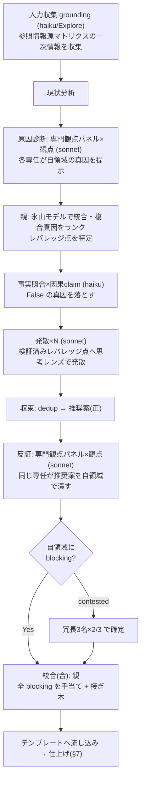

# 提案書（anytime-proposal）の生成

更新日: 2026-06-30

## Overview

RFC / ADR / 軽量提案の 3 形式を使い分けて提案書を生成し、プロジェクト規約の `proposal/` に保存する。\
proposal は **「やるべきか（Why / What）」** を扱う意思決定の材料・記録である。\
実装手順（How）は対象外で、採用後に `plan`（または superpowers `writing-plans`）が担う。

出力は `anytime-markdown-output` スキル（`type: proposal`）に準拠する。\
テンプレ構造は OSS の RFC / ADR 慣行を流用し、frontmatter・出力先のみ本プロジェクト規約に合わせる。\
各フェーズの「考え方」は後述の **思考法ガイド** に従い、論理系で整理し・創造系で広げ・俯瞰系で統合する。


## 0. ヘルプ（`--help` / `help`）

引数に `--help` または `help` が含まれる場合は、**提案を生成せず以下のヘルプをそのまま表示して終了する**。

```text
anytime-proposal — 提案書(RFC / ADR / 軽量)を生成するスキル

■ 起動
  /anytime-proposal [形式] [--deep] <テーマ>
  例) /anytime-proposal 再発防止策をまとめて
      /anytime-proposal adr 状態管理ライブラリの選定
      /anytime-proposal --deep trail 拡張のレビュー指摘を提案

■ 形式 (省略時 = 軽量)
  lightweight  軽量提案  改善提案・再発防止     見出し: 論点/現状分析/根本原因/改善案/方針比較/推奨
  rfc          RFC       採否未定の提案・合意形成 見出し: Summary/Motivation/Detailed design/Drawbacks/Alternatives/Unresolved
  adr          ADR       確定した意思決定の記録   見出し: Status/Context/Decision/Consequences/Alternatives

■ オプション
  --deep   専門観点パネルで grounding→原因診断→発散→反証→統合 を並列サブエージェントで実行
  --help   このヘルプを表示

■ 出力
  <docsベース>/proposal/[YYYYMMDD]-[topic].[lang].md   (frontmatter type: proposal / 既定 lang=ja)

■ 記述テンプレート (見出し構成・完全版は §5)
  軽量 : 論点 / 概要 / 現状分析 / 根本原因 / 改善案(高・中・低) / 方針の比較(正→反→合) / 推奨
  RFC  : 論点 / 概要 / 動機 / 詳細設計 / 欠点 / 代替案 / 未解決の論点
  ADR  : ステータス / コンテキスト / 決定 / 理由 / 影響 / 検討した代替案

■ 思考法 (フェーズ別ガイドは §2)
  論理系=整理 → 創造系=発散(レンズプール §8) → 俯瞰系=統合。出典 business-thinking-methods.ja.md
```


## 1. 形式の判定

ユーザー指定がなければ、提案の性質から形式を選ぶ。迷ったら **軽量提案** を既定とする（既存 `/proposal/` の主流）。

| 形式 | 使う場面 | 主な見出し |
| --- | --- | --- |
| **ADR**（Architecture Decision Record） | **確定した意思決定の記録**。技術選定・設計判断を後から追跡したい | Status / Context / Decision / Consequences / Alternatives |
| **RFC**（Request for Comments） | **採否未定の提案**。レビュー・合意形成を起こしたい | Summary / Motivation / Detailed design / Drawbacks / Alternatives / Unresolved questions |
| **軽量提案**（lightweight） | **改善提案・再発防止策**。現状分析から改善案までを一気通貫で示す | 論点 / 現状分析 / 根本原因 / 改善案 / 方針比較 |

### モードの選択（軽量 / 深掘り）— grounding は常に必須

形式（ADR/RFC/軽量）とは別軸で、分析の厚み（軽量＝単一コンテキスト / 深掘り＝専門観点パネル §8）を選ぶ。

- **grounding（一次情報の収集）は軽量・深掘りを問わず必須**。分析品質を決めるのは「深掘りか否か」より「**grounding したか否か**」。参照情報源マトリクス（§8）を軽量モードでも最低限なぞる
- **軽量版（単一コンテキスト）で十分**: 低 stakes / 真因が明白 / 単一ドメイン / 速い初稿。ただし grounded であること
- **深掘り版（§8 専門観点パネル）が要る**: 失敗コストが高い（技術選定・アーキ・再発防止）/ ドメイン横断 / 真因が係争的 / 確証バイアスを排したい
- **避けるべきは grounding 抜きの軽量版**（要約頼みで分析が痩せ、レバレッジ点を取り違える）


## 2. 思考法ガイド（フェーズ別）

各フェーズで下表の思考法を適用する。\
出典は `/Shared/anytime-markdown-docs/tech/business-thinking-methods/business-thinking-methods.ja.md`（論理系＝正しく考える / 創造系＝新しく考える / 俯瞰系＝全体を見て考える）。

| フェーズ | 系統 | 適用する思考法 | やること |
| --- | --- | --- | --- |
| **論点設定** | 俯瞰系 | 論点思考・時間軸思考（短期⇔長期 / 魚の目） | 「そもそも何を考えるべきか」を定める。誤った問題を上手に解く事故を防ぐ |
| **現状分析** | 論理系 | フレームワーク思考（3C/SWOT）・要素分解（MECE）・クリティカルシンキング | 事実を漏れ・ダブりなく整理し、前提を疑う |
| **根本原因** | 俯瞰系 | Why思考（5 回）・因果関係分析・システム思考・**氷山モデル / レバレッジポイント** | 真因と構造（ループ）を特定し、**最小介入で最大効果の点（レバレッジ点）**を 1 つ見つける |
| **改善案/代替案** | 創造系 | ラテラル・アナロジー・IF思考・ゼロベース・逆説思考・SCAMPER・TRIZ（矛盾解決）・制約思考・デザイン思考（プールから提案タイプで 4〜5 個選ぶ。§8 参照） | 発散→収束し、**恒久対策（レバレッジ点を断つ）と暫定対策（症状の刈り取り）に分類**する |
| **方針比較** | 創造系→論理系 | 弁証法（正→反→合）・ディベート思考・プラスサム思考・**セカンドオーダー思考・機会費用** | 対立軸を明確化し統合案（合）を立てる。各案の**二次的帰結**と**捨てるもの（機会費用）**を読む |
| **全体俯瞰** | 俯瞰系 | メタ思考・概念化思考・図解思考 | 一段上から構造を俯瞰し Mermaid で視覚化する |

> サイクル: 論理系で整理 → 創造系で広げ → 俯瞰系で統合。提案 1 本の中でこの 3 系統を必ず一巡させる。

> [!TIP]
> 思考法を図解する際、Mermaid で足りる図（flowchart / stateDiagram）は Mermaid を、Mermaid 非対応の思考法フレームは **`anytime-graph` フェンス**を使う。\
> 対応: Why思考→`type: fishbone` / システム思考→`type: causal-loop` / メタ思考→`type: pyramid` / ラテラル→`type: mindmap` / デザイン思考→`type: double-diamond` / 論点思考→`type: logic-tree` / なぜなぜ→`type: why-chain` / SWOT→`type: swot` / 組み合わせ→`type: morph-box` / KJ法→`type: affinity` / 構造化（全体↔部分↔他領域）→`type: structure-map`。\
> DSL 仕様は `/Shared/anytime-markdown-docs/spec/anytime-graph-fence/anytime-graph-fence.ja.md`。


### 2.1 構造化レンズ（全体↔部分↔関係）

**現状分析**（論理系）と**全体俯瞰**（俯瞰系）のフェーズで、対象の構造を取りこぼしなく問い直すチェックリスト。\
出典は太田賢一「構造化における14の考えを図解する」（<https://note.com/kenichiota0711/n/ncbad19a92131>）。14 の考えは重複が多く、独立操作は次の **8 レンズ**に畳める。各レンズは対応する思考法ダイアグラム（§2 TIP）で図示できる。

| # | レンズ | 問い | 図示 |
| --- | --- | --- | --- |
| 1 | 全体把握・俯瞰 | 全体像を一枚で捉えているか。何を「全体」と置くか | `structure-map` / `pyramid` |
| 2 | 分解 | 全体を MECE に部分へ割れているか | `logic-tree` |
| 3 | 粒度合わせ | 並べた部分の詳細度（粒度）は揃っているか | （規律。図種なし） |
| 4 | 要点識別 | 多数の要素から本質的に重要な要素を見分けたか | （強調。図種なし） |
| 5 | 相対化 | 各要素を他との比較で位置づけたか | `swot` / `morph-box` |
| 6 | 部分↔全体の関係 | 部分が全体に及ぼす影響を捉えたか | `structure-map` |
| 7 | 構造応用 | この構造を他の文脈へ転用できるか | `structure-map`（domains） |
| 8 | 他領域との関係 | 隣接領域とどう接続するか | `structure-map`（domains） |

> 1・6・7・8 は `structure-map`（全体・部分・関係・他領域を一枚に束ねる図種）で同時に図示できる。\
> このチェックリストは「網羅の点検」であり、すべてを毎回図にする必要はない。論点に効くレンズを選んで適用する。


## 3. 入力の確認

明示されていない項目のみ質問する。

- **論点**: この提案が解くべき問いは何か（論点思考。1 文で言語化する）
- **テーマ / 対象**: 何についての提案か（対象パッケージ・ファイル・機能）
- **形式**: ADR / RFC / 軽量（未指定なら 1 の判定を提示して確認）
- **背景**: 提案に至った経緯・観測した問題（再発防止なら事故概要）
- **lang**: `ja`（既定）/ `en`。指示がなければ日本語のみ
- **深掘り**: `--deep` / 「反証付きで」指定、または失敗コストの高い提案（技術選定・アーキ判断・再発防止）なら深掘りモード（§8）を使う
- **ヘルプ**: `--help` / `help` が含まれる場合は §0 のヘルプを表示して終了する（提案は生成しない）


## 4. frontmatter

`anytime-markdown-output` スキルに従い、先頭に付与する。`type` は必ず `proposal`。

```markdown
---
title: "提案タイトル"
date: "YYYY-MM-DD"
type: "proposal"
lang: "ja"
author: "Claude Code v[CLIバージョン]"
category: "カテゴリ名"
excerpt: "提案の要約。200文字以内。何を・なぜ提案するかを 1〜2 文で。"
---
```

- `author` のバージョンは `claude --version` で取得する
- `category` は任意（例: `refactoring` / `tech-selection` / `incident-prevention` / `feature`）
- 設計判断を含む提案では、`clarity`（指示の明確さ 1〜100）を frontmatter に追記し、チャットでも評価と理由を通知する（global `CLAUDE.md` ルール）


## 5. テンプレート

### 5.1 ADR

```markdown
# ADR: [決定の短いタイトル]

## ステータス

承認済み / 提案中 / 却下 / 廃止（supersedes: [旧 ADR] / superseded by: [新 ADR]）

## コンテキスト

決定が必要になった背景・制約・前提。観測した事実を中立に記述する（クリティカルシンキングで前提を点検）。

## 決定

採用する選択肢と、その具体的内容。

## 理由

なぜこの選択肢か。判断基準（保守性 / 性能 / リスク / コスト）に沿って説明する。

## 影響（Consequences）

- 良い影響:
- 悪い影響・トレードオフ:
- 移行・後始末が必要な箇所:

## 検討した代替案

創造系で発散した案を含めて列挙する（無難な 2 択に限定しない）。

| 代替案 | 概要 | 不採用の理由 |
| --- | --- | --- |
| 案 A | ... | ... |
| 案 B | ... | ... |
```

### 5.2 RFC

```markdown
# RFC: [提案タイトル]

## 論点（Question）

この RFC が決めたい問いを 1 文で（論点思考）。

## 概要（Summary）

提案の 1 段落要約。

## 動機（Motivation）

なぜ必要か。解決する課題・現状の痛み。可能なら定量データを添える。

## 詳細設計（Detailed design）

提案の具体。API / データモデル / フロー。複雑な分岐・順序は Mermaid 図で示す
（`anytime-mermaid` スキルに従う）。

## 欠点（Drawbacks）

この提案を採用することの不利益・コスト・リスク。

## 代替案（Alternatives）

創造系で発散した案を含める。弁証法の「合」（統合案）も 1 つ検討する。

| 代替案 | 概要 | 比較（メリット / デメリット） |
| --- | --- | --- |
| ... | ... | ... |

## 未解決の論点（Unresolved questions）

レビューで決めたい点・保留事項を箇条書きで残す。
```

### 5.3 軽量提案（lightweight）

```markdown
# [提案タイトル]

## 論点

この提案が解くべき問いを 1 文で（論点思考）。\
「そもそも今これが最優先の論点か」をボトルネック分析で点検する。

## 概要

何を・なぜ提案するか（2〜3 文）。

## 現状分析

観測した事実・データ。フレームワーク思考（3C/SWOT）・要素分解（MECE）で漏れなく整理し、
クリティカルシンキングで前提を疑う。

## 根本原因

Why思考で why-why-why を 3 段以上掘り下げ、因果関係分析・システム思考で構造（ループ）を示す
（再発防止提案では必須。global `CLAUDE.md` ルール）。\
氷山モデル（できごと→パターン→構造→メンタルモデル）で深層に降り、**レバレッジ点**（最小介入で最大効果の一点）を特定する。

## 改善案

まず創造系（ラテラル・アナロジー・IF思考・ゼロベース・逆説思考・SCAMPER・TRIZ・制約思考 等から提案タイプで選ぶ）で**発散**し、
論理系で**収束**する。\
収束した案を**恒久対策／暫定対策**に二分して列挙する（優先度 高 / 中 / 低 は各区分内の副軸として各項目に付す）。

### 恒久対策（再発防止）

根本原因の**レバレッジ点を断つ**手。各項目に「断つ真因」を 1 行添える。

- [高] <対策> — 断つ真因: <根本原因のどれか>

### 暫定対策（応急・症状の刈り取り）

既存の問題を今止めるが**再発は止めない**繋ぎ。恒久対策が入るまでの措置である旨を明記する。

- [高] <対策>

> 暫定だけで恒久を落とさない。**恒久対策の無い提案は再発を許す**（症状の刈り取りの繰り返しになる）。

## 方針の比較（正→反→合）

弁証法に沿って、対立する 2 案に加えて**統合案（合）**を検討する。
最適解は二者択一でなく統合であることが多い。

| 観点 | ベストプラクティス案（正） | 安定性・既存挙動優先案（反） | 統合案（合） |
| --- | --- | --- | --- |
| 方針 | 根本構造を整える（再設計・抽象化） | 最小限・局所的な変更にとどめる | 段階適用（先行ゲート + 漸進移行 等） |
| 変更ファイル数 / 影響範囲 | ... | ... | ... |
| 将来コスト / リスク | ... | ... | ... |
| 二次的帰結（セカンドオーダー） | ... | ... | ... |
| 機会費用（捨てるもの） | ... | ... | ... |

## 推奨

どの案を推すか、その理由（プラスサム思考で全体最適を志向）。\
推す案の**二次的帰結**が許容範囲か、時間軸（短期⇔長期）で見て妥当かを確認する。最終判断はユーザーに委ねる。
```


## 6. 出力先・命名

- 出力先: プロジェクトの `CLAUDE.md`「ドキュメント出力先」で定義された docs ベースの `proposal/` 配下\
（anytime-markdown では `/Shared/anytime-markdown-docs/proposal/`）。未定義ならユーザーに確認する
- ファイル名: `[YYYYMMDD]-[topic].[lang].md`（都度作成ドキュメント。指示がなければ `ja` のみ）
- 独立 Git リポジトリのことがあるため、保存後に当該リポで `git status` を確認する


## 7. 仕上げ

1. 複雑なロジック（分岐・順序・依存）は文章で粘らず **Mermaid 図**にする（`anytime-mermaid` スキル）
2. 変数名・ファイル名・テーブル名などの固有名称はインラインコードで囲む
3. **クリティカルシンキングで自己検証**: 主要な主張ごとに `True?（事実か）/ Why so?（なぜそう言えるか）/ So what?（だから何か）` を点検し、根拠の薄い断定を削る
4. `bash ~/.claude/scripts/validate-markdown.sh <出力ファイル>` を実行し、NG があれば修正して再実行する（`anytime-markdown-check` スキル）
5. 設計判断を含む場合は `clarity` 評価（1〜100）と理由をチャットで通知し、frontmatter にも記載する


## 8. 深掘りモード（専門観点パネル）

既定は単一コンテキストの逐次実行（軽量・低コスト）。\
次のいずれかで**深掘りモード**を起動し、役割分担した並列サブエージェントで検証/反証する。\
まず **grounding** で一次情報を集め、発散は**思考レンズ**で広げ、**専門観点パネル**（コードレビューの専門レビューアーに相当）が根本原因を**診断（前）**し提案を**反証（後）**する。

起動条件:

- ユーザーが `--deep` / 「反証付きで」「徹底検証で」と指示した
- 失敗コストの高い提案（技術選定・アーキ判断・再発防止策）

起動前チェック（global `CLAUDE.md`）:

- `free -h` で利用可能メモリを確認し並行数を決める（通常 4〜6。逼迫時は絞る）
- サブエージェント起動時は `model` を必ず明示する
- サブエージェントは `CLAUDE.md` を継承しないため、プロンプトに「## コンテキスト・ツール効率」ルール（専用ツール優先・`offset`/`limit` 読み）と対象スコープ・変更禁止範囲を明記する

役割と並列構成:

| 役割 | モデル | 並列 | 多様化軸 | 指示 |
| --- | --- | --- | --- | --- |
| 入力収集（grounding・最初） | haiku 主体（コード探索は Explore） | 情報源別に並列 | — | 参照情報源マトリクス（下表）の**一次情報を収集**し、現状分析・診断・発散へ供給する |
| 発散（起案・正） | sonnet | レンズ別に N 並列 | 思考レンズ（下のプールから提案タイプで 4〜5 個選ぶ） | 各レンズで候補案を独立生成。互いの案は見せない |
| 原因診断（専門観点パネル・前） | sonnet | 観点別に 1 名ずつ | **専門観点（ドメイン）** | 現状分析を受け、各専任が**自領域から見た真因を 1 つ**提示する（鑑別診断） |
| 反証（専門観点パネル・後） | sonnet | 観点別に 1 名ずつ | **専門観点（ドメイン）** | **同じ専任**が推奨案・根本原因を自領域で潰しにかかる |
| 事実照合（検証） | haiku | claim 数だけ並列 | — | 現状分析・**因果 claim** を Trail DB 等の一次データと突合し `True` / `False` を判定 |
| 統合（合） | 親（メイン） | 逐次 | — | 全 blocking を手当てし、生存案 + 良案を接ぎ木。改善案を**恒久対策（レバレッジ点）/ 暫定対策**に分類して統合提案を作る |

参照情報源マトリクス（grounding が集め、各フェーズが参照する一次情報。プロジェクト別に読み替える。anytime-markdown の例）:

| フェーズ | 参照すべき一次情報源 |
| --- | --- |
| 論点設定 | `mcp-trail:list_unaddressed_review_findings`（全体の未対処量）・他 `proposal` / `plan`（優先度） |
| 現状分析 | `memory_review_findings` の**全列**（`finding_text` / `suggestion_text` / `target_file_path` / `target_symbol`）・実コード（Serena / Grep）・`git blame` |
| 原因診断 | `mcp-trail:list_recurring_bugs` / `get_bug_history` / `search_memory`・`memory_bug_fixes`・`current_code_graphs`（構造）・`git log/blame`（churn）・`get_review_history`（過去同種） |
| 発散（改善案） | `package.json`（scripts / devDeps）・`eslint.config.*`・`tsconfig.json`・CI（`.github/workflows`）・`suggestion_text`（レビュアー修正案）・`message_commits` / `addresses`（既往修正） |
| 反証 | 上記設定ファイル群で実行可能性を**実証**（推論で済ませない） |
| 事実照合 | `trail.db` / `memory-core.db` ＋ 設定ファイル |

> 軽量モードでも親はこのマトリクスを**最低限なぞる**（深掘りモードは grounding エージェントが収集して各パネルへ供給する）。\
> grounding が重くなりすぎないよう、提案に無関係な情報源は外し、結果はそのセッション内で再利用する。

発散レンズのプール（提案タイプ別に 4〜5 個選ぶ。対象に無関係なレンズは外す）:

| 提案タイプ | 発散レンズ |
| --- | --- |
| bug / 品質 | ゼロベース・アナロジー・逆説・IF・SCAMPER |
| 改良 / 最適化 | SCAMPER・制約思考・アナロジー・逆説 |
| トレードオフ判断 | TRIZ（矛盾解決）・制約思考・弁証法・IF |
| UX / 機能 | デザイン思考・アナロジー・IF・ラテラル |

レンズの一行定義（発散プロンプトに同梱する）: ラテラル=前提を外し自由発想 / アナロジー=他分野の借用 / ゼロベース=白紙から / 逆説=常識の逆 / IF=「もし～なら」 / SCAMPER=置換・結合・応用・修正・転用・削除・逆転 / TRIZ=矛盾を妥協せず両取り / 制約思考=あえてキツい制約で最小手を生む / デザイン思考=利用者への共感起点 / 形態分析=属性×選択肢の組合せ網羅。\
出典は `business-thinking-methods.ja.md`。

専門観点パネルの観点セット（提案タイプ別。対象に無関係な観点は外し、3〜6 個に絞る）:

| 提案タイプ | 反証パネルの観点 |
| --- | --- |
| bug / 品質 | 正しさ・セキュリティ・性能・保守性・運用/コスト・リスク |
| 技術選定 | コスト・性能・エコシステム成熟度・移行リスク・チーム習熟 |
| アーキ / 設計 | 整合性・拡張性・性能・運用/障害・移行リスク |
| 再発防止 | 検出網羅性・回帰リスク・運用継続性・コスト |

専門観点パネルは「原因診断（前）」と「反証（後）」の**二役を同じ専任が担う**。観点セットは上表を共用する。

原因診断（前・鑑別診断）:

- 現状分析を渡し、各専任が**自領域から見た最も妥当な真因を 1 つ**挙げる（観測根拠つき）。多数決はしない（全候補を俎上に載せる＝鑑別診断）
- 親が**氷山モデル**（できごと→パターン→構造→メンタルモデル）で統合し、複合真因を**エビデンス順にランク**。各真因に**レバレッジ点**（最小介入で断つ一点）を対応づける
- **事実照合**で各因果 claim を一次データと突合し、`False` の真因候補は落とす
- この検証済み真因が、続く**発散のターゲット**になる（レバレッジ点に発散を集中させ、的外れな案の量産を防ぐ）

各診断者の出力形式（行頭固定）:

```text
観点: <観点名>
真因: <自領域から見た最も妥当な真因を 1 つ>
観測根拠: <なぜそう言えるか・データ / 事実>
レバレッジ点: <その真因を最小介入で断つ一点>
```

各反証者の出力形式（行頭固定）:

```text
観点: <観点名>
blocking: true/false — 自領域の致命傷があれば 1 行、なければ「なし」
要修正点: <箇条書き>
contested: <確度を争点化したい主張があれば記載、なければ空>
```

判定ルール（2 層）:

- **専門ブロック（単独で有効）**: ある観点の専任が**自領域で** `blocking: true`**（致命傷）を 1 つでも提示**したら、その提案は要修正。\
多数決で覆さない（専門家を多数決で黙らせない）。統合フェーズで必ず手当てする
- **争点の冗長検証**: `contested` に挙がった主張、または blocking の真偽が割れる争点のみ、その観点に**冗長 3 名 × 2/3** の二段検証をかけ、2 名以上が refute なら棄却確定
- **事実照合**: `False` 判定の claim は提案から削除する（根拠の薄い断定を残さない）
- blocking でない指摘（nit / info）は記録し、統合フェーズで取捨する

フロー:



出力要件（深掘りモードで生成した提案には必ず付与）:

深掘りモードでは並列サブエージェントの過程が見えなくなるため、提案ファイルの**末尾に別見出しで以下を収録する**（追跡性・再現性の確保）。

- **`## 深掘り検証ログ`**: 各フェーズの構成（**原因診断パネルの観点別の真因とレバレッジ点**・発散レンズ数・事実照合の claim 判定・反証パネルの観点別 `blocking`）と、専門観点パネルの判定表（**診断・反証の両方**）。**各フェーズが参照した一次情報源**も記録する（入力の薄い提案を可視化）
- **`## 付録: 発散フェーズの各レンズの提案（生データ）`**: 各思考レンズ（ゼロベース / アナロジー / 逆説 / IF 等）のサブエージェントが**独立生成した原案をそのまま**レンズ別小見出しで列挙する（互いの案を見せず生成しているため重複・対立を含む）。末尾に**収束の判断**（どの案に収束し、どの案をなぜ主案から外したか）を 1 段落で添える

> 本文「改善案」は収束後の主案のみを載せ、棄却・不採用の原案は付録に退避する。読み手は本文で結論を、付録で発散の全体像と採否理由を追える。

軽量モード（既定）との違い: 軽量モードは発散・反証・事実照合を親が自演する。\
深掘りモードはこれらを**独立サブエージェントに分離**し、反証を**専門観点パネル**にすることで、思考レンズ多様化では拾えない\*\*失敗モードの網羅性（coverage）\*\*を担保する。\
多数のエージェントを決定論的に fan-out したい場合は Workflow ツールを使うが、これは明示的な opt-in が必要なため、本スキルは既定で Agent ツールによる並列起動を用いる。


## 補足: proposal と plan / brainstorming の関係

- **anytime-proposal**（本スキル）= Why / What。採否を判断する材料・記録
- **plan**（または superpowers `writing-plans`）= How。採用後の実装手順
- superpowers `brainstorming` は「新規アイデアを対話で詰める前段」に向く。確定提案・意思決定の記録には本スキル（ADR / RFC / 軽量）を使う
