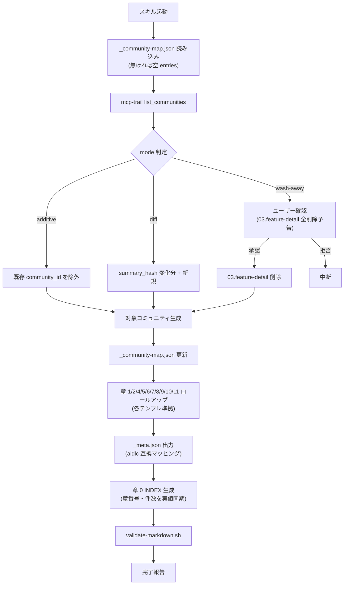

# /anytime-reverse-spec

更新日: 2026-07-04

`anytime-reverse-codegraph` でコミュニティに `name` / `summary` / `mappings_json` が付与済みであることを前提に、`{outputDir}` 配下に基本設計書 11 章（システム概要 / 機能一覧 / 機能詳細 / データモデル / 外部 I/F / 画面仕様 / データフロー / 用語集 / ビジネス概要 / コード構造 / コード品質評価）と `_meta.json` を生成する。任意のリポジトリに適用可能。

章 9〜11 は AWS Labs [aidlc-workflows](https://github.com/awslabs/aidlc-workflows) reverse-engineering ステージの business-overview / code-structure / code-quality-assessment に相当し、`_meta.json` に aidlc 互換マッピングを記録する。

> [!IMPORTANT]
> 本スキルは Trail DB に対して**読み取り専用**で動作する。書き込みは MCP ツール経由で行うべきだが、本スキルは書き込みを行わない（コミュニティ書き込みは `anytime-reverse-codegraph` の責務）。


## 適用するコンテキスト・ツール効率ルール

本スキルが従うコンテキスト効率ルールを以下に明示する。サブエージェントへの委譲プロンプトにも本セクションへの参照を含めること（サブエージェントは親エージェントの規約ファイル（`CLAUDE.md` / `AGENTS.md` / `GEMINI.md` など）を継承しないため）。

| ルール | 本スキルでの適用箇所 |
| --- | --- |
| **ソースコードの構造的探索は Trail DB の** `current_code_graphs.graph_json`（パッケージ単位・コミュニティ単位・依存関係・fanIn 上位の集計） | Phase 0-2 / 0-2-bis でコミュニティメンバーと fanIn を `graph_json` から取得 |


## テンプレ準拠生成（重要）

本スキルが生成する Markdown は、すべて `{skillDir}/templates/<chapter>.ja.md` の skeleton に厳密に従う。テンプレは章ごとに分離されており、各サブエージェント / 各 Phase はそれぞれ対応するテンプレを Read してから出力する。

| 章 | テンプレ |
| --- | --- |
| 0 INDEX | `templates/00-index.ja.md` |
| 1 システム概要 | `templates/01-system-overview.ja.md` |
| 2 機能一覧 | `templates/02-feature-list.ja.md` |
| 3 機能詳細（コミュニティ単位） | `templates/03-feature-detail.ja.md` |
| 4 データモデル | `templates/04-data-model.ja.md` |
| 5 外部 I/F | `templates/05-interface.ja.md` |
| 6 画面仕様 | `templates/06-screen.ja.md` |
| 7 データフロー | `templates/07-data-flow.ja.md` |
| 8 用語集 | `templates/08-glossary.ja.md` |
| 9 ビジネス概要 | `templates/09-business-overview.ja.md` |
| 10 コード構造 | `templates/10-code-structure.ja.md` |
| 11 コード品質評価 | `templates/11-code-quality.ja.md` |

> [!IMPORTANT]
> テンプレ内の `<!-- ガイダンス: ... -->` コメントと `{{placeholder}}` プレースホルダは、サブエージェントが内容に置き換える対象である。最終出力に残してはならない。\
> テンプレが要求する章番号体系（`## 1.` / `### 1.1`）と「目的とスコープ → ユースケース → 設計概要 → I/F → 依存 → 関連リソース → 設計判断 → 制約」の縦軸順序は変更不可。コンテンツが空の場合でも見出しは残す（中身を `-` で埋めるか、必要なら見出しごと削除可能 — テンプレ内のガイダンスに従う）。

サブエージェントへの委譲プロンプトには毎回:

1. 該当テンプレファイルへの絶対パス（`{skillDir}/templates/<file>`）
2. 「テンプレを Read してから生成すること」
3. 「`<!-- ガイダンス: -->` コメントは出力に残さないこと」
4. 「セクションごとの内容深度（目的・想定読者・ユースケース・設計判断・制約を埋める）」

を明示する。


## オプション

スキル呼び出し時の引数として以下を解釈する。指定がなければ既定値を使う。

| オプション | 値 | 既定 | 効果 |
| --- | --- | --- | --- |
| `mode` | `additive` / `diff` / `wash-away` | `additive` | 既存ファイル保護 / 差分更新 / 全削除全生成 |
| `chapter` | `1`〜`11` または `all` | `all` | 特定章のみ生成（1: システム概要 / 2: 機能一覧 / 3: 機能詳細 / 4: データモデル / 5: 外部 I/F / 6: 画面仕様 / 7: データフロー / 8: 用語集 / 9: ビジネス概要 / 10: コード構造 / 11: コード品質評価） |
| `community` | コミュニティ ID（数値） | 未指定 | 章 3 で特定コミュニティのみ再生成 |
| `dry-run` | `true` / `false` | `false` | 出力先には書かず diff のみ表示 |
| `outputDir` | 絶対パス | `lep.json` の `workspace.docsPath` フィールドの値。未設定時は `{repoRoot}/basic-design` | 設計書の出力先ディレクトリ。lep.json（`packages/trail-server/src/runtime/LepConfig.ts` 定義。`<workspace>/.anytime/trail/lep.json` 等）の `workspace.docsPath` を設定しておけば docs リポジトリ等別領域へ自動的に書き出される。未設定時のみ自ワークスペース（`{repoRoot}/basic-design`）にフォールバックする。明示指定すれば設定値より優先 |
| `repoRoot` | 絶対パス | VS Code 設定 `anytimeTrail.workspace.path` の値（未設定時はガード 1 で中断） | 解析対象リポジトリのルート（スキーマ・API ファイルの検索起点）。**Anytime Trail でコード解析を実行した対象パス**と一致する必要がある。`pwd` には**フォールバックしない**（解析対象と乖離して誤った設計書を生成する事故を防ぐため） |
| `systemId` | 文字列 | `sys_{repoName}` | c4Scope に使う C4 システム ID |
| `schemaGlobs` | glob 配列（`repoRoot` 起点） | `["**/migrations/**/*.sql", "prisma/schema.prisma", "**/schema.prisma", "**/schema/**/*.{ts,js,sql}", "**/entities/**/*.{ts,js}", "**/models/**/*.{ts,js,py,rb}", "db/structure.sql"]` | データ永続化定義の検索範囲。SQL DDL（PostgreSQL / MySQL / Supabase 等）、SQLite テーブル定義、Prisma / Drizzle / TypeORM / Sequelize / SQLAlchemy / ActiveRecord などの ORM スキーマを横断的に拾う。サブエージェントが内容から DB 種別を判定する。該当ファイル 0 件なら章 4 を「データ永続化未検出」プレースホルダで縮退生成 |
| `interfaceGlobs` | glob 配列（`repoRoot` 起点） | `["packages/*/src/**/*.{ts,js}", "src/**/*.{ts,js,py,go,rb}", "app/**/route.{ts,js}", "pages/api/**/*.{ts,js}", "**/handlers/**/*.{ts,js,py,go}"]` | プログラム外部 I/F 定義の検索範囲。REST（Express / Hono / Fastify / Koa / Next.js Route Handlers）、GraphQL リゾルバ、gRPC サービス、tRPC、MCP ツール、CLI コマンド、Webhook ハンドラなどを統合的に拾う。サブエージェントが種別（HTTP / GraphQL / MCP / CLI 等)を判定して章 5 のセクション分けに反映する |
| `screenGlobs` | glob 配列（`repoRoot` 起点） | `["app/**/page.{tsx,jsx,vue,svelte}", "pages/**/*.{tsx,jsx,vue,svelte}", "src/pages/**/*.{tsx,jsx,vue,svelte}", "src/views/**/*.{tsx,jsx,vue,svelte}", "src/screens/**/*.{tsx,jsx}", "**/router*.{ts,js,tsx}", "**/routes.{ts,js,tsx}", "packages/*-extension*/src/**/*Webview*.{ts,tsx}"]` | 画面（ユーザー視点の View / Page）と画面遷移定義の検索範囲。Next.js App/Pages Router、React Router、Vue Router、Svelte routes、VS Code 拡張の WebView を横断的に拾う。サブエージェントがファイルから「画面 ID（パス or コンポーネント名）」「画面名」「主操作と遷移先」を抽出し、章 6 の画面一覧と遷移図に使う。0 件なら章 6 を「画面未検出（バックエンド/ライブラリ）」プレースホルダで縮退生成 |
| `evaluate` | `true` / `false` | `false` | `true` の場合、章生成 (Phase 0〜4) はスキップし、評価モード (Phase E1〜E4) のみ実行する。`outputDir` 直下の markdown を git HEAD と比較して 3 軸 (Intent / Design / Completeness) で採点 |
| `candidateDir` | 絶対パス | 未指定時は `outputDir` を使用 | 評価モードで採点対象とするディレクトリ。通常は `outputDir` と同一でよいが、テスト時など別ディレクトリと比較したい場合に明示 |

> [!IMPORTANT]
> `mode=wash-away` 指定時のみユーザー確認を必須とする（章 3 ファイル削除を伴う）。`_eval/` 配下 (評価レポート出力先) は wash-away の削除対象外。


## 前提条件 / ガード

実行開始時に順番に確認し、いずれか欠落時は中断してユーザーに具体的な対処を指示する。

1. `repoRoot` **の解決**

オプション `repoRoot` が未指定の場合、VS Code 設定 `anytimeTrail.workspace.path` を以下の順で読み取って解決する。**このパスは Anytime Trail 拡張のコード解析対象（=Trail DB に格納されたコードグラフの出処）と一致する必要がある**ため、`$(pwd)` を機械的に既定値に使ってはいけない。

```bash
WS={cwd} node -e '
const fs = require("fs");
const path = require("path");
const ws = process.env.WS;
const stripJsonc = (s) => s.replace(/\/\*[\s\S]*?\*\//g,"").replace(/(^|[^:])\/\/[^\n]*/g,"$1");
const settings = {};
const candidates = [
    path.join(ws, ".vscode/settings.json"),
    path.join(process.env.HOME || "", ".vscode-server/data/User/settings.json"),
    path.join(process.env.HOME || "", ".config/Code/User/settings.json"),
];
for (const f of candidates) {
    if (!fs.existsSync(f)) continue;
    try { Object.assign(settings, JSON.parse(stripJsonc(fs.readFileSync(f, "utf8")))); } catch {}
}
const wsPath = settings["anytimeTrail.workspace.path"] || ws;
console.log(wsPath);
'
```

判定:

- 設定値が見つかり、かつ `test -d "{wsPath}"` が真 → `repoRoot={wsPath}` として続行
- 設定値が見つかり、ディレクトリが存在しない → 「Anytime Trail の Workspace: Path 設定が指すディレクトリ `{wsPath}` が存在しません。VS Code の設定を修正してください」と表示して中断
- 設定値が空 → 「Anytime Trail の Workspace: Path（`anytimeTrail.workspace.path`）を VS Code で設定するか、`repoRoot` オプションで明示してください」と表示して中断

> [!IMPORTANT]
> Trail DB のコードグラフは Anytime Trail 拡張がコード解析時に対象としたパス（= `anytimeTrail.workspace.path`）から生成されている。devcontainer 用 workspace やビルド成果物のみ置かれたディレクトリで本スキルを起動した場合、解析対象のソースは別の場所にあるため `repoRoot` を必ず設定値で解決すること。`pwd` と設定値が異なる場合は **設定値を優先**する。

2. **mcp-trail サーバ稼働確認**

`mcp__mcp-trail__list_communities` を呼び、エラーが返れば `claude mcp get mcp-trail` で登録状態を確認し、状態に応じて中断する。

未登録（`No MCP server found`）の場合は、以下のインストールコマンドをユーザーに提示して中断する。

```bash
# インストール済み拡張機能から mcp-trail-server.js を検出してプロジェクトスコープで登録
SERVER_PATH=$(ls -t /home/node/.vscode-server/extensions/anytime-trial.anytime-trail-*/dist/mcp-trail-server.js 2>/dev/null | head -1)
claude mcp add --scope project mcp-trail -- node "$SERVER_PATH"
```

登録後はセッションを `/clear` で再起動してから再実行する必要がある。

`mcp-trail-server.js` が見つからない場合（拡張機能 v0.16.0 未満）は「Anytime Trail 拡張 v0.16.0 以上をインストールしてください」と表示して中断する。

登録済みだが Status が `✗ Failed` の場合は「Anytime Trail 拡張を VS Code で起動してください」と表示して中断する。

3. **anytime-reverse-codegraph 部分実行確認**

`mcp__mcp-trail__list_communities` のレスポンスを走査し、`name` が付与されたコミュニティの件数を集計する。

- 0 件なら「先に anytime-reverse-codegraph を実行してください」と表示して中断
- 1 件以上あれば続行。`name` が空のコミュニティは Phase 0-1 でスキップ対象として警告ログに記録する
- カバレッジ（命名済み件数 / 全件数）が **30% 未満** であっても **中断はしない**。「カバレッジが極端に低い旨」「未命名分は章 2 の未命名表に label のみ列挙される旨」「より充実した設計書が必要なら `/anytime-reverse-codegraph` を実行する旨」を **警告として 1 度だけ表示** し、そのまま実行を続行する

> [!NOTE]
> 「全件命名済みでなければ中断」ではなく「1 件でも命名済みがあれば章 3 の対象として進める」緩和版。`anytime-reverse-codegraph` を増分実行している環境（一部コミュニティのみ命名済み）でも本スキルが動作する。命名済み件数 / 全体件数を実行ログ冒頭に出力する。低カバレッジでも警告のみで続行し、ユーザー判断を奪わない。

4. **C4 モデル存在確認**

`mcp__mcp-trail__get_c4_model` を呼び、以下のいずれかなら中断:

- 例外（`Cannot read properties of undefined (reading 'projectRoot')` 等）→ 「mcp-trail サーバの C4 派生計算で例外が発生しました。Anytime Trail 拡張のバージョン互換性、または `current_code_graphs` テーブルの存在を確認してください」と表示
- `model.elements` が空配列 → 「コード解析を実行してください（VS Code: Anytime Trail のコード解析コマンド）」と表示

正常時は `model.elements` をインデックス化して Phase 0-3 で利用する。

5. **データ永続化定義の存在確認**

`schemaGlobs` に列挙された各 glob パターンを `{repoRoot}` 起点で展開し、合計マッチ件数を集計する。

- 1 件以上 → 続行（Phase 0-4 で内容を解析し DB 種別を判定）
- 0 件 → 章 4 を「データ永続化未検出」プレースホルダで縮退生成（警告付き）。中断はしない

6. **並行セッション確認**

`{repoRoot}/.vscode/claude-code-status-*.json` を Glob し、各ファイルの `timestamp` を確認。別セッションが ACTIVE（5 分以内）で `{outputDir}` を触っていれば中断。ステータスファイルが存在しない環境では本ガードをスキップする。

## Phase 0: 入力ローダ

すべての Phase で共通の入力データを 1 度だけ取得し、後続 Phase で再利用する。

### 0-1: コミュニティメタ一覧

```text
ツール: mcp__mcp-trail__list_communities（includeMappings=true を指定すること）
返り値の利用カラム: communityId, label, name, summary, mappings_json
```

`name` が空の行はスキップ（ガード 3 で検出済みだが念のため）。`mappings_json` は文字列なので `JSON.parse` する（パース失敗は警告ログを出して該当コミュニティをスキップ）。`includeMappings=true` を省略すると `mappings_json` が返らず後続処理が壊れるため必ず指定する。

### 0-2: コードグラフ読み取り（sqlite3 CLI 読み取り専用）

> [!IMPORTANT]
> `current_code_graphs.graph_json`（ノード・エッジ情報）は mcp-trail の公開ツールでは取得できない。\
> このセクションのみ直接 DB アクセスが必要。TrailDataServer が起動していない環境では `sqlite3` CLI を優先する。\
> TrailDataServer が起動中の場合でも**読み取り専用**クエリに限り sqlite3 CLI は安全（in-memory 状態への書き込みが発生しないため）。
>
> [!WARNING]
> sqlite3 CLI 直読のフォールバックパスは現状**未検証**。`mcp-trail` MCP サーバ経由で公開ツールが揃った場合はそちらに切り替える。実行時に CLI 直読が必要になった場合、`sqlite3` バイナリの存在 (`which sqlite3`) を確認し、無ければ「`sqlite3` をインストールするか、Anytime Trail 拡張 v0.16.0+ で MCP サーバを起動してください」と表示して中断する。


Trail DB パスを `anytime-reverse-codegraph` Step 1 と同じロジックで解決する。

```bash
WS={repoRoot} node -e '
const fs = require("fs");
const path = require("path");
const os = require("os");
const ws = process.env.WS;
const stripJsonc = (s) => s.replace(/\/\*[\s\S]*?\*\//g,"").replace(/(^|[^:])\/\/[^\n]*/g,"$1");
const settings = {};
const settingsCandidates = [
  path.join(ws, ".vscode/settings.json"),
  path.join(process.env.HOME || "", ".vscode-server/data/User/settings.json"),
  path.join(process.env.HOME || "", ".config/Code/User/settings.json"),
];
for (const f of settingsCandidates) {
  if (!fs.existsSync(f)) continue;
  try { Object.assign(settings, JSON.parse(stripJsonc(fs.readFileSync(f, "utf8")))); } catch {}
}
// database.storagePath は lep.json（packages/trail-server/src/runtime/LepConfig.ts 定義）から解決する。
// 探索順は precedence 低→高（後から見つかったファイルが上書き）。
const home = os.homedir();
const lepCandidates = [
  path.join(home, ".anytime/trail/lep.json"),
  path.join(ws, ".anytime/trail/lep.json"),
  path.join(ws, ".anytime/trail/lep.local.json"),
];
let dbDir = ".anytime/trail/db"; // DEFAULT_LEP_CONFIG.database.storagePath
for (const f of lepCandidates) {
  if (!fs.existsSync(f)) continue;
  try {
    const lep = JSON.parse(fs.readFileSync(f, "utf8"));
    if (lep.database && typeof lep.database.storagePath === "string" && lep.database.storagePath) {
      dbDir = lep.database.storagePath;
    }
  } catch {}
}
let trailDbPath = path.isAbsolute(dbDir) ? path.join(dbDir, "trail.db") : path.join(ws, dbDir, "trail.db");
// Fallback: 拡張機能のデフォルト保存先（VS Code globalStorage 経由ではなく ~/.claude/trail/）
if (!fs.existsSync(trailDbPath)) {
  const fallbacks = [
    path.join(process.env.HOME || "", ".claude/trail/trail.db"),
    path.join(process.env.HOME || "", ".vscode-server/data/User/globalStorage/anytime-tools.anytime-trail/trail.db"),
  ];
  for (const fb of fallbacks) {
    if (fs.existsSync(fb)) { trailDbPath = fb; break; }
  }
}
const wsPath = settings["anytimeTrail.workspace.path"] || ws;
const repoName = path.basename(wsPath);
console.log(JSON.stringify({ trailDbPath, repoName, exists: fs.existsSync(trailDbPath) }));
'
```

`exists: false` が返れば「`lep.json` の `database.storagePath` 設定または `~/.claude/trail/trail.db` を確認してください」と表示して中断する。

得られたパスを sqlite3 CLI で**読み取り専用**でクエリし、以下を取得する（`sql.js`/`better-sqlite3` が利用できない環境では sqlite3 CLI を使う）。

```bash
sqlite3 "<trailDbPath>" "SELECT graph_json FROM current_code_graphs WHERE repo_name = '<repoName>';"
```

`JSON.parse(graph_json).nodes` をコミュニティ ID で集約する。

> [!IMPORTANT]
> ノードは **TS モジュール（ファイル）粒度**で、関数シグネチャは含まれない。「主要関数」セクションは後段のサブエージェントが Serena `find_symbol` で各ファイルから抽出する。


```javascript
const byCommunity = new Map();
for (const n of nodes) {
    if (n.community == null) continue;
    if (!byCommunity.has(n.community)) byCommunity.set(n.community, []);
    byCommunity.get(n.community).push({ id: n.id, label: n.label, package: n.package });
}
```

### 0-2-bis: fanIn 算出

ノードに `fanIn` フィールドは無いため、`edges` から target ごとに件数を集計する。

```javascript
const fanInByNode = new Map();
for (const e of edges) {
    fanInByNode.set(e.target, (fanInByNode.get(e.target) ?? 0) + 1);
}
// 後段で byCommunity の各メンバーに fanInByNode.get(id) を付与する
```

各コミュニティ内の fanIn 上位 10 ノードを「主要モジュール」として抽出し、サブエージェントに渡す。

### 0-3: C4 モデル取得

```text
ツール: mcp__mcp-trail__get_c4_model
返り値: { model: { elements: [...], relationships: [...] } }
```

`elements` を `id` でインデックス化し、`children` 階層から System / Container / Component の階層を構築する。

### 0-4: スキーマ・I/F 抽出

以下をサブエージェント（`haiku`）に並列委譲（並行数は実行環境のメモリ余裕に応じて調整。目安: 10GB+ で 3 並行、6〜10GB で 2 並行、それ未満は逐次）。各サブエージェントには本スキルの「適用するコンテキスト・ツール効率ルール」セクションへの参照と、ファイル探索は `Glob` / `Grep` / `Read` の専用ツールを優先する旨を委譲プロンプトに明示する（サブエージェントは親の規約ファイルを継承しないため）。

| サブエージェントタスク | 対象 | 抽出項目 |
| --- | --- | --- |
| データ永続化スキーマ抽出 | `schemaGlobs` のマッチ全件 | ファイル種別を内容から判定し、それぞれ正規化テーブル定義 `{dbKind, source, tableName, tableSummary, columns: [{name, type, nullable, default, constraints, description}], primaryKey, foreignKeys: [{column, refTable, refColumn, onDelete}], indexes: [{name, columns, unique, purpose}]}` に変換。`dbKind` は `postgres` / `mysql` / `sqlite` / `prisma` / `drizzle` / `typeorm` / `sequelize` / `sqlalchemy` / `activerecord` / `other` のいずれか。判定ロジック例: `CREATE TABLE` を含む `.sql` → SQL DDL（`PRAGMA` や `AUTOINCREMENT` があれば SQLite、`SERIAL`/`UUID DEFAULT gen_random_uuid()` があれば Postgres、`AUTO_INCREMENT` なら MySQL）/ `model ... {}` を含む `.prisma` → Prisma / `pgTable` / `sqliteTable` / `mysqlTable` 呼び出し → Drizzle / `@Entity()` デコレータ → TypeORM / `sequelize.define` → Sequelize / `class Foo(Base)` + `__tablename__` → SQLAlchemy / `class Foo < ApplicationRecord` → ActiveRecord。**列レベル詳細は必須**: `columns[]` 内に物理カラム名 / 型 / NULL 可否 / DEFAULT 値 / 制約（PK / UNIQUE / CHECK / GLOB）/ 1 文要約をすべて埋める。`description` 列はカラム名・型・コメントから推測可能なら 30〜80 文字で生成、推測不能なら空文字。テーブル単位の `tableSummary` も同様に「1 行が何を表すか」を 1 文で要約 |
| 外部 I/F 抽出 | `interfaceGlobs` のマッチ全件 | プロトコルを内容から判定し正規化エントリ `{ifKind, source, name, method, path, requestType, responseType, authRequired, hasSideEffect, description}` に変換。`ifKind` は `rest` / `graphql` / `grpc` / `trpc` / `mcp` / `cli` / `webhook` / `rpc` / `other`。判定ロジック例: `app.(get\|post\|put\|delete\|patch)` / `router.(get\|...)` / `@Get()` `@Post()` デコレータ / `export const GET/POST` (Next.js Route Handlers) / `def get_*` + Flask `@app.route` → REST / `Query`/`Mutation`/`Subscription` 型 + `resolvers` → GraphQL / `.proto` 定義参照 / `grpc.ServerCredentials` → gRPC / `t.procedure.(query\|mutation)` → tRPC / `server.tool(name, desc, schema, handler)` / `registerTool(...)` → MCP / `commander.command(...)` / `yargs.command(...)` / `argparse` → CLI / `webhooks.on(...)` / Stripe `constructEvent` → Webhook |
| 画面 / 遷移抽出 | `screenGlobs` のマッチ全件 | 画面エントリ `{screenId, name, path, source, description}` と遷移エントリ `{from: screenId, to: screenId, trigger}` に分けて出力。判定ロジック例: Next.js App Router の `app/**/page.tsx` → `screenId` はディレクトリパス（例: `/users/[id]`）/ React Router の `<Route path="..." element={<X/>} />` → `path` と `element` のペア / Vue Router の `routes` 配列 / VS Code 拡張の `registerWebviewViewProvider` / `createWebviewPanel` → WebView ID をそのまま `screenId`。遷移は `router.push("...")` / `navigate("...")` / `<Link to\|href="...">` / `redirect("...")` / `command: "<command>"` を Grep し、呼び出し元ファイルから `from` を逆引き。`trigger` はその呼び出しを含む関数名・ボタン名から推測（例: `onSubmit` / `handleSave`） |
| ビルドシステム検出（章 10 用） | ルートおよび `packages/*/` 配下の `package.json` / `pyproject.toml` / `Cargo.toml` / `pom.xml` / `build.gradle*` / `Makefile` / `Justfile` | `{buildSystem, version, rootConfigPath, workspaces, scriptNames: string[], perPackage: [{pkgName, buildTool, outputDir}]}`。判定ロジック: ルート `package.json` `workspaces` フィールド → npm workspaces（`packageManager` フィールドから yarn / pnpm を識別）/ `pyproject.toml` `[tool.poetry]` → Poetry / `[build-system]` `setuptools` → setuptools / `Cargo.toml` `[workspace]` → cargo workspaces / `pom.xml` → Maven / `build.gradle` → Gradle |
| テスト / Lint / CI 検出（章 11 用） | `jest.config.*` / `vitest.config.*` / `playwright.config.*` / `cypress.config.*` / `pytest.ini` / `.eslintrc*` / `eslint.config.*` / `biome.json` / `.prettierrc*` / `.github/workflows/*` / `.gitlab-ci.yml` / `.circleci/config.yml` / `Jenkinsfile` | `{testFrameworks: [{name, configPath, scope}], linters: [{name, configPath}], formatters: [{name, configPath}], typeCheckers: [{name, configPath}], ciPlatforms: [{platform, workflowPath, triggers: string[], jobs: string[]}]}`。判定ロジックは設定ファイル存在＋内容から `name` フィールドを特定（`vitest` を含む `vite.config.ts` も Vitest として扱う） |
| 技術的負債検出（章 11 用） | 全ソースに対する Grep | `{counts: {TODO, FIXME, HACK, XXX}, perFile: [{path, TODO, FIXME, HACK, XXX}]}` を上位 20 ファイルに絞って出力。コマンド: `grep -rn -E '(TODO\|FIXME\|HACK\|XXX)[: ]' --include='*.ts' --include='*.tsx' --include='*.js' --include='*.jsx' --include='*.py' --include='*.rs' --include='*.go' --include='*.java' --include='*.rb' .` |
| 静的指標集計（章 11 用） | TypeScript / Python / Rust ソース | `{anyTypeCount, consoleCallCount, nonNullAssertionCount, silentCatchCount, hardcodedColorCount}` を全体集計。コマンド例: `grep -rn ': any' --include='*.ts' --include='*.tsx' . \| wc -l` 等。言語別の同等指標（Python の `Any` 型、Rust の `unwrap()` 等）が検出ロジックに無い場合は空欄 |
| ビジネストランザクション抽出（章 9 用） | Phase 0-4 で抽出済みの I/F エントリ全件 + Phase 1 完了後の章 3 ユースケース | I/F の `description` / `path` / `hasSideEffect` から「業務上完結する取引」を特定し、`{transactionName, actor, triggerIf, sideEffect, relatedCommunities}` に正規化。health check / metrics / 認証エンドポイント等の純技術系は除外。最大 10 件まで集約（多すぎる場合は粒度を上げる） |

各タスクのプロンプトには「変更禁止: ファイル変更不可・読み取り専用」「出力形式: JSON」「種別判定の根拠（マッチした構文断片）を `evidence` フィールドに含める」を明記する。`source` には `repoRoot` 起点の相対パスと行番号を入れる。

> [!NOTE]
> ビジネストランザクション抽出は章 9 専用で Phase 1（章 3 機能詳細）完了後に実行する必要があるため、本サブエージェント群とは別タイミングで Phase 4-7 内で呼ぶ。他の追加タスク（ビルドシステム検出 / テスト / Lint / CI 検出 / 技術的負債検出 / 静的指標集計）は Phase 0-4 で並列実行可能。

### 0-5: 既存 `_community-map.json` 読み込み

```bash
MAP={outputDir}/03.feature-detail/_community-map.json
test -f "$MAP" && cat "$MAP" || echo '{"version":1,"entries":[]}'
```

`entries` を `community_id` でインデックス化（後続のモード判定で使用）。


### 0-6: 既存仕様書資産・README の取り込み

設計書の深さを実情報に寄せるため、`outputDir` の上位ディレクトリにある既存仕様書資産と、各パッケージの README をインデックス化する。

#### 0-6-1: 既存仕様書資産

```bash
SPEC_ROOT=$(dirname {outputDir})   # 例: {outputDir}=.../spec/02.basic-design → SPEC_ROOT=.../spec
ls -d "$SPEC_ROOT"/{01.*,10.*,2*,3*,4*,5*,6*,7*,8*,9*} 2>/dev/null
```

各 `*.ja.md` のフロントマター（`c4Scope` / `title` / `excerpt`）と本文冒頭 200 字を抽出し、以下の形に正規化する。

```javascript
const specIndex = [
    { path, title, excerpt, c4Scope, firstParagraph, packages: derivedFromC4Scope },
    ...
];
```

`c4Scope` から `pkg_<name>` を抽出し、パッケージ名 × spec doc のマップを構築する。章 3 の各機能設計書サブエージェントには「§6.3 関連設計書」を埋めるためにこの spec doc 候補（c4Scope のパッケージが mappings_json と重なるもの）を渡す。

#### 0-6-2: パッケージ README / メタ

各 Container の責務記述を実情報に寄せるため、以下を `repoRoot` 起点で並列探索する（haiku サブエージェント）。

| 探索対象 | 抽出内容 |
| --- | --- |
| `packages/<name>/README.md` | 最初の本文行（最初の `#` 見出しの次行〜最初の段落） |
| `packages/<name>/{CLAUDE,AGENTS,GEMINI}.md` | 最初の本文行 |
| `packages/<name>/package.json` | `description` フィールド |
| `pyproject.toml` / `Cargo.toml` / `go.mod` | 言語別の同等メタ |

得られた責務記述を `containerSummaryByPkg = Map<pkgName, description>` に格納し、章 1（Container 一覧）と章 3（mappings_json と異なる側面で構造を語る用）で使う。優先順位は SKILL.md 既存記述（4-1 章）と同じ。

## Phase 1: 章 3 機能詳細（コミュニティ単位 AI 生成）

各コミュニティに対して 1 ファイル `02.basic-design/03.feature-detail/feature-<slug>.ja.md` を生成。

### 1-1: 対象コミュニティの選別

`mode` に応じて対象を絞り込む。

| mode | 対象 |
| --- | --- |
| `additive` | `_community-map.json` に存在しない `community_id` のみ |
| `diff` | `_community-map.json` の `summary_hash` と現在の `sha256(summary)` が異なるもの + 新規 |
| `wash-away` | 全コミュニティ（事前にディレクトリを削除済み） |

`option.community` 指定時はそのコミュニティ 1 件のみに絞り込む。

### 1-2: スラグ生成

```bash
slugify() {
    local name="$1"
    local id="$2"
    local label="$3"
    local s
    s=$(echo "$name" | tr '[:upper:]' '[:lower:]' | tr ' ' '-' | sed 's/[^a-z0-9-]//g' | sed 's/--*/-/g' | sed 's/^-\|-$//g')
    # 日本語 name は ASCII 化で全部削れて空になるため、label-id でフォールバック
    if [ -z "$s" ]; then
        s="${label}-${id}"
    fi
    if [ ${#s} -gt 32 ]; then
        s="${s:0:32}-$(echo $id | cut -c1-8)"
    fi
    echo "feature-${s}"
}
```

> [!NOTE]
> name に英字が含まれない場合（CJK のみ）、現行 sed フィルタ後に空文字となるため必ず fallback が発火する。例: name="スクリプトトレース" + label="trail-core" + id=5 → `feature-trail-core-5`。


#### スラグ衝突対策

英単語のみ含む CJK 混在 name は、フィルタ後の文字列が他コミュニティと衝突する場合がある（例: name="CMS サービス層" と "CMS中核" は両方 `cms` に潰れる）。生成後に全 24 件の slug 集合を検査し、重複があれば該当 slug 全件に `-${id}` を付加する。

```bash
slugifyAll() {
    # 入力: TSV (id\tlabel\tname)、出力: TSV (id\tlabel\tname\tslug)
    awk -F'\t' '...' | dedupe-with-id-suffix
}
```

### 1-3: コミュニティ単位のサブエージェント生成

メモリ別並行数（10GB+ で 3 / 6〜10GB で 2 / 6GB 未満は逐次）でサブエージェント（`sonnet`）に委譲する。各サブエージェントへの委譲プロンプト:

```text
以下のコミュニティについて、機能設計書 Markdown を生成してください。

## テンプレ準拠（必須）
1. まず {skillDir}/templates/03-feature-detail.ja.md を Read する
2. テンプレの章番号体系（## 1. 〜 ## 8.）と縦軸順序を厳守する
3. テンプレ内の `<!-- ガイダンス: ... -->` コメントは内容を埋める指示。最終出力に残さない
4. frontmatter の `{{...}}` プレースホルダは実値で置換する（updated は本日付）
5. テンプレが空セクション省略を許可しているサブセクションは、根拠データが無ければ見出しごと削除可

## 入力
- communityId: {community_id}
- name: {community_name}
- summary: {community_summary}
- mappings: {primary/secondary/dependency 別の C4 要素 ID 一覧}
- topMembers: {fanIn 上位 10 個のノード（ファイル）情報: id, label, package, fanIn}
- allMembers: {全メンバーのノード（ファイル）ID 配列}
- specCandidates: {Phase 0-6-1 で抽出した既存仕様書のうち、本コミュニティの mappings パッケージと c4Scope が重なるもの。0 件なら §6.3 を見出しごと削除}
- containerSummaryByPkg: {Phase 0-6-2 で抽出したパッケージ責務記述。§1.1 目的の構造的視点で利用}

## 制約
- ファイル変更は不可（読み取り専用）
- ノードは TS モジュール（ファイル）粒度。関数情報は含まれない
- 各 topMembers ファイルから「公開 export かつ被参照のある関数」を Serena `find_symbol` で抽出すること
  - まず `get_symbols_overview` で当該ファイルの関数一覧を取得
  - 関数本体が必要な場合のみ `find_symbol include_body=true` で読む（Read 全件は禁止）
- 抽出する関数は各ファイル最大 3 個まで（合計でおおむね 30 個以内）
- mermaid 内のラベルでは <br/> 以外の HTML タグを使わないこと（strict モード制約）
- 関数シグネチャの `<` / `>` はテーブルセル内で `&lt;` / `&gt;` にエスケープ

## 内容深度（テンプレ §1〜§8 の埋め方）

### §1 目的とスコープ
- §1.1 目的: summary をそのまま貼らず、背景・アプローチ・受益者・構造的視点を 2〜4 段落で展開する（containerSummaryByPkg を活用）
- §1.2 想定読者: パッケージ構成・関連 I/F から自然に導出可能な役割を 2〜4 項目（バックエンド開発者 / API クライアント / レビュアー 等）
- §1.3 スコープ: allMembers と mappings の境界を根拠に「含む / 含まない」を表で明示

### §2 ユースケース / シナリオ
- 主要関数 + 関連 I/F + 関連 DB から推定可能なシナリオを 2〜4 件
- 各シナリオは 3〜6 行の説明 + sequenceDiagram 1 枚
- コードから推定できないシナリオは書かない（捏造禁止）

### §3 設計概要
- §3.1 構成パッケージ / モジュール: allMembers をパッケージ × モジュールで集約、メンバー数併記
- §3.2 主要関数: Serena 抽出結果を表に
- §3.3 内部フロー: fanIn 上位ファイル間の依存を flowchart で（15 ノード以内）

### §4 入出力 I/F
- §4.1 入力: 引数型 + 外部 I/F リンク `[I/F: <name>](../05-interface.ja.md#<name>)`
- §4.2 出力: 戻り値型 + 副作用（DB 書き込みは ``[`table`](../04-data-model.ja.md#table)`` 形式）

### §5 依存関係
- mappings_json の role='primary' / 'secondary' / 'dependency' を §5.1 / §5.2 / §5.3 に割り当て

### §6 関連リソース
- §6.1 関連 DB テーブル: 関数ボディの SQL から検出した対象テーブル（読込/書込/双方向の操作種別を必ず記載）
- §6.2 関連 API / MCP: 章 5 へのアンカーリンク
- §6.3 関連設計書: specCandidates をリンク。0 件なら見出しごと削除

### §7 設計判断・トレードオフ
- コード構造から推測可能な判断のみ書く（パッケージ分割の根拠 / インターフェース抽象 / 同期戦略など）
- 推測不能な場合は表行を「設計判断 1」のようなプレースホルダで埋めず **セクションごと削除** する

### §8 制約 / 既知の課題
- マッピングと実態の乖離（下記の整合性チェック）
- 関数ボディの TODO / FIXME / HACK
- 性能制約・WSL 制約・非推奨 API
- 該当 0 件ならセクションごと削除

## 整合性チェック（出力前必須）
- mappings に指定された C4 要素 ID の package と、allMembers の package が乖離している場合は §8 制約セクションに格上げして注記する（例: 「DB のメタは trace-* だが実メンバーは trail-core/* に存在する。要メタ再生成」）
- 乖離検出条件: mappings 全要素のパッケージ集合と、allMembers のパッケージ集合の和集合に対するジャッカード係数が 0.3 未満
```

### 1-4: フロントマター付与

各ファイルの先頭に以下を付ける（`anytime-markdown-output` スキル準拠）。`updated` は本日付（再生成時に更新）。

```yaml
---
title: "機能設計書: {community_name}"
date: "{today}"
updated: "{today}"
type: "spec"
lang: "ja"
author: "Claude Code v{cli_version}"
category: "basic-design/feature"
excerpt: "{summary を 1 行に圧縮}"
c4Scope:
    - "{primary role の C4 要素 ID 1 つ目}"
    - "{primary role の C4 要素 ID 2 つ目}"
communityId: {community_id}
communityName: "{community_name}"
summaryHash: "sha256:{hex}"
---
```

`{cli_version}` は `claude --version` の出力から数字部分のみ抽出。

### 1-5: 失敗ハンドリング

サブエージェントが失敗したコミュニティはスキップしてログに記録。他コミュニティは続行する。

## Phase 2: 章 4 データモデル（抽出 + AI 補足）

出力: `02.basic-design/04-data-model.ja.md`

テンプレ: `{skillDir}/templates/04-data-model.ja.md` を skeleton として準拠する。

### 2-1: テーブル定義集約

Phase 0-4 で抽出した正規化テーブル定義（`columns[]` に NULL / DEFAULT / 制約 / 説明 を含む列レベル詳細）を `dbKind` ごとにグルーピングして Map にまとめる。`dbKind` ラベルは章立てに直接使うので一貫した表記（例: `Postgres` / `MySQL` / `SQLite` / `Prisma` / `Drizzle` / `TypeORM` / `Sequelize` / `SQLAlchemy` / `ActiveRecord` / `その他`）に整形する。同一テーブル名が複数 `dbKind` に存在する場合（例: Prisma 定義と Postgres マイグレーションの両方）は併記する。

### 2-2: ER 図 + テーブル要約生成（AI 1 回呼び出し）

サブエージェント（`sonnet`）にテーブル定義全件を渡し、以下を生成させる。

```text
以下のテーブル定義群から、テーブル間の論理的関係を表す mermaid erDiagram と、各テーブルの 1 文説明、各カラムの 1 文説明を返してください。

## テンプレ準拠
{skillDir}/templates/04-data-model.ja.md を Read し、章番号体系と「§1 永続化階層 → §2 ER 図 → §3 テーブル別詳細 → §4 階層間マッピング → §5 主要インデックス → §6 整合性 → §7 セキュリティ → §8 既知の差分」の順序を厳守する。

## 入力
{dbKind ごとにグループ化された全テーブル定義（columns / FK / indexes / コメント含む）}

## 出力
1. §2 ER 図 (1〜N 個。テーブル数が多い場合は機能領域でサブセクション分割: セッション・メッセージ系 / 解析系 / マスタ系 等)
   - テーブル名は そのまま（dbKind 区別が必要なら `<dbKind>__<table>` プレフィックス）
   - 関係は FK 定義（または ORM の relation 宣言）から導出
   - `||--o{` `}o--||` 等の cardinality を適切に
2. §3 テーブル別詳細: 全テーブルを 1 件ずつ「§3.N {{table_name}}」見出しで展開
   - tableSummary（1 文の何を保存するか）
   - カラム表: カラム / 型 / NULL / DEFAULT / 制約 / 説明 の 6 列必須
   - 外部キー表（該当無しなら見出しごと削除）
   - インデックス表（該当無しなら見出しごと削除）
3. §6 データ整合性ルールの候補（FK ON DELETE / CHECK 制約 / GLOB / 時刻フォーマット / wash-away 同期等）
4. §8 既知の差分・要レビュー事項の候補（階層間マッピングで判明した差分・移植時の注意点）
```

### 2-3: Markdown 組み立て

テンプレ `04-data-model.ja.md` の skeleton に従い、検出された dbKind と階層構造に応じて見出しを生成する。検出されない章（§7 RLS が無いプロジェクト等）は見出しごと削除してよい。frontmatter の `updated` は本日付。

> [!IMPORTANT]
> **列レベル詳細は必須**。テーブル名一覧のみで終わらせず、§3 テーブル別詳細で各テーブルのカラム表（カラム / 型 / NULL / DEFAULT / 制約 / 説明）を必ず展開する。章 3 機能設計書がアンカーリンク（`#<table_name>`）で参照するため、見出しは `### 3.N {{table_name}}` 形式で固定する。

## Phase 3: 章 5 I/F（抽出 + AI 補足）

出力: `02.basic-design/05-interface.ja.md`

テンプレ: `{skillDir}/templates/05-interface.ja.md` を skeleton として準拠する。

### 3-1: I/F 統合

Phase 0-4 で抽出した I/F エントリを `ifKind` ごとにグルーピングする。`ifKind` ラベルは章立てに使うので一貫した表記（例: `REST API` / `GraphQL` / `gRPC` / `tRPC` / `MCP ツール` / `CLI コマンド` / `Webhook` / `RPC` / `その他`）に整形する。

### 3-2: 「何のため」AI 補足（1 回呼び出し）

サブエージェント（`sonnet`）に I/F 全件を渡し、各 I/F に 1 行説明を生成させる。判定根拠（`evidence`）も渡し、誤判定の可能性がある I/F は説明文末尾に `(要確認)` を付与させる。委譲プロンプトにはテンプレファイル絶対パスと「テンプレを Read してから生成」「`<!-- ガイダンス: -->` コメントを残さない」を明示する。

### 3-3: Markdown 組み立て

テンプレの §1〜§8 の順序に従い、検出された ifKind のみ章として残す（検出されない章は見出しごと削除）。`ifKind` ごとに見出しを立て、各セクションのテーブル列は I/F 種別ごとに最適化する。frontmatter の `updated` は本日付。

```markdown
# 外部 I/F 一覧

## REST API
| メソッド | パス | リクエスト | レスポンス | 認証 | 用途 |
| --- | --- | --- | --- | --- | --- |
...

## GraphQL
| 種別 | フィールド名 | 引数 | 戻り値 | 用途 |
| --- | --- | --- | --- | --- |
...

## MCP ツール
| サーバ | ツール名 | 入力スキーマ | 出力 | 副作用 | 用途 |
| --- | --- | --- | --- | --- | --- |
...

## CLI コマンド
| コマンド | サブコマンド | 引数 / オプション | 用途 |
| --- | --- | --- | --- |
...

## Webhook
| 提供元 | イベント | ペイロード型 | 副作用 | 用途 |
| --- | --- | --- | --- | --- |
...
```

各 I/F 行にはアンカー（`<a id="<name>">`）を付け、章 3 から `#<name>` でリンクできるようにする。

## Phase 4: 章 1/2/6/7/8（ロールアップ）

各章は対応するテンプレ（`{skillDir}/templates/<chapter>.ja.md`）を skeleton として準拠する。frontmatter の `updated` は常に本日付。

### 4-1: 章 1 システム概要

出力: `02.basic-design/01-system-overview.ja.md`\
テンプレ: `{skillDir}/templates/01-system-overview.ja.md`

C4 モデル（Phase 0-3）と Phase 0-6-2 で取得した `containerSummaryByPkg` を組み合わせ、テンプレの §1〜§6 を埋める。

- §1.1 目的: README / システム全体仕様書（Phase 0-6-1 の specIndex に `category=設計書` 等のシステム概要があればその excerpt を活用）から 2〜4 段落
- §1.2 想定読者: 検出された I/F 種別と画面有無から導出
- §2 Container 一覧: 役割グループ × Container × 責務（1 文）
- §3 Container 構成図: mermaid `flowchart` で Container 階層まで描画（`mermaid.md` 規約により C4Context 構文ではなく `flowchart` + `subgraph` を用いる）
- §4 主要依存関係: pkg→pkg 依存の多重度上位 10 件
- §5 観測される構造的特徴: C4 モデルから機械的に観測された事実のみ
- §6 技術スタック概観: `package.json` / `pyproject.toml` 等から検出した主要技術

Container 責務の導出優先順:

1. C4 要素の `description` フィールド（存在すれば最優先）
2. Phase 0-6-2 の `containerSummaryByPkg` から `packages/<name>/README.md` 抽出値
3. Phase 0-6-2 の `containerSummaryByPkg` から `packages/<name>/{CLAUDE.md,AGENTS.md,GEMINI.md}` 抽出値
4. Phase 0-6-2 の `containerSummaryByPkg` から `package.json` description（または言語別の同等メタ）
5. パッケージ名規則によるフォールバック（`*-core` → コアロジック / `*-viewer` → 描画 UI / `*-extension` → 拡張 / `mcp-*` → MCP サーバ / `*-app` → エンドユーザアプリ など、検出された命名パターンから機械的に推定）

> [!NOTE]
> 現状の C4 モデル `elements` には `description` フィールドが付与されないため、実態は 2〜5 のフォールバックで処理する。`description` 付与は将来的な anytime-trail 拡張への要望事項。


### 4-2: 章 2 機能一覧

出力: `02.basic-design/02-feature-list.ja.md`\
テンプレ: `{skillDir}/templates/02-feature-list.ja.md`

テンプレ §1〜§5 に従い、全コミュニティを「命名済み」「未命名」の構造で出力する。冒頭にカバレッジ（命名済み件数 / 全件数）を `> [!NOTE]` で明示し、未命名分を `/anytime-reverse-codegraph` で埋める導線を残す。

```markdown
> [!NOTE]
> 命名済みカバレッジ: {命名済み} / {全件} ({百分率}%)。\
> 未命名コミュニティを充足するには `/anytime-reverse-codegraph` を実行する。

## 命名済み機能

| ID | 名称 | 概要 | 主要 C4 要素 | 詳細 |
| --- | --- | --- | --- | --- |
| 5 | カバレッジ計算 | カバレッジ集計と差分... | pkg_trail-core/coverage | [→](03.feature-detail/feature-coverage.ja.md) |

## 未命名コミュニティ

| ID | label | 暫定主要パッケージ |
| --- | --- | --- |
| 26 | extension-audio | pkg_extension-audio |
```

- **命名済み**: `name` が非空のコミュニティ。章 3 で詳細ファイルが生成されているため `[→](...)` リンクを張る
- **未命名**: `name` が空のコミュニティ。`label` と `mcp-trail` の `current_code_graphs.graph_json` から逆引きした主要パッケージのみ列挙。章 3 のリンクは張らない
- 同一 `label` の重複コミュニティ（例: `extension-audio` が ID 26/117/118）は別行として全件列挙する。集約はしない（後続の `/anytime-reverse-codegraph` で個別に命名する必要があるため）

### 4-3: 章 6 画面仕様

出力: `02.basic-design/06-screen.ja.md`\
テンプレ: `{skillDir}/templates/06-screen.ja.md`

Phase 0-4 の「画面 / 遷移抽出」結果をテンプレ §1〜§6 に流し込む。詳細レイアウト・コンポーネント階層は対象外（最小スコープ）。

- §1 概要: 検出されたルーティング種別（Next.js App Router / Pages Router / React Router / Vue Router / Svelte / VS Code WebView）を 1〜2 文で要約
- §2 画面一覧:
  - `ID` は `screenId` をスラッグ化（`/users/[id]` → `screen.users.detail` 等、ドット階層）
  - `概要` は AI（`haiku`）に「画面ファイル本文の冒頭・主要 JSX タグ・コメントから 1 文要約」を 1 回呼び出しで生成させる（画面数 ≤ 50 なら 1 バッチ、超過時は分割）
  - 画面数 0 件なら本章全体を縮退（テンプレ §1 の縮退プレースホルダのみ出力し §2 以降は省略）
- §3 主操作の画面遷移図:
  - mermaid `stateDiagram-v2` で主要画面間の遷移を 1 図にまとめる
  - ノード = 画面（画面一覧の `ID`）。初期画面は `[*] --> screen.X`
  - エッジラベル = `trigger`（操作名・ボタン名）
  - 「主操作」の選定基準: Phase 0-4 で抽出した遷移エントリのうち、`trigger` が空でないもの。同一エッジが複数 trigger を持つ場合は `/` 区切りで併記
  - ノード数 20 超なら、エッジ件数で上位 20 ノードのみ採用し、`> [!NOTE]` で「省略あり」を明記
  - 遷移エントリ 0 件なら `> [!NOTE] 自動検出された主要遷移はありません` を出して図は省略
- §4 画面とパッケージの対応: 画面ファイル所属パッケージと C4 要素のマッピング表
- §5 画面と機能のマッピング: 画面 → 章 3 機能（コミュニティ）の対応表
- §6 既知の制約: 検出ロジック上の限界（動的ルーティング / WebView screenId 命名 等）

### 4-4: 章 7 データフロー

出力: `02.basic-design/07-data-flow.ja.md`\
テンプレ: `{skillDir}/templates/07-data-flow.ja.md`

テンプレ §1〜§7 に従い、章 5（I/F）→ 章 3（コミュニティ）→ 章 4（DB テーブル）の連結を mermaid `flowchart` で集約。画面（章 6）が I/F を呼ぶ関係も検出されていれば §5 に追加する（画面 → I/F → コミュニティ → DB の縦断）。

エッジ抽出ロジック:

- 画面 → I/F: 画面ファイル内の `fetch("...")` / `axios.*("...")` / tRPC `client.*.useQuery` 等を Grep し、章 5 の I/F `path` / `name` と突合
- I/F → コミュニティ: 章 3 ファイルの §6.2 関連 API / MCP セクションを逆引き
- コミュニティ → DB: 章 3 ファイルの §6.1 関連 DB テーブルセクションを逆引き

ノード数 30 超なら §2 俯瞰図を C4 Container 単位に集約する（個別コミュニティは省略）。§6 主要なエンドツーエンドシナリオは検出された I/F + 機能 + DB の組み合わせから 2〜4 件、sequenceDiagram で記述する。

### 4-5: 章 8 用語集（AI 1 回呼び出し）

出力: `02.basic-design/08-glossary.ja.md`\
テンプレ: `{skillDir}/templates/08-glossary.ja.md`

テンプレ §1〜§4（機能名 / 技術用語 / プロジェクト固有用語 / 関連リソース）の構造に従い、全コミュニティ name + 各章 3 ファイルの主要関数名 + ドメイン用語 + プロジェクト固有用語（README / CLAUDE.md / docs/ から Grep 収集）をリスト化し、サブエージェント（`sonnet`）に説明文を生成させる。

```text
以下の用語について、それぞれ 1 行（30〜80 文字）の日本語説明をテーブル形式で返してください。

## 入力
[
    {"term": "カバレッジ計算", "context": "カバレッジ集計と差分計算を担うユーティリティ群"},
    {"term": "fanIn", "context": "他関数からの呼び出し回数"},
    ...
]

## 出力
| 用語 | 説明 |
| --- | --- |
| カバレッジ計算 | ... |
```

### 4-6: 章 9 ビジネス概要

出力: `{outputDir}/09-business-overview.ja.md`\
テンプレ: `{skillDir}/templates/09-business-overview.ja.md`

Phase 0-4 「ビジネストランザクション抽出」結果と、章 5 I/F・章 3 ユースケースから、テンプレ §1〜§5 を埋める。サブエージェント（`sonnet`）へ委譲し、以下を明示する。

- §1 業務目的: `containerSummaryByPkg`（Phase 0-6-2）と README から 2〜4 段落
- §2 業務トランザクション: 抽出結果を表に。アクター・トリガー I/F リンク・副作用・関連機能リンクを必ず埋める
- §3 業務辞書: 章 8 用語集生成後の結果からドメイン用語のみを抽出（章 8 が未生成なら本章は §3 を空テーブルで残す）
- §4 業務コンテキスト図: アクター → 業務行為 → 本システム → 副作用先 を flowchart で。アクターは円形・本システムは subgraph・外部システムは点線
- §5 業務スコープと除外範囲: 機能 / I/F 検出有無を根拠に「含む / 含まない」を表で明示

委譲プロンプトに「コードから読み取れないビジネス価値（経営目的・KPI 等）の推測は禁止」を明記する。

### 4-7: 章 10 コード構造

出力: `{outputDir}/10-code-structure.ja.md`\
テンプレ: `{skillDir}/templates/10-code-structure.ja.md`

Phase 0-4 「ビルドシステム検出」結果と、Phase 0-2 / 0-2-bis のコードグラフ・fanIn 結果、package.json の dependencies を入力にサブエージェント（`sonnet`）へ委譲する。

- §1 ビルドシステム: 検出値を表に。パッケージ別ビルド設定も §1.1 で展開
- §2 主要モジュール階層: fanIn 上位ファイルを subgraph（パッケージ別）でグルーピングした flowchart
- §3 デザインパターン: Grep 検出結果（`interface .*Repository` / `class .*Factory` / `EventEmitter` 等）を表に。検出 0 件なら見出しごと残しつつ表は空欄
- §4 主要ファイル一覧: fanIn 上位 30 ファイルをパッケージ別に表化
- §5 主要依存（外部 npm / PyPI / crates）: 全 `package.json` の `dependencies` を集約、バージョン・ライセンス（取得可能なら）・用途を表に。上位 30 件
- §6 ディレクトリ規約: 検出された命名規則を箇条書きで列挙

委譲プロンプトに「fanIn 値・依存バージョン等は集計結果を変えずそのまま記載」「設計の良し悪し評価は禁止」を明記する。

### 4-8: 章 11 コード品質評価

出力: `{outputDir}/11-code-quality.ja.md`\
テンプレ: `{skillDir}/templates/11-code-quality.ja.md`

Phase 0-4 「テスト / Lint / CI 検出」「技術的負債検出」「静的指標集計」結果を入力にサブエージェント（`sonnet`）へ委譲する。

- §1 テスト構成: 検出されたフレームワークと設定ファイルを表に
- §1.1 テストファイル件数: パッケージ別の `*.test.*` / `*.spec.*` / `__tests__/` カウントを表に（実行は `find ... \| wc -l`）
- §2 テストカバレッジ: `coverage/coverage-summary.json` / `lcov.info` / `.coverage` 等を検出。不能なら全行「未計測」と明記
- §3 Lint / Format 構成: 検出値を表に
- §4 CI/CD 構成: 検出されたワークフローを表に。§4.1 主要パスを flowchart で
- §5 技術的負債: 集計サマリ + ファイル別 top 20
- §6 観測されたパターン / アンチパターン: 静的指標集計結果を表に。集計コマンドも併記
- §7 既知の制約: テンプレのガイダンスに従い列挙

委譲プロンプトに「`Pass` / `Fail` 等の評価判定は禁止、観測値のみを淡々と記述」を明記する。

### 4-9: 章 0 INDEX

出力: `02.basic-design/00-index.ja.md`\
テンプレ: `{skillDir}/templates/00-index.ja.md`

テンプレ §1〜§5 に従い、章構成表・想定読者・生成プロセス図・自動生成と手動更新の運用・既知の制約を出力する。章 1〜11 全ての生成完了後に最終ステップとして実行する（章番号・件数表記が他章の実値に同期するため）。


## Phase 5: 後処理

### 5-1: 全ファイルにフロントマター付与

各章のフロントマター（`anytime-markdown-output` スキル準拠）を付与。`updated` は本日付（全章共通）。

| ファイル | category | c4Scope | excerpt |
| --- | --- | --- | --- |
| `00-index.ja.md` | `basic-design` | `["{systemId}"]` | 「基本設計書のナビゲーション」 |
| `01-system-overview.ja.md` | `basic-design/overview` | `["{systemId}"]` | 「システム全体の構成と責務」 |
| `02-feature-list.ja.md` | `basic-design/features` | `["{systemId}"]` | 「機能（コミュニティ）一覧」 |
| `03.feature-detail/feature-<slug>.ja.md` | `basic-design/feature` | コミュニティの primary role 要素 | summary を 1 行に圧縮 |
| `04-data-model.ja.md` | `basic-design/data` | `["{systemId}", "{primary data containers}"]` | 「データ永続化（検出された DB 種別）のテーブル定義と関係」 |
| `05-interface.ja.md` | `basic-design/interface` | `["{systemId}", "{primary interface containers}"]` | 「外部 I/F（検出されたプロトコル横断）一覧」 |
| `06-screen.ja.md` | `basic-design/screen` | `["{systemId}", "{primary UI containers}"]` | 「画面一覧と主操作の画面遷移図」 |
| `07-data-flow.ja.md` | `basic-design/flow` | `["{systemId}"]` | 「画面 → I/F → 機能 → DB の縦断フロー」 |
| `08-glossary.ja.md` | `basic-design/glossary` | `["{systemId}"]` | 「用語と機能の定義集」 |
| `09-business-overview.ja.md` | `basic-design/business` | `["{systemId}"]` | 「業務目的・業務トランザクション・業務辞書・業務コンテキスト」 |
| `10-code-structure.ja.md` | `basic-design/code-structure` | `["{systemId}"]` | 「ビルドシステム・モジュール階層・デザインパターン・主要ファイル・外部依存」 |
| `11-code-quality.ja.md` | `basic-design/quality` | `["{systemId}"]` | 「テスト・Lint / CI/CD・技術的負債・パターン / アンチパターン」 |

### 5-1.5: `_meta.json` 出力（aidlc 互換メタデータ）

`{outputDir}/_meta.json` を以下のスキーマで出力する。aidlc-workflows reverse-engineering の `reverse-engineering-timestamp.md` 相当のトレーサビリティを提供する。

```json
{
    "version": 1,
    "generated_at": "{ISO 8601 UTC}",
    "analyzer": "anytime-reverse-spec",
    "analyzer_version": "Claude Code v{cli_version}",
    "workspace": "{repoRoot}",
    "repo_name": "{repoName}",
    "files_analyzed": {Phase 0-2 で取得した graph_json.nodes 件数},
    "packages_analyzed": {Phase 0-2 で取得したパッケージ数},
    "communities_named": {Phase 0-1 で `name` 非空のコミュニティ件数},
    "communities_total": {Phase 0-1 の全件数},
    "chapters_generated": [
        "00-index", "01-system-overview", "02-feature-list",
        "03.feature-detail", "04-data-model", "05-interface",
        "06-screen", "07-data-flow", "08-glossary",
        "09-business-overview", "10-code-structure", "11-code-quality"
    ],
    "aidlc_compatibility": {
        "business-overview": "09-business-overview.ja.md",
        "architecture": "01-system-overview.ja.md + 07-data-flow.ja.md",
        "code-structure": "10-code-structure.ja.md",
        "api-documentation": "05-interface.ja.md",
        "component-inventory": "01-system-overview.ja.md §2",
        "technology-stack": "01-system-overview.ja.md §6 + 10-code-structure.ja.md §1",
        "dependencies": "01-system-overview.ja.md §4 + 10-code-structure.ja.md §5",
        "code-quality-assessment": "11-code-quality.ja.md"
    }
}
```

`mode=additive` でも `_meta.json` は **常に上書き**（最新の実行メタデータを反映するため）。

### 5-2: `_community-map.json` 更新

```json
{
    "version": 1,
    "generated_at": "{ISO 8601 UTC}",
    "entries": [
        {
            "community_id": 5,
            "filename": "feature-coverage.ja.md",
            "name_at_generation": "カバレッジ計算",
            "summary_hash": "sha256:..."
        }
    ]
}
```

`additive` モードでは既存エントリを保持して新規分のみ追加。

### 5-3: validate-markdown.sh 実行

```bash
for f in {outputDir}/**/*.ja.md; do
    bash ~/.claude/scripts/validate-markdown.sh "$f" 2>&1 | tee -a /tmp/basic-design-validate.log
done
grep -c "^NG:" /tmp/basic-design-validate.log
```

NG 件数が 0 でなければ、該当ファイルを 1 度だけ自動修正リトライ（フロントマター・空行・テーブル整形）。再度 NG なら該当ファイル名を提示して中断。

### 5-4: 完了報告

ユーザーへ表示:

```text
[完了] anytime-reverse-spec
- mode: additive
- 対象コミュニティ: 全 50 件中 3 件を新規生成
- 章 0/1/2/4/5/6/7/8/9/10/11: 再生成（各テンプレ準拠）
- `_meta.json`: 出力（aidlc 互換マッピング込み）
- AI 呼び出し: 10 回 (Sonnet 8 / Haiku 2)
- 出力先: {outputDir}
- git status:
  ?? {outputDir}/03.feature-detail/feature-foo.ja.md
  ?? ...
- 次の操作: 内容確認後、git add / commit してください。
```

## モード別動作



| 項目 | additive | diff | wash-away |
| --- | --- | --- | --- |
| 章 3 既存ファイル（変更なし） | 保護 | 保護 | 削除 |
| 章 3 既存ファイル（summary 変化） | 保護 | 再生成 | 削除→再生成 |
| 章 3 新規コミュニティ | 生成 | 生成 | 生成 |
| 章 3 削除済みコミュニティのファイル | 保護（残存） | 保護（残存）+ 警告 | 削除 |
| 章 0/1/2/4/5/6/7/8/9/10/11 | 常に再生成 | 常に再生成 | 常に再生成 |
| `_meta.json` | 常に上書き | 常に上書き | 常に上書き |
| ユーザー確認 | 不要 | 不要 | 必須 |

### 手動編集保護の検証

`additive` / `diff` モードで章 3 既存ファイルを保護する際、ファイルが本スキル生成由来かを以下で判定する。

1. フロントマターに `communityId` フィールドが存在
2. `_community-map.json` に該当 `community_id` がある
3. 両方が一致

不一致（手動作成・名称衝突）の場合、警告を出してユーザーに対応指示。スキルは中断する（自動マージ・自動上書きは禁止）。

## 評価モード (evaluate=true)

`evaluate=true` で起動すると、章生成 (Phase 0〜5) はスキップし、評価専用の Phase E1〜E4 を実行する。\
`{outputDir}` (または明示された `candidateDir`) 配下の markdown 全ファイルを git HEAD と比較し、3 軸 (Intent / Design / Completeness) で採点する。

### 前提

- `outputDir` (もしくは `candidateDir`) が解決済みで、git 管理下にあること。`git -C {dir} rev-parse --show-toplevel` でドキュメントリポジトリのルートを取得できること
- `mcp__mcp-trail__evaluate_reverse_spec` ツールが使えること (mcp-trail サーバ稼働、もしくは direct invocation 可能)

### Phase E1: golden 取得 (git HEAD で凍結)

`{outputDir}` 配下を `git ls-tree -r HEAD --name-only` で再帰列挙し、対象パターン (`**/*.ja.md`、`_eval/**` 除外) にマッチするファイルだけを抽出。各ファイルの内容を `git show HEAD:{relativePath}` で取得し、`goldenFiles[]` 配列を構築する。

```bash
# 擬似コード
DOCS_ROOT=$(git -C "{outputDir}" rev-parse --show-toplevel)
REL_BASE=$(realpath --relative-to="$DOCS_ROOT" "{outputDir}")
git -C "$DOCS_ROOT" ls-tree -r HEAD --name-only -- "$REL_BASE" \
  | grep -E '\.ja\.md$' \
  | grep -v '/_eval/' \
  | while read p; do
      content=$(git -C "$DOCS_ROOT" show "HEAD:$p")
      # candidate からの相対パスに変換して goldenFiles に積む
    done
```

未トラックファイル (新規追加で未コミット) は golden 側に存在しないため、Phase E2 の `unmatched.candidate` に積まれる。

### Phase E2: MCP `evaluate_reverse_spec` 呼び出し

`mcp__mcp-trail__evaluate_reverse_spec` を呼び、ペアリング + heuristic スコア + excerpt を一括取得。

入力:

```json
{
  "goldenFiles": [
    {"relativePath": "01-system-overview.ja.md", "content": "..."},
    {"relativePath": "03.feature-detail/feature-coverage.ja.md", "content": "..."}
  ],
  "candidateDir": "{outputDir}",
  "documentGlob": "**/*.ja.md",
  "excludeGlobs": ["_eval/**"],
  "maxExcerptChars": 15000
}
```

出力 (要点):

```json
{
  "pairs": [
    {
      "file": "01-system-overview.ja.md",
      "heuristic": {"intent": 0.78, "design": 0.82, "completeness": 0.75},
      "golden_excerpt": "...",
      "candidate_excerpt": "...",
      "truncated": {"golden": false, "candidate": false}
    }
  ],
  "unmatched": {"reference": [], "candidate": ["12-extra.ja.md"]},
  "meta": {"golden_count": 43, "candidate_count": 44, ...}
}
```

### Phase E3: LLM 採点 (スキル実行 Agent が直接実施)

各 `pair` について `templates/_eval/prompt.ja.md` のプロンプト雛形に従い、3 軸 (Intent / Design / Completeness) で 0.0〜1.0 のスコアと簡潔な notes を判定する。**1 ペアずつ逐次採点する** (43 ファイル並列はコンテキスト膨張のため避ける)。

採点結果は次の構造で保持:

```typescript
type LlmScore = {
  file: string;
  intent: number;     // 0..1
  design: number;     // 0..1
  completeness: number; // 0..1
  notes: string;
};
```

heuristic と LLM の両スコアから章ごとの overall を計算:

```text
overall_heuristic = 0.4 × intent_h + 0.4 × design_h + 0.2 × completeness_h
overall_llm       = 0.4 × intent_l + 0.4 × design_l + 0.2 × completeness_l
overall_chapter   = (overall_heuristic + overall_llm) / 2
```

全章の overall_chapter 単純平均を `overall_score` とする。

### Phase E4: 統合レポート markdown 出力

出力先: `{outputDir}/_eval/{YYYYMMDD-HHmmss}-eval.ja.md` (`_eval/` は wash-away 対象外)

`templates/_eval/report.ja.md` の skeleton に従い、以下を埋める:

1. **サマリ**: Golden commit short hash / Candidate dir / Overall score / threshold (0.75) PASS or FAIL / 対象ファイル数 / unmatched 件数
2. **トップレベル章スコア** (12 ファイル): 表で heuristic / LLM / overall を表示
3. **機能詳細スコア** (31 ファイル、`<details>` で折りたたみ): 同表形式
4. **⚠ Regression Findings** (overall < 0.75 のみ): 軸別下落分析 + 主因推測 (識別子表記変更 / セクション構成変更 / golden 見出し脱落 / 同義語言い換え) + LLM notes 引用 + 推奨アクション (`chapter=N` での再生成)
5. **Unmatched**: candidate-only / reference-only ファイル一覧
6. **詳細スコア** (`<details>` 折りたたみ): 章ごとの軸別内訳

最後にチャットに以下を表示:

- Overall score と PASS/FAIL 判定
- regression が出た章のリスト + 推奨アクション
- レポートファイルの絶対パス (ユーザーがすぐ開けるように)

**自動是正は行わない**。判断は人間。

### Phase E のスキップ条件 / エラー処理

| 条件 | 動作 |
| --- | --- |
| `outputDir` が git 管理外 | 中断。「ドキュメントリポジトリ内で実行してください」 |
| `git ls-tree HEAD` が空 (初回 commit 前) | 中断。「golden が存在しないため評価不可。先に一度コミットしてください」 |
| `mcp__mcp-trail__evaluate_reverse_spec` 失敗 | 中断。エラー詳細をログ + mcp-trail サーバ状態確認を促す |
| candidate ファイル 0 件 | 中断。「`{candidateDir}` に markdown が見つかりません」 |
| ペア 0 件 (golden / candidate どちらも 0 か、相対パス全く合わず) | 中断。「ペアリング不能。`outputDir` と `candidateDir` の関係を確認してください」 |

## エラー処理

| 失敗ポイント | 動作 |
| --- | --- |
| Trail DB に命名済みコミュニティ 0 件 | 中断。「先に anytime-reverse-codegraph を実行」 |
| Trail DB の命名済みカバレッジ 30% 未満 | **警告のみ表示して続行**。中断しない |
| `mcp-trail` サーバ無応答 | 中断。「VS Code 拡張 (Anytime Trail) を起動」 |
| サブエージェント失敗（章 3 個別） | 該当ファイル生成スキップ + ログ。他コミュニティ続行。最後に失敗一覧を提示 |
| `validate-markdown.sh` で NG | 自動修正 1 回リトライ。再度 NG なら該当ファイル名提示して中断 |
| 外部 I/F 抽出 0 件（`interfaceGlobs` マッチなし、または該当ファイルから I/F を 1 件も検出できず） | 章 5 を空テーブルで生成 + 警告 |
| データ永続化定義 0 件（`schemaGlobs` マッチなし） | 章 4 を「データ永続化未検出」プレースホルダで生成 + 警告（章 4 自体は生成） |
| ビルドシステム検出 0 件（章 10 用） | §1 を「ビルドシステム未検出」プレースホルダで生成 + 警告。§4 fanIn ファイル一覧は Trail DB から続行 |
| テストフレームワーク検出 0 件（章 11 用） | §1〜§2 を「テスト構成未検出」プレースホルダで生成 + 警告。§3〜§6 は続行 |
| カバレッジレポート未検出 | §2 全行「未計測」で生成（警告なし、検出失敗は正常系として扱う） |
| 業務トランザクション抽出 0 件（章 9 用） | §2 を空テーブルで生成 + 警告。他節は続行 |
| 出力先書き込み権限なし | 中断。`{outputDir}` の git 状態・ディレクトリ存在確認を促す |
| メモリ不足（実行中） | 章 3 の並行数を 1 に縮退。それでも不足なら中断 |
| 手動編集された章 3 ファイルを検出 | 中断。`communityId` の整合性違反を警告 |

## ロギング

- 各 Phase 開始・完了を ISO 8601 UTC タイムスタンプ付きで標準出力（例: `[2026-05-04T05:32:11.123Z] [INFO] Phase 1 開始 (対象 N 件)`）
- AI 呼び出し回数とトークン概算を最後にサマリ
- silent catch（`catch { /* skip */ }`）禁止: 必ずコミュニティ ID（または対象識別子）とエラー内容を併記
- ERROR ログには `Error.stack` を含める

> [!NOTE]
> 親エージェントのプロジェクト規約（`CLAUDE.md` / `AGENTS.md` / `GEMINI.md` 等）にロギング規約が定義されている場合は、そちら（時刻フォーマット・出力先・冗長度）を上書き優先する。本セクションは規約が無い環境でのデフォルト挙動。

## 検証ステージ（スキル開発者用）

スキル本体の動作確認は以下の順で実行する。各ステージで失敗があれば SKILL.md またはテンプレを修正して再実行する。

| ステージ | コマンド | 成功条件 |
| --- | --- | --- |
| 1 | `/anytime-reverse-spec chapter=1 dry-run` | 章 1 が `templates/01-system-overview.ja.md` の §1〜§6 順に出力、ファイル変更なし |
| 2 | `/anytime-reverse-spec chapter=4 dry-run` | テンプレ §3 テーブル別詳細にカラム表（カラム / 型 / NULL / DEFAULT / 制約 / 説明）が全テーブル分含まれる |
| 3 | `/anytime-reverse-spec chapter=5 dry-run` | テンプレ §1〜§8 の構造で出力、検出 ifKind のみ章として残る |
| 3.5 | `/anytime-reverse-spec chapter=6 dry-run` | 画面一覧と遷移図 mermaid が出力。検出 0 件ならテンプレ §1 縮退プレースホルダのみ |
| 3.6 | `/anytime-reverse-spec chapter=9 dry-run` | テンプレ §1〜§5 構造で出力。業務トランザクション表が章 5 へのアンカーリンク付きで生成される |
| 3.7 | `/anytime-reverse-spec chapter=10 dry-run` | テンプレ §1〜§6 構造で出力。ビルドシステム検出値・fanIn 上位ファイル・外部依存一覧が空欄でなく埋まる |
| 3.8 | `/anytime-reverse-spec chapter=11 dry-run` | テンプレ §1〜§7 構造で出力。TODO/FIXME 集計値が grep で再現できる |
| 4 | `/anytime-reverse-spec chapter=3 community=<one-id> dry-run` | コミュニティ 1 件で §1 目的とスコープ・§2 ユースケース・§7 設計判断・§8 制約までフル展開、フォーマット OK |
| 5 | `/anytime-reverse-spec chapter=all mode=wash-away`（初回） | 全ファイル生成（章 0〜11 の 12 ファイル + `_meta.json`）、`validate-markdown.sh` 全 OK、`_community-map.json` 整合 |
| 6 | 同条件で 2 回目 `mode=additive` | 章 3 ファイルは無変更、章 0/1/2/4/5/6/7/8/9/10/11 と `_meta.json` のみ再生成 |
| 7 | 章 3 ファイルを 1 つ手動編集 → `mode=additive` 再実行 | 手動編集が保護されている |
| 8 | 章 3 ファイルから `communityId` を削除 → `mode=additive` 再実行 | 警告検出、スキル中断 |
| 9 | 任意の章生成後、`<!-- ガイダンス: -->` コメントが出力ファイルに残っていないか `grep -r '<!-- ガイダンス' {outputDir}` で確認 | 該当 0 件 |

## 出力先

`{outputDir}` の解決順序:

1. オプション `outputDir` で絶対パスが明示されていればそれを使う
2. `lep.json`（`packages/trail-server/src/runtime/LepConfig.ts` 定義。探索順は precedence 低→高で `~/.anytime/trail/lep.json` < `{repoRoot}/.anytime/trail/lep.json` < `{repoRoot}/.anytime/trail/lep.local.json`）の `workspace.docsPath` フィールドに値があればそれを使う。docs リポジトリ等、解析対象とは別領域に設計書を集約したい場合はこちらに設定する
3. いずれも未指定なら自ワークスペース（`{repoRoot}/basic-design`）に出力する

`pwd` ではなく `repoRoot` を起点にするため、devcontainer ホストから別パスの実体リポジトリ（例: `/host-mount/<repo>`）を解析する場合でも、出力先が解析対象と乖離しない。

Phase 0-2 の `lep.json` 探索と同じロジック（precedence 低→高でマージ）で `workspace.docsPath` を抽出し、ディレクトリの実在を確認した上で `{outputDir}` に採用する。実在しない場合は `mkdir -p` で作成する（権限エラーは中断）。

| 保存先 | 内容 | 対応テンプレ |
| --- | --- | --- |
| `{outputDir}/00-index.ja.md` | ナビゲーション（章 0） | `templates/00-index.ja.md` |
| `{outputDir}/01-system-overview.ja.md` | システム概要（章 1） | `templates/01-system-overview.ja.md` |
| `{outputDir}/02-feature-list.ja.md` | 機能一覧（章 2） | `templates/02-feature-list.ja.md` |
| `{outputDir}/03.feature-detail/feature-<slug>.ja.md` | 機能詳細（章 3、コミュニティ別） | `templates/03-feature-detail.ja.md` |
| `{outputDir}/03.feature-detail/_community-map.json` | コミュニティ ID → ファイル名 索引 | — |
| `{outputDir}/04-data-model.ja.md` | データモデル（章 4、テーブル別カラム詳細含む） | `templates/04-data-model.ja.md` |
| `{outputDir}/05-interface.ja.md` | 外部 I/F（章 5） | `templates/05-interface.ja.md` |
| `{outputDir}/06-screen.ja.md` | 画面仕様（章 6、画面一覧 + 主操作の画面遷移図） | `templates/06-screen.ja.md` |
| `{outputDir}/07-data-flow.ja.md` | データフロー（章 7） | `templates/07-data-flow.ja.md` |
| `{outputDir}/08-glossary.ja.md` | 用語集（章 8） | `templates/08-glossary.ja.md` |
| `{outputDir}/09-business-overview.ja.md` | ビジネス概要（章 9） | `templates/09-business-overview.ja.md` |
| `{outputDir}/10-code-structure.ja.md` | コード構造（章 10） | `templates/10-code-structure.ja.md` |
| `{outputDir}/11-code-quality.ja.md` | コード品質評価（章 11） | `templates/11-code-quality.ja.md` |
| `{outputDir}/_meta.json` | リバースエンジニアリングメタデータ（aidlc 互換マッピング含む） | — |
