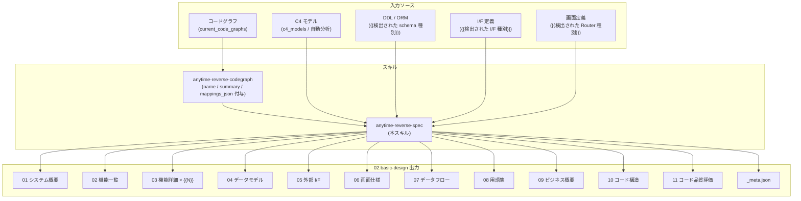

# 基本設計書 INDEX

<!--
ガイダンス: 冒頭 2〜3 段落で「このリポジトリが何を解決するシステムか」「11 章構成の役割分担」を要約する。
- repo name / Container 数 / 検出 I/F 数 / 機能（コミュニティ）数 を数字で根拠付ける
- 「自動生成 + 手動更新」の運用前提に触れる
- 章 1〜8 が機能設計、章 9 が業務、章 10〜11 がコード構造/品質という縦軸を示す
-->

`{{repoName}}` の基本設計書は、Trail DB のコードグラフコミュニティ・C4 モデル・データ永続化スキーマ・外部 I/F・画面定義から自動生成される 11 章構成のドキュメントセットである。

{{機能数 / Container 数 / I/F 数 / テーブル数 のサマリを 1 段落で記述}}

## 1. 章構成

| # | ファイル | 内容 |
| ---: | --- | --- |
| 1 | [01-system-overview.ja.md](01-system-overview.ja.md) | システム全体の構成と {{N}} コンテナの責務 |
| 2 | [02-feature-list.ja.md](02-feature-list.ja.md) | コミュニティ検出から抽出した {{N}} 機能の一覧 |
| 3 | [03.feature-detail/](03.feature-detail/) | 機能ごとの詳細設計（コミュニティ単位、{{N}} ファイル） |
| 4 | [04-data-model.ja.md](04-data-model.ja.md) | {{検出された DB 種別}} のデータモデル |
| 5 | [05-interface.ja.md](05-interface.ja.md) | {{検出された I/F プロトコル横断}} の I/F 仕様 |
| 6 | [06-screen.ja.md](06-screen.ja.md) | 画面一覧と主操作の画面遷移図 |
| 7 | [07-data-flow.ja.md](07-data-flow.ja.md) | 画面 → I/F → 機能 → DB の縦断データフロー |
| 8 | [08-glossary.ja.md](08-glossary.ja.md) | 用語集 |
| 9 | [09-business-overview.ja.md](09-business-overview.ja.md) | 業務目的・業務トランザクション・業務辞書・業務コンテキスト |
| 10 | [10-code-structure.ja.md](10-code-structure.ja.md) | ビルドシステム・モジュール階層・デザインパターン・主要ファイル・外部依存 |
| 11 | [11-code-quality.ja.md](11-code-quality.ja.md) | テスト・Lint / CI/CD・技術的負債・パターン / アンチパターン |

> [!NOTE]
> 章 9〜11 は AWS Labs の [aidlc-workflows](https://github.com/awslabs/aidlc-workflows) reverse-engineering ステージ（business-overview / code-structure / code-quality-assessment）と相互参照可能。生成メタデータは `_meta.json` に出力される。

## 2. 想定読者と読み方ガイド

| 想定読者 | 推奨読み順 |
| --- | --- |
| プロジェクト初参加者 | 9 → 1 → 2 → 3（興味のある機能のみ）→ 8 |
| バックエンド設計レビュアー | 1 → 4 → 5 → 7 → 3（DB / I/F に関連する機能） |
| フロントエンド設計レビュアー | 1 → 2 → 6 → 3（画面系機能）→ 7 |
| データフロー監査 | 7 → 4 → 5 → 3（関連機能） |
| 事業 / プロダクト企画 | 9 → 2 → 6 |
| コード品質 / アーキ監査 | 10 → 11 → 1 → 4 |

## 3. 生成プロセス

## 4. 自動生成と手動更新の運用

- 生成スキル: `anytime-reverse-spec`（`~/.claude/skills/anytime-reverse-spec/SKILL.md`）
- 入力: Trail DB（`current_code_graphs` / `current_code_graph_communities`）+ リポジトリの schema / I/F / 画面ファイル
- AI 呼び出し: Sonnet（章 3 機能詳細・章 4 ER 図補足・章 5 用途文・章 6 画面要約・章 8 用語集・章 9 業務概要・章 10 コード構造・章 11 コード品質）+ Haiku（章 6 画面 1 文要約・抽出パイプライン・章 10 ビルドシステム検出・章 11 静的指標集計）
- 再生成: `/anytime-reverse-spec chapter=all mode=wash-away` で全章再生成、`mode=additive` で既存ファイル保護

## 5. 既知の制約

<!--
ガイダンス: 本ドキュメントセットの自動生成上の制約を列挙する。
- カバレッジ未充足のコミュニティ（name 未付与）
- C4 モデル要素の description フィールド欠落
- 画面検出が 0 件のバックエンド寄りプロジェクトでの章 6 縮退
等を実情報で書く。
-->

- 章 3 の対象は name / summary / mappings_json が付与された {{N}} コミュニティのみ
- 残 {{M}} 件のコミュニティ（うち {{K}} 件はサイズ 1 の単独ファイル）は本設計書では機能として扱わない
- {{C4 モデル / 画面検出の制約があれば記述}}
