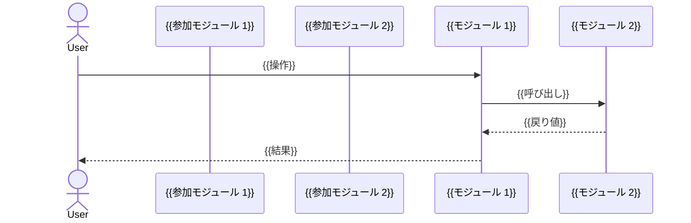

# 機能設計書: {{communityName}}

<!-- 生成ガイダンス: 章番号は ## 1.〜## 8. で固定。`<!-- ガイダンス: -->` コメントは出力に残さない。frontmatter のプレースホルダ（{{...}}）は実値で置換する。 -->


## 1. 目的とスコープ


### 1.1 目的

<!--
ガイダンス: コミュニティ summary をそのまま貼らず、以下を 2〜4 段落で展開する。
- 背景: なぜこの機能が存在するか（解決対象の課題）
- アプローチ: どう解決しているか（コアモジュール構成の要約）
- 受益者: 誰に価値を届けるか（trail-viewer / web-app / VS Code 拡張 / MCP クライアント 等）
- 構造的視点: allMembers のパッケージ分布から「N パッケージが連携してこの機能を構成」のような俯瞰を含める

NG: summary をコピーするだけ / 関数名の羅列で終わる
-->


### 1.2 想定読者

<!--
ガイダンス: この設計書を「誰が何のために読むか」を表形式で 2〜4 項目列挙する。
パッケージ構成・関連 I/F から自然に導出可能な役割のみ採用する。
-->

| 役割 | 読む目的 |
| --- | --- |
| {{役割1}} | {{目的1}} |
| {{役割2}} | {{目的2}} |


### 1.3 スコープ

<!--
ガイダンス: allMembers と mappings の境界、隣接コミュニティとの責務分担を根拠に
「含む / 含まない」を表で明示する。「含まない」側は隣接コミュニティへの委譲を書く。
-->

| 含む | 含まない |
| --- | --- |
| {{この機能が担う責務 1}} | {{隣接コミュニティが担う責務 1}} |
| {{この機能が担う責務 2}} | {{隣接コミュニティが担う責務 2}} |


## 2. ユースケース / シナリオ

<!--
ガイダンス: 主要関数・関連 I/F・関連 DB の組み合わせから推定可能なシナリオを 2〜4 件記述する。
各シナリオは「誰が・いつ・どのトリガで開始し、内部でどのモジュールが連携するか」を 1 段落 + sequenceDiagram 1 枚で示す。
コードから推定できないユースケースは書かない。
-->


### 2.1 {{シナリオ1: 主要ユースケース名}}

{{誰が（actor）・いつ（trigger）・何のために（goal）開始し、どのコンポーネントが順に呼ばれるかを 3〜6 行で記述}}




### 2.2 {{シナリオ2: 副ユースケース名}}

{{同様の形式で 3〜6 行 + 必要に応じて sequenceDiagram}}


## 3. 設計概要


### 3.1 構成パッケージ / モジュール

<!--
ガイダンス: allMembers をパッケージ × モジュールで集約し、各パッケージ内モジュールの役割を 1 文で記述する。
メンバー数（ファイル数）は構造的な重みを示すために併記する。
-->

| パッケージ | モジュール | 役割 | メンバー数 |
| --- | --- | --- | ---: |
| {{pkg-name}} | {{module}} | {{役割の 1 文要約}} | {{N}} |


### 3.2 主要関数

<!--
ガイダンス: 各 topMembers ファイル（fanIn 上位 10 件）から「公開 export かつ被参照のある関数」を Serena `find_symbol` で抽出する。
各ファイル最大 3 個・合計 30 個以内。
シグネチャは引数型と戻り値型を要約形式で書く（HTML エスケープ: `<` → `&lt;` / `>` → `&gt;`）。
-->

| ファイル | 関数名 | シグネチャ | 役割 |
| --- | --- | --- | --- |
| {{relative/path.ts}} | `{{fn}}` | `{{(args): RetType}}` | {{1 文要約}} |


### 3.3 内部フロー

<!--
ガイダンス: fanIn 上位ファイル間の依存関係を mermaid flowchart で図示する。
- ノード数 15 個以内
- ラベル内 HTML タグは <br/> のみ可（strict モード）
- 線種は実線（メインフロー） / 点線（補足・非同期）を使い分ける
- 描画幅 900px 以内になるよう TD / LR を選択
-->

```mermaid
flowchart TD
    {{ノード定義}}
    {{接続定義}}
```


## 4. 入出力 I/F


### 4.1 入力

<!--
ガイダンス: 主要関数の引数型からデータ供給源を導出する。
- 同期: 関数引数として渡されるドメイン型
- 非同期: DB 経由・外部 I/F 経由（[I/F: <name>](../05-interface.ja.md#<name>) 形式でアンカーリンク）
- 設定値: 環境変数・VS Code 設定の場合は明示
-->

| 入力 | 型 | 供給元 |
| --- | --- | --- |
| {{引数名}} | `{{Type}}` | {{呼び出し元 or [I/F: <name>](../05-interface.ja.md#<name>)}} |


### 4.2 出力

<!--
ガイダンス: 主要関数の戻り値型と副作用を明示する。
- 純粋関数なら「副作用なし」と明記
- DB 書き込み・ファイル I/O・外部 API 呼び出しがある場合は対象を [`table`](../04-data-model.ja.md#table) 形式でリンク
-->

| 出力 | 型 | 副作用 |
| --- | --- | --- |
| {{戻り値}} | `{{Type}}` | {{なし / DB 書き込み: `table` / I/O: ...}} |


## 5. 依存関係


### 5.1 Primary（主要ロジック・直接実装）

<!-- ガイダンス: mappings_json の role='primary' を持つ C4 要素を全件列挙。 -->

| C4 要素 | 役割 |
| --- | --- |
| `{{pkg_xxx/yyy}}` | {{1 文要約}} |


### 5.2 Secondary（実装上の参照）

<!-- ガイダンス: role='secondary' + allMembers の package から派生する補助モジュール。 -->


### 5.3 Dependency（被依存・外部利用側）

<!-- ガイダンス: role='dependency' を持つ要素 = この機能を「使う」側の C4 要素。 -->


## 6. 関連リソース


### 6.1 関連 DB テーブル

<!--
ガイダンス: 主要関数のボディから検出した SQL の対象テーブルを列挙。
章 4 へのアンカーリンクを必ず張る。書き込み / 読み取りの種別も併記する。
-->

| テーブル | 用途 | 操作 |
| --- | --- | --- |
| [`{{table}}`](../04-data-model.ja.md#{{table}}) | {{用途}} | {{読込 / 書込 / 読込+書込}} |


### 6.2 関連 API / MCP

<!--
ガイダンス: 章 5 の I/F 一覧と対応付ける。# アンカーリンクで結ぶ。
入出力対応関係（この機能の入力になる I/F / 出力を消費する I/F）を区別すると尚良い。
-->

| エンドポイント / ツール | 関係 | 説明 |
| --- | --- | --- |
| [{{mcp-server.tool}}](../05-interface.ja.md#{{anchor}}) | {{入力 / 出力 / 双方向}} | {{1 文}} |


### 6.3 関連設計書

<!--
ガイダンス: outputDir の親 spec/ 配下を Glob で検索し、frontmatter `c4Scope` または title に
本機能のパッケージ名（mappings 由来）を含む既存仕様書をリンクする。
- 探索対象: spec/{30,31,40,41,42,50,51,52,53,60,61}.*/*.ja.md
- 該当 0 件なら本セクション自体を省略してよい
-->

| パス | 内容 |
| --- | --- |
| [{{relative/path.ja.md}}]({{relative-link}}) | {{1 文要約}} |


## 7. 設計判断・トレードオフ

<!--
ガイダンス: コード構造から推測可能な判断のみ書く。推測できない場合はセクション内容を「-」とし、見出しは残す。
よくある判断:
- なぜ pkg-A と pkg-B に分割しているか（責務境界 / テスト容易性 / 配布単位）
- なぜインターフェース抽象を持つか（モック差替 / 多バックエンド対応）
- フレームワーク選択（例: Canvas 2D vs SVG / sql.js vs better-sqlite3）
- 同期 / 非同期戦略（例: wash-away 同期 / イベント駆動）
NG: 「設計判断 1」のようなプレースホルダを残す / 検証不能な評価語（"最適"等）を使う
-->

| 判断 | 採用根拠 | 代替案 / 棄却理由 |
| --- | --- | --- |
| {{判断 1}} | {{根拠 1}} | {{代替 / 棄却理由}} |


## 8. 制約 / 既知の課題

<!--
ガイダンス: 以下を箇条書きで:
- マッピングと実態の乖離（mappings 由来パッケージと allMembers のパッケージのジャッカード係数 < 0.3 の場合）
- 主要関数本体に TODO / FIXME / HACK のコメントが grep で見つかる場合
- 性能制約（sql.js / WSL / 外部 API レート制限）
- 非推奨 API 使用 / 将来移行予定
NG: 制約が無い場合に「特になし」で埋めない。本当に無ければセクション自体を省略する。
-->

- {{制約 / 課題 1}}
- {{制約 / 課題 2}}
