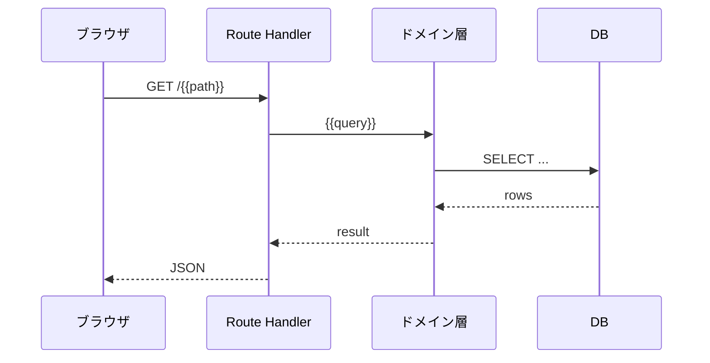
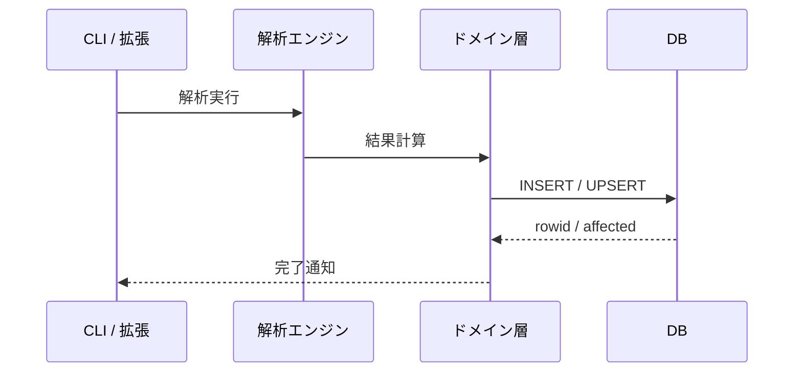
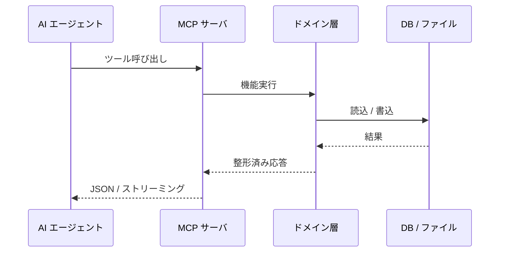
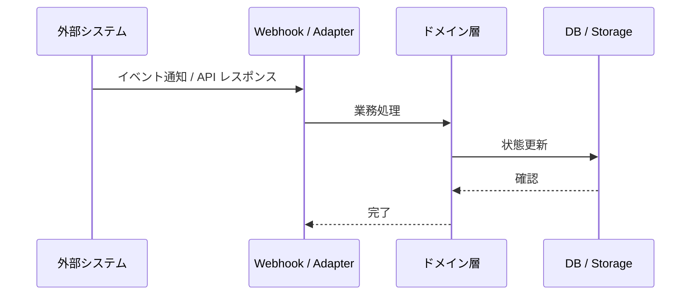

# データフロー


## 1. 概要

<!--
ガイダンス: 画面（章 6）→ I/F（章 5）→ 機能（章 3）→ DB（章 4）の連結を集約する目的を 1〜2 段落で記述する。
- 個別ノード数が多くなる場合は Container 単位に集約する判断基準を明示
- 機能 ≤ 30 件・I/F ≤ 30 件・テーブル ≤ 30 件なら個別ノードでも可。それ以上は集約版を主とする

# 章番号の安定化ルール（重要）
本テンプレでは 1〜7 番のセクションを固定で出力する:
1 概要
2 Container 単位の俯瞰図
3 機能 → DB テーブルのマッピング
4 外部 I/F → 機能のマッピング
5 画面 → I/F → 機能 → DB の縦断
6 主要なエンドツーエンドシナリオ
7 注記

検出 0 件のセクションでも **見出しは削除せず、本文を「(該当なし)」と書く**こと。
（画面 0 件のプロジェクトでも §5 は残して「(画面 0 件のため適用外)」と書く）
理由: 章番号や見出し集合が変わると evaluate=true で過去 commit と Jaccard 比較した際に
heuristic completeness が大幅低下するため (golden completeness 0.42 の事例あり)。
-->

> [!NOTE]
> 本章は画面（章 6）→ 外部 I/F（章 5）→ 機能（章 3）→ DB（章 4）の連結を集約表示する。\
> ノード数（機能 {{F}} + I/F {{I}} + テーブル {{T}}）の合計が過密になるため、Container 単位の俯瞰図を主とし、機能単位の詳細リンクを併記する。


## 2. Container 単位の俯瞰図

<!--
ガイダンス: flowchart LR で「外部 I/F → アプリ層 → ドメイン層 → 永続化層」の 4 段構造を描く。
- subgraph: IF / App / Domain / Data
- エッジは集約済み（pkg→pkg レベル）
- ノード数 15 個以内
- 描画幅 900px 以内
-->

```mermaid
flowchart LR
    subgraph IF["外部 I/F"]
        {{ifNodes}}
    end

    subgraph App["アプリ層"]
        {{appNodes}}
    end

    subgraph Domain["ドメイン層"]
        {{domainNodes}}
    end

    subgraph Data["永続化層"]
        {{dataNodes}}
    end

    {{edges}}
```


## 3. 機能 → DB テーブルのマッピング

<!--
ガイダンス: 章 3 の各機能設計書「## 6.1 関連 DB テーブル」を逆引きして集約する。
「主に書く DB」「主に読む DB」の 2 列に分けると性能観点でわかりやすい。
-->

> [!NOTE]
> 詳細は章 3 の各機能設計書「## 6.1 関連 DB テーブル」セクションを参照。本章では集約のみ示す。

| 機能カテゴリ | 主に書く DB | 主に読む DB |
| --- | --- | --- |
| {{カテゴリ}} | `{{table_write}}` | `{{table_read}}` |


## 4. 外部 I/F → 機能のマッピング

<!--
ガイダンス: 章 3 の各機能設計書「## 6.2 関連 API / MCP」を逆引きして集約する。
I/F 系統（mcp-cms / mcp-graph / REST 等）→ 主な対応機能 のマッピング表。
-->

> [!NOTE]
> 詳細は章 3 の各機能設計書「## 6.2 関連 API / MCP」セクションを参照。

| I/F 系統 | 主な対応機能 |
| --- | --- |
| `{{ifKind}}` | {{機能一覧}} |


## 5. 画面 → I/F → 機能 → DB の縦断

<!--
ガイダンス: 画面検出が 0 件のプロジェクトでも本章は残し、本文に「(画面 0 件のため適用外)」と書く。
画面ファイル内の fetch / axios / tRPC client から章 5 の I/F を逆引きし、
画面 → I/F → 機能 → DB の 4 段マッピング表を作る。
-->

| 画面 ID | 呼ぶ I/F | 経由する機能 | 触る DB |
| --- | --- | --- | --- |
| `screen.{{slug}}` | [{{I/F}}](05-interface.ja.md#{{anchor}}) | [{{機能}}](03.feature-detail/feature-{{slug}}.ja.md) | `{{table}}` |


## 6. 主要なエンドツーエンドシナリオ

<!--
ガイダンス: 検出された I/F + 機能 + DB の組み合わせから「典型的な利用フロー」を sequenceDiagram で記述する。

# シナリオ archetype の固定（重要）
6.1〜6.4 は **以下の固定 archetype 名** から該当するものを順番に採用する:

- **6.1 オンライン参照シナリオ (Web 画面 → REST → 機能 → DB 読込)**
  例: ダッシュボード閲覧 / 一覧画面表示 / 詳細ページ閲覧
  該当する fetch / SWR / route handler 経路が無ければ「(該当なし)」と書く

- **6.2 バッチ書き込みシナリオ (拡張 / CLI → 解析 → DB 永続化)**
  例: コード解析実行 / インポート / マイグレーション
  該当する CLI コマンド / VS Code コマンドが無ければ「(該当なし)」と書く

- **6.3 AI 連携シナリオ (MCP ツール → 機能 → DB / ファイル操作)**
  例: メモリ検索 / ツール呼び出し / ストリーミング応答
  該当する MCP ツールが無ければ「(該当なし)」と書く

- **6.4 外部連携シナリオ (Webhook / S3 / 外部 API → 状態更新)**
  例: Webhook 受信 / S3 アップロード / 外部 API ポーリング
  該当する外部連携が無ければ「(該当なし)」と書く

シナリオ archetype を勝手に置き換え・追加・削除しない。
理由: シナリオ見出し名が run ごとに変わると heuristic 見出し Jaccard が崩れ
heuristic completeness が大幅低下するため (golden vs candidate で 6.1〜6.4 のタイトルが
全件不一致になり design 0.29 / completeness 0.42 まで落ちた事例あり)。

各シナリオの sequenceDiagram は:
- 参加者は最大 6 個まで
- 4 段構造 (Source / I/F / Domain / Store)
- メッセージラベルは動詞 + 名詞 ("解析実行" "結果保存" 等)
-->


### 6.1 オンライン参照シナリオ (Web 画面 → REST → 機能 → DB 読込)

<!-- 該当なしなら sequenceDiagram の代わりに「(該当なし)」と書く -->




### 6.2 バッチ書き込みシナリオ (拡張 / CLI → 解析 → DB 永続化)

<!-- 該当なしなら sequenceDiagram の代わりに「(該当なし)」と書く -->




### 6.3 AI 連携シナリオ (MCP ツール → 機能 → DB / ファイル操作)

<!-- 該当なしなら sequenceDiagram の代わりに「(該当なし)」と書く -->




### 6.4 外部連携シナリオ (Webhook / S3 / 外部 API → 状態更新)

<!-- 該当なしなら sequenceDiagram の代わりに「(該当なし)」と書く -->




## 7. 注記

- 章 3 の各機能設計書には「関連 DB テーブル」「関連 API / MCP」セクションがあり、機能とテーブル / I/F の接続は機能ファイル側で詳細化される
- 本章の集約図は俯瞰用途。個別機能のフロー詳細は機能設計書側を正とする
