# Anytime Markdown


[日本語](https://github.com/anytime-trial/anytime-markdown/blob/master/README.ja.md) | [English](https://github.com/anytime-trial/anytime-markdown/blob/master/README.md)

**コードも文書も AI も見える化する。**

AI エージェントは、苛酷な砂漠（開発環境）を往くキャラバン。\
Markdown の WYSIWYG 編集・差分レビュー、TypeScript プロジェクトのリアルタイム可視化、そして AI セッションの一元管理で、その旅路を安全に見守り導く ― AI 時代の羅針盤となる **3 つの VS Code 拡張** です。

[**Web サイトを見る**](https://www.anytime-trial.com)

## 3 つの VS Code 拡張

### Anytime Trail — 構造・品質・行動の可視化

TypeScript プロジェクトを 1 コマンドで解析し、コードベース・AI 行動・プロジェクト品質をリアルタイムに可視化する VS Code 拡張機能。\
ブラウザのライブビューアで構造を確認しながらコーディングできる。

- **構造の可視化**: C4 アーキテクチャ図と DSM（依存構造マトリクス）を自動生成。L1（システムコンテキスト）〜 L4（コード）の 4 段階でドリルダウン、循環依存は赤枠でハイライト
- **行動の可視化**: ユーザー入力・AI 応答・ツール実行を 1 ターンずつ階層ツリーで可視化。ターンタイムラインと連動した会話ツリーで AI エージェントの判断を時系列で追跡
- **品質の可視化**: エラー発生数・リトライ率・ビルド/テスト失敗率・カバレッジを C4 図にヒートマップで重ね、構造の中で品質弱点を特定
- **生産性の可視化**: トークン消費・推定コスト・キャッシュヒット率・Four Keys（DORA）指標で AI エージェントの投資対効果を定量評価

> 詳細: [Anytime Trail README](packages/vscode-trail-extension/README.ja.md)

### Anytime Markdown — WYSIWYG 編集と差分レビュー

Tiptap / ProseMirror ベースの WYSIWYG マークダウンエディタ。\
Web ・ VS Code ・ Android の 3 プラットフォームで同じ編集体験を提供する。

- **AI の足跡をレビュー**: AI が編集した箇所を色付きで表示し、セクション単位の差分比較で変更点を即把握。確定済みセクションはロックして AI の再編集を防止
- **3 モード瞬時切替**: WYSIWYG ・ ソース ・ レビューの 3 モードをワンクリックで切替。レビューモードは読み取り専用で AI 出力の集中レビューに最適
- **図表の即時プレビュー**: Mermaid ・ PlantUML ・ 数式（KaTeX）をエディタ内で直接プレビュー。コンテキストスイッチなしで完結
- **画像アノテーション**: 矩形・円・線・テキストで画像に直接注釈を追加。Agent Note にスクリーンキャプチャを貼り付けて AI に視覚コンテキストを共有
- **スラッシュコマンド**: 「/」入力で見出し・表・コードブロック・図表・テンプレートを素早く挿入
- **Git サイドバー**: 変更一覧・コミットグラフ・タイムラインをサイドバーに統合
- **インラインコメント / アウトライン / 脚注 / セクション自動番号 / 検索・置換**
- 日本語 / 英語 対応

### Anytime Agent — AI セッションの可視化と引き継ぎ

複数の Claude Code / Codex セッションを worktree・ブランチをまたいで一覧し、肥大化したセッションを文脈ごと引き継ぐ VS Code 拡張機能。\
VS Code から離れずにキャラバン全体の隊列を把握できる。

- **Agent マッピング**: すべての Claude Code / Codex セッションを最近のアクティビティ順で一覧。ブランチ・worktree・コミット情報をホバーで確認し、コンテキストトークンが閾値を超えたセッションには引き継ぎ推奨の警告バッジを表示
- **セッション引き継ぎ**: 肥大化したセッションを作業の圧縮要約ごと新セッションへ移行。ターミナルへのワンクリック起動と引き継ぎドキュメントのコピーに対応
- **AI ノート**: 画像・表・自由記述のメモを AI に共有し、画面を直接見られない AI へ視覚コンテキストを渡す。ノートはワークスペースの `.anytime/notes/` に保存
- **同梱スキル**: ワークスペースの `.claude/skills/` へ `anytime-note` ・ `anytime-cross-review` ・ `anytime-dev-cycle` 等の Claude Code スキルを自動配置
- **トークン予算**: 日次・セッション単位のトークン上限と警告閾値を設定可能

> 詳細: [Anytime Agent README](packages/vscode-agent-extension/README.ja.md)

## MCP サーバー

AI エージェントがプロジェクトの資産に直接アクセスするための MCP（Model Context Protocol）サーバー群。

| サーバー | 機能 |
| --- | --- |
| `mcp-markdown` | Markdown の読み書き・セクション操作・差分計算 |
| `mcp-graph` | グラフドキュメントの CRUD ・ SVG / draw.io エクスポート |
| `mcp-trail` | C4 モデル・DSM の操作、要素・グループ・関係の管理 |
| `mcp-cms` | S3 上のドキュメント・レポートの管理 |
| `mcp-cms-remote` | Cloudflare Workers 経由のリモート CMS アクセス |

## プロジェクト構成

```mermaid
flowchart TD
    subgraph core ["共有ライブラリ"]
        MV["markdown-viewer<br/>(エディタ基盤)"]
        MR["markdown-rich<br/>(図表描画・基盤の派生)"]
        GC["graph-core<br/>(グラフエンジン)"]
        TC["trail-core<br/>(TypeScript 解析・C4・DSM)"]
        CC["cms-core<br/>(S3 クライアント)"]
        AC["agent-core<br/>(AI セッション状態)"]
        SC["spreadsheet-core<br/>trace-core"]
        DC["database-core<br/>(SQLite アクセス)"]
    end

    subgraph vendor ["ベンダリング"]
        MC["markdown-core<br/>(vendored tiptap)"]
    end

    subgraph viewer ["ビューア (Web 埋め込み)"]
        TV["trail-viewer"]
        GV["graph-viewer"]
        SV["spreadsheet-viewer"]
        CV["cooccurrence-viewer"]
        DV["database-viewer"]
    end

    subgraph app ["アプリケーション"]
        WA["web-app<br/>(Next.js · Capacitor Android ビルドを兼ねる)"]
    end

    subgraph ext ["VS Code 拡張機能"]
        VME["vscode-markdown-extension"]
        VTE["vscode-trail-extension"]
        VAE["vscode-agent-extension"]
        VGE["vscode-graph-extension"]
        VDE["vscode-database-extension"]
        VSE["vscode-sheet-extension<br/>vscode-history-extension"]
        VEP["vscode-extension-pack"]
    end

    subgraph mcp ["MCP サーバー"]
        MM["mcp-markdown"]
        MG["mcp-graph"]
        MT["mcp-trail"]
        MCM["mcp-cms<br/>mcp-cms-remote"]
    end

    MR --> MV
    MV --> MC
    TV --> TC
    GV --> GC
    SV --> SC
    CV --> GC
    DV --> DC
    WA --> MR
    WA --> MV
    WA --> TV
    WA --> GV
    WA --> CV
    WA --> CC
    VME --> MR
    VME --> MV
    VGE --> GC
    VGE --> CV
    VTE --> TC
    VTE --> TV
    VAE --> AC
    VDE --> DV
    VDE --> TC
    VSE --> SV
    MM --> MV
    MG --> GC
    MT --> TC
    MCM --> CC
```



矢印は各 `package.json` の内部依存（`@anytime-markdown/*`）に基づく。例外は `vscode-trail-extension → trail-viewer` で、これは webpack のバンドル時依存であり `package.json` には現れない。

### markdown 系パッケージの役割

`markdown-` を接頭辞に持つパッケージは 7 つあり、**名前から依存の向きが読み取れない**。土台は `markdown-viewer` で、`markdown-rich` はその上に図表描画を足した派生である（その逆ではない）。

| パッケージ | 役割 | 内部依存 |
| --- | --- | --- |
| `markdown-viewer` | **エディタ基盤**。TipTap 拡張の組み立て・mount API・vanilla UI・i18n・ファイルシステム抽象。名前に反して read-only ビューアではない | `markdown-core` |
| `markdown-rich` | `markdown-viewer` に **mermaid / katex / plantuml / plotly / jsxgraph の描画を足した派生**。重量依存をここへ隔離し、基盤側を軽量に保つ | `markdown-viewer` |
| `markdown-core` | vendored tiptap。自作コードではなく、バンドラ・tsconfig のエイリアス経由で参照する | なし |
| `markdown-engine` | markdown テキスト処理（整形・差分・セクション解析・サニタイズ）。エディタに依存しない | なし |
| `markdown-react-islands` | web-app 向けの React ラッパ。エディタ本体は React-free で、React が要る箇所だけをここに隔離する | `markdown-viewer` |
| `markdown-view` | 公開ラッパ。`<anytime-markdown-view>`（図表あり）を登録する | `markdown-rich` |
| `markdown-view-lite` | 公開ラッパ。`<anytime-markdown-view>`（図表なし）を登録する | `markdown-viewer` |

配布する Web Component は次の 3 つで、いずれも同じ属性・プロパティ・イベントの I/F を持つ。

| タグ | 登録元 | 図表描画 | 編集 |
| --- | --- | --- | --- |
| `<anytime-markdown-editor>` | `markdown-viewer/element` | なし | あり |
| `<anytime-markdown-rich-editor>` | `markdown-rich/element` | あり | あり |
| `<anytime-markdown-view>` | `markdown-rich` または `markdown-view-lite` | 登録元による | なし（read-only） |

`<anytime-markdown-view>` は同一タグの軽量／同梱の双子で、どちらを import したかで描画能力が決まる。両方を同一ページで読み込むと先に登録されたほうが有効になる。

## 前提条件

- WSL2（Windows の場合）
- Docker Desktop（WSL2 バックエンド）
- VS Code + [Dev Containers 拡張機能](https://marketplace.visualstudio.com/items?itemName=ms-vscode-remote.remote-containers)
- Android Studio（Android アプリをビルドする場合）

## 開発環境のセットアップ

### Dev Container を使う場合（推奨）

1. WSL2 上でリポジトリをクローンする
2. VS Code でリポジトリを開く
3. コマンドパレット → 「Dev Containers: Reopen in Container」を実行

> 初回はコンテナのビルドと `npm install` が自動実行される。\
> ポート `3000` は自動フォワードされる。

```bash
# 開発サーバーを起動
cd packages/web-app
npm run dev
```

ブラウザで http://localhost:3000 にアクセスする。

### Docker を手動で使う場合

```bash
# 1. コンテナをビルド・起動
docker compose up -d

# 2. コンテナ内に入る
docker compose exec anytime-markdown bash

# 3. 依存パッケージをインストール
npm install

# 4. 開発サーバーを起動
cd packages/web-app
npm run dev
```

ブラウザで http://localhost:3000 にアクセスする。
