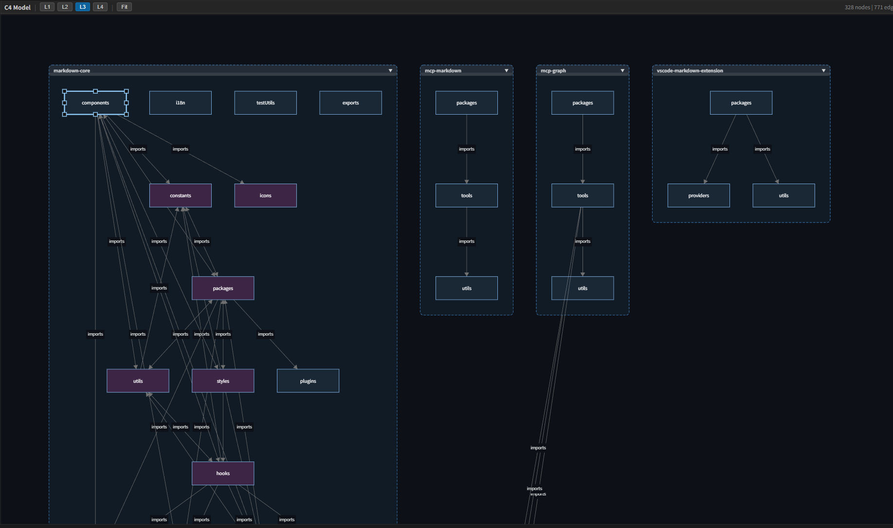

# Anytime Markdown

[](https://marketplace.visualstudio.com/items?itemName=anytime-trial.anytime-extension-pack)[](https://marketplace.visualstudio.com/items?itemName=anytime-trial.anytime-extension-pack)


[日本語](https://github.com/anytime-trial/anytime-markdown/blob/master/README.ja.md) | [English](https://github.com/anytime-trial/anytime-markdown/blob/master/README.md)

**Code, docs, and AI — made visible.**

AI agents are a caravan crossing the harsh terrain of development.\
WYSIWYG Markdown editing with diff review, real-time TypeScript architecture visualization, and unified AI session management — **three VS Code extensions** that serve as your compass in the age of AI.


[**Visit the website**](https://www.anytime-trial.com)

Or open the [browser-based Markdown editor](https://www.anytime-trial.com/en/markdown) — no install, no sign-up. Syntax guides:
[Mermaid](https://www.anytime-trial.com/en/markdown/mermaid) ·
[PlantUML](https://www.anytime-trial.com/en/markdown/plantuml) ·
[KaTeX](https://www.anytime-trial.com/en/markdown/katex) ·
[Diff](https://www.anytime-trial.com/en/markdown/diff) ·
[Tables](https://www.anytime-trial.com/en/markdown/table)


## Quick Start

Three ways in, from lightest to heaviest. Only the third one needs WSL2 and Docker — installing the extensions does not.


### 1. Try it in the browser

No install, no sign-up: [the Markdown editor runs on the web](https://www.anytime-trial.com/en/markdown).


### 2. Install the VS Code extensions

All seven at once, via the extension pack:

```bash
code --install-extension anytime-trial.anytime-extension-pack
```

Or pick individual ones:

| Extension | What it does | Install |
| --- | --- | --- |
| [Anytime Markdown](https://marketplace.visualstudio.com/items?itemName=anytime-trial.anytime-markdown) | WYSIWYG Markdown editor with live preview, diagrams, and diff review | `code --install-extension anytime-trial.anytime-markdown` |
| [Anytime Trail](https://marketplace.visualstudio.com/items?itemName=anytime-trial.anytime-trail) | C4 / DSM architecture visualization and AI session dashboard | `code --install-extension anytime-trial.anytime-trail` |
| [Anytime Agent](https://marketplace.visualstudio.com/items?itemName=anytime-trial.anytime-agent) | Status panels for Claude Code sessions and Ollama backends | `code --install-extension anytime-trial.anytime-agent` |
| [Anytime Graph](https://marketplace.visualstudio.com/items?itemName=anytime-trial.anytime-graph) | Co-occurrence network editor | `code --install-extension anytime-trial.anytime-graph` |
| [Anytime History](https://marketplace.visualstudio.com/items?itemName=anytime-trial.anytime-history) | Git staging, commit graph, and timeline | `code --install-extension anytime-trial.anytime-history` |
| [Anytime Sheet](https://marketplace.visualstudio.com/items?itemName=anytime-trial.anytime-sheet) | Spreadsheet editor for `.sheet`, `.csv`, and `.tsv` | `code --install-extension anytime-trial.anytime-sheet` |
| [Anytime Database](https://marketplace.visualstudio.com/items?itemName=anytime-trial.anytime-database) | Browse and query SQLite databases | `code --install-extension anytime-trial.anytime-database` |


### 3. Build from source

For contributors, and for running the web app locally — see [Development Setup](#development-setup) below. This is the only path that needs WSL2 and Docker.


## Three VS Code Extensions


### Anytime Trail — Visualize Structure, Quality, and Behavior

A VS Code extension that analyzes a TypeScript project with a single command and visualizes the codebase, AI behavior, and project quality in real time.\
Code while inspecting structure in a live browser viewer.

- **Structure visualization**: Auto-generate C4 architecture diagrams and a DSM (Dependency Structure Matrix). Drill down across four levels (L1 System Context to L4 Code), with circular dependencies highlighted in red
- **Behavior visualization**: Visualize user input, AI responses, and tool executions turn by turn as a hierarchical tree. A conversation tree synced with the turn timeline traces what the AI agent decided, when, and why
- **Quality visualization**: Overlay error counts, retry rates, build/test failure rates, and coverage as a heatmap on the C4 diagram to locate weak spots within the structure
- **Productivity visualization**: Quantify AI agent ROI with token consumption, estimated cost, cache hit rate, and Four Keys (DORA) metrics



> [**Install Anytime Trail**](https://marketplace.visualstudio.com/items?itemName=anytime-trial.anytime-trail) · [Details](packages/vscode-trail-extension/README.md)


### Anytime Markdown — WYSIWYG Editing and Diff Review

A WYSIWYG Markdown editor built on Tiptap / ProseMirror.\
The same editing experience across three platforms: Web, VS Code, and Android.

- **Review AI's footprints**: AI-edited sections are color-highlighted for instant section-level diff comparison. Lock finalized sections to prevent AI from re-editing them
- **Instant 3-mode switching**: Switch between WYSIWYG, Source, and Review modes with a single click. Review mode is read-only — perfect for focused review of AI output
- **Diagram preview in-editor**: Render Mermaid, PlantUML, and math (KaTeX) directly in the editor. No context switching needed
- **Image annotation**: Add rectangles, circles, lines, and text directly on images. Paste screen captures into Agent Note to share visual context with the AI
- **Slash commands**: Quickly insert headings, tables, code blocks, diagrams, and templates by typing "/"
- **Git sidebar**: Change list, commit graph, and timeline integrated in the sidebar
- **Inline comments / outline / footnotes / automatic section numbering / find & replace**
- Japanese / English support

> [**Install Anytime Markdown**](https://marketplace.visualstudio.com/items?itemName=anytime-trial.anytime-markdown) · [Details](packages/vscode-markdown-extension/README.md)


### Anytime Agent — Visualize and Hand Off AI Sessions

A VS Code extension that lists every Claude Code / Codex session across worktrees and branches, and hands off bloated sessions along with their context.\
See the whole caravan without leaving VS Code.

- **Agent mapping**: List all Claude Code / Codex sessions ordered by recent activity. Inspect branch, worktree, and commit details on hover; sessions whose context tokens exceed the threshold get a handoff-recommended warning badge
- **Session handoff**: Migrate a bloated session to a new one along with a compacted summary of the work. Launch it in a terminal with one click, or copy the handoff document
- **AI Note**: Share images, tables, and free-form notes with AI tools that cannot see your screen. Notes are stored in the workspace under `.anytime/notes/`
- **Bundled skills**: Automatically install Claude Code skills such as `anytime-note`, `anytime-cross-review`, and `anytime-dev-cycle` into the workspace `.claude/skills/`
- **Token budget**: Configure daily and per-session token limits with an alert threshold

> [**Install Anytime Agent**](https://marketplace.visualstudio.com/items?itemName=anytime-trial.anytime-agent) · [Details](packages/vscode-agent-extension/README.md)


## MCP Servers

A set of MCP (Model Context Protocol) servers that give AI agents direct access to project assets.

| Server | Capabilities |
| --- | --- |
| `mcp-markdown` | Read/write Markdown, section operations, diff computation |
| `mcp-graph` | Graph document CRUD, SVG / draw.io export |
| `mcp-trail` | C4 model and DSM operations; manage elements, groups, and relationships |
| `mcp-cms` | Document and report management on S3 |
| `mcp-cms-remote` | Remote CMS access via Cloudflare Workers |


## Project Structure

```mermaid
flowchart TD
    subgraph core ["Shared Libraries"]
        MV["markdown-editor<br/>(Editor foundation)"]
        MR["markdown-rich-editor<br/>(Diagram rendering · derived)"]
        GC["graph-core<br/>(Graph engine)"]
        TC["trail-activity<br/>(TypeScript analysis · C4 · DSM)"]
        CC["cms-core<br/>(S3 client)"]
        AC["agent-core<br/>(AI session state)"]
        SC["spreadsheet-core<br/>trace-core"]
        DC["database-core<br/>(SQLite access)"]
    end

    subgraph vendor ["Vendored"]
        MC["markdown-core<br/>(vendored tiptap)"]
    end

    subgraph viewer ["Viewers (Web Embed)"]
        TV["trail-viewer"]
        GV["graph-viewer"]
        SV["spreadsheet-viewer"]
        CV["cooccurrence-viewer"]
        DV["database-viewer"]
    end

    subgraph app ["Applications"]
        WA["web-app<br/>(Next.js · also builds the Capacitor Android app)"]
    end

    subgraph ext ["VS Code Extensions"]
        VME["vscode-markdown-extension"]
        VTE["vscode-trail-extension"]
        VAE["vscode-agent-extension"]
        VGE["vscode-graph-extension"]
        VDE["vscode-database-extension"]
        VSE["vscode-sheet-extension<br/>vscode-history-extension"]
        VEP["vscode-extension-pack"]
    end

    subgraph mcp ["MCP Servers"]
        MM["mcp-markdown"]
        MG["mcp-graph"]
        MT["mcp-trail"]
        MCM["mcp-cms<br/>mcp-cms-remote"]
    end

    MR --> MV
    MV --> MC
    TV --> TC
    GV --> GC
    SV --> SC
    CV --> GC
    DV --> DC
    WA --> MR
    WA --> MV
    WA --> TV
    WA --> GV
    WA --> CV
    WA --> CC
    VME --> MR
    VME --> MV
    VGE --> GC
    VGE --> CV
    VTE --> TC
    VTE --> TV
    VAE --> AC
    VDE --> DV
    VDE --> TC
    VSE --> SV
    MM --> MV
    MG --> GC
    MT --> TC
    MCM --> CC
```



Arrows reflect the internal dependencies (`@anytime-markdown/*`) declared in each `package.json`. The one exception is `vscode-trail-extension → trail-viewer`, which is a webpack bundling dependency and does not appear in `package.json`.

### The markdown-* packages

Seven packages share the `markdown-` prefix. `markdown-editor` is the foundation; `markdown-rich-editor` is derived from it by adding diagram rendering — not the other way around. Because the names are similar, the table below states each package's scope and the direction of its dependencies explicitly.

| Package | Role | Internal dependency |
| --- | --- | --- |
| `markdown-editor` | **Editor foundation.** TipTap extension assembly, mount API, vanilla UI, i18n, file system abstraction. Does not include diagram rendering | `markdown-core` |
| `markdown-rich-editor` | `markdown-editor` plus **mermaid / katex / plantuml / plotly / jsxgraph rendering**. Isolates the heavy dependencies here so the foundation stays lean | `markdown-editor` |
| `markdown-core` | Vendored tiptap. Not first-party code; consumed through bundler and tsconfig aliases | none |
| `markdown-engine` | Markdown text processing (formatting, diff, section parsing, sanitization). Independent of the editor | none |
| `markdown-react-islands` | React wrappers for web-app. The editor itself is React-free; React is isolated to this package | `markdown-editor` |
| `markdown-view` | Published wrapper registering `<anytime-markdown-view>` (with diagrams) | `markdown-rich-editor` |
| `markdown-view-lite` | Published wrapper registering `<anytime-markdown-view>` (without diagrams) | `markdown-editor` |

Three Web Components are distributed. All three expose the same attribute, property, and event interface.

| Tag | Registered by | Diagrams | Editing |
| --- | --- | --- | --- |
| `<anytime-markdown-editor>` | `markdown-editor/element` | no | yes |
| `<anytime-markdown-rich-editor>` | `markdown-rich-editor/element` | yes | yes |
| `<anytime-markdown-view>` | `markdown-rich-editor` or `markdown-view-lite` | depends on which | no (read-only) |

`<anytime-markdown-view>` has lean and diagram-bundled twins under the same tag; the import you choose determines its rendering capability. If both are loaded on one page, whichever registers first wins.


## Prerequisites

- WSL2 (on Windows)
- Docker Desktop (WSL2 backend)
- VS Code + [Dev Containers extension](https://marketplace.visualstudio.com/items?itemName=ms-vscode-remote.remote-containers)
- Android Studio (if building the Android app)


## Development Setup


### Using Dev Container (Recommended)

1. Clone the repository on WSL2
2. Open the repository in VS Code
3. Command Palette -> "Dev Containers: Reopen in Container"

> On first run, the container build and `npm install` run automatically.\
> Port `3000` is auto-forwarded.

```bash
# Start the development server
cd packages/web-app
npm run dev
```

Open http://localhost:3000 in your browser.


### Using Docker Manually

```bash
# 1. Build and start the container
docker compose up -d

# 2. Enter the container
docker compose exec anytime-markdown bash

# 3. Install dependencies
npm install

# 4. Start the development server
cd packages/web-app
npm run dev
```

Open http://localhost:3000 in your browser.
