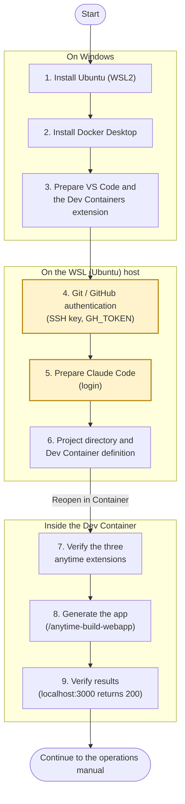

# Development Environment Setup for New Apps (anytime-build-webapp)

Generating the app itself takes a single command. The work sits before it: the authentication and the mounts that span Windows, the WSL host, and the Dev Container. If any one of them is missing, nothing fails until the container is already running and only the last step remains. So the wiring is built from the bottom layer up, and each step closes with a command that confirms it before the next begins.

The goal is the following two points.

- Claude Code can run `/anytime-build-webapp` inside a VS Code Dev Container
- The generated app responds with HTTP 200 at `http://localhost:3000`

## Overall Flow

The diagram groups steps 1-9 by where they run (Windows, WSL host, inside the Dev Container). Work top to bottom, and move on only after the verification command of the current step succeeds.



Steps 4 and 5 (highlighted) handle credentials: the SSH key, `GH_TOKEN`, and the Claude Code login. Never record their values in this manual or in the generated repository; keep them in environment variables and secret storage only.

### Scope of each step

Use this table to decide where to restart when rebuilding the environment.

| Steps | Scope | When to redo |
| --- | --- | --- |
| 1-3 | Per machine (first time only) | New machine, or WSL rebuilt from scratch |
| 4-5 | Per user (first time only) | Key or token expired, or Claude Code logged out |
| 6-9 | Per project | Every time a new app is created |

## Prerequisites

| Item | Requirement |
| --- | --- |
| OS | Windows 10 (21H2 or later) or Windows 11, with administrator rights (WSL2 is installed in step 1, Docker Desktop in step 2) |
| VS Code | Installed on Windows (WSL integration is verified in step 3) |
| Node.js | v20+ on the WSL side (used to run the Claude Code CLI; installed in step 1) |
| GitHub account | Read access to the `anytime-trial/anytime-lab` repository |
| Claude Code | Subscription or API key (log in at step 5) |

> [!IMPORTANT]
> Never write account information or token values into this document or into the generated app's repository. Handle tokens only via environment variables or secret management.

## Steps

### 1. Install Ubuntu (WSL2) — on Windows

If it is already installed, just run the version check in item 4 below and move on.

1. Install WSL and Ubuntu from an **administrator PowerShell**.

    ```powershell
    wsl --install -d Ubuntu
    ```

2. Restart Windows when prompted. Ubuntu launches automatically after the restart — set a UNIX user name and password
3. Update the WSL core.

    ```powershell
    wsl --update
    ```

4. Check the version.

    ```powershell
    wsl -l -v
    # Ubuntu must be VERSION 2
    ```

    If it is VERSION 1, convert it: `wsl --set-version Ubuntu 2`

5. Install Node.js v20+ inside Ubuntu (for the Claude Code CLI; any method such as nvm is fine).

    ```bash
    node --version   # must be v20 or later
    ```

### 2. Install Docker Desktop — on Windows

1. Download and run the installer from the [Docker Desktop official site](https://www.docker.com/products/docker-desktop/). Choose **Use WSL 2 instead of Hyper-V** in the install options
2. Start Docker Desktop and verify the WSL integration in Settings
    - **General**: `Use the WSL 2 based engine` is enabled
    - **Resources > WSL integration**: enable the `Ubuntu` toggle and **Apply & Restart**
3. Verify the integration from WSL (Ubuntu).

    ```bash
    docker info   # printing without errors means the integration works (Docker daemon running)
    ```

> [!NOTE]
> Commercial use in larger organizations (more than 250 employees or more than $10 million in annual revenue) requires a paid Docker Desktop subscription. Check the license terms if this applies. As an alternative, installing Docker Engine (docker-ce) directly inside WSL also satisfies this procedure.

### 3. Prepare VS Code and the Dev Containers extension

Run the following in a WSL (Ubuntu) terminal (the Windows-side VS Code must be launchable from WSL).

```bash
code --version       # VS Code CLI must be available
```

Install the Dev Containers extension.

```bash
code --install-extension ms-vscode-remote.remote-containers
```

### 4. Configure Git / GitHub authentication (on the WSL host)

The container mounts the host's `~/.ssh`, so keys and tokens are configured on the **host** side.

1. **Committer identity**

    ```bash
    git config --global user.name "<user name>"
    git config --global user.email "<email address>"
    ```

2. **Generate an SSH key and register it with GitHub** (required — anytime-lab is cloned over SSH)

    ```bash
    ssh-keygen -t ed25519 -C "<email address>"
    cat ~/.ssh/id_ed25519.pub
    ```

    Register the public key at GitHub Settings > SSH and GPG keys > New SSH key, then verify connectivity.

    ```bash
    ssh -T git@github.com
    # Success prints "Hi <user>! You've successfully authenticated..."
    # (the exit code is 1 because no shell is allocated — this is expected)
    ```

    > [!NOTE]
    > The anytime-build-webapp preflight check requires `ssh -T git@github.com` to exit with code 1. Seeing the message above means you are ready.

3. **Personal Access Token (GH_TOKEN)** (for the gh CLI and the GitHub MCP server)

    Issue a token at GitHub Settings > Developer settings > Personal access tokens (for classic tokens, scope `repo`). Export it in your WSL shell init file.

    ```bash
    echo 'export GH_TOKEN=<token value>' >> ~/.bashrc
    source ~/.bashrc
    ```

    Adding `"GH_TOKEN": "${localEnv:GH_TOKEN}"` to the Dev Container definition's `containerEnv` propagates it into the container automatically (see the sample in step 6).

4. **(Optional) authenticate the gh CLI**

    ```bash
    gh auth login
    gh repo view anytime-trial/anytime-lab   # verify access
    ```

### 5. Prepare Claude Code (on the WSL host)

```bash
npm install -g @anthropic-ai/claude-code
claude    # log in on first launch (subscription or API key)
```

A successful login creates `~/.claude/` on the host. Mounting this directory into the container shares the authentication state, settings, and skills with Claude Code inside the container.

### 6. Project directory and Dev Container definition

1. **Create an empty directory**

    ```bash
    mkdir -p ~/projects/<app-name>
    ```

    > [!IMPORTANT]
    > In in-place mode, the directory name (the basename of the CWD) becomes the project name as-is. Use kebab-case alphanumerics.

2. **Create `.devcontainer/devcontainer.json`**

    In-place mode of anytime-build-webapp preserves the existing `.devcontainer/`, so prepare a minimal configuration first. The sample below contains all required elements.

    ```json
    {
      "name": "<app-name>",
      "image": "mcr.microsoft.com/devcontainers/typescript-node:22",
      "remoteUser": "node",
      "mounts": [
        "source=${localEnv:HOME}/.ssh,target=/home/node/.ssh,type=bind,consistency=cached",
        "source=${localEnv:HOME}/.claude,target=/home/node/.claude,type=bind,consistency=cached"
      ],
      "containerEnv": {
        "GH_TOKEN": "${localEnv:GH_TOKEN}"
      },
      "customizations": {
        "vscode": {
          "extensions": [
            "anytime-trial.anytime-agent",
            "anytime-trial.anytime-trail",
            "anytime-trial.anytime-markdown"
          ]
        }
      },
      "forwardPorts": [3000]
    }
    ```

    Roles of the required elements:

    | Element | Role |
    | --- | --- |
    | `~/.ssh` mount | SSH authentication for cloning `anytime-lab` from inside the container |
    | `~/.claude` mount | Shares Claude Code login state, settings, and skills with the container |
    | `containerEnv.GH_TOKEN` | Propagates the host's `GH_TOKEN` into the container (gh CLI / GitHub MCP) |
    | `customizations.vscode.extensions` | Auto-installs the three anytime extensions (step 7) |
    | `forwardPorts: [3000]` | Lets the host browser reach the generated app's dev server |

3. **Start the Dev Container**

    Open the folder in VS Code and run **Dev Containers: Reopen in Container** from the command palette (`Ctrl+Shift+P`).

### 7. Verify extension installation (inside the container)

The `customizations.vscode.extensions` from step 6 auto-installs the three extensions on first container startup. To install manually, search for `anytime-trial` in the Extensions view or run `code --install-extension <ID>` inside the container.

| Extension | ID | Role |
| --- | --- | --- |
| Anytime Agent | `anytime-trial.anytime-agent` | Session list (Agent Mapping), session handoff, AI Note, bundled development skills |
| Anytime Trail | `anytime-trial.anytime-trail` | Session/commit records (Trail Viewer), C4 structure visibility, token budget monitoring |
| Anytime Markdown | `anytime-trial.anytime-markdown` | Markdown WYSIWYG editor, auto-lock while AI edits, change highlight |

On activation, the extensions set up the following automatically.

- **Agent extension**: deploys bundled skills into the workspace `.claude/skills/` — including `anytime-build-webapp`, plus `anytime-dev-cycle` (base development), `anytime-cross-review` (mutual review), `anytime-analysis` (formerly `anytime-proposal`), `anytime-loop-start` / `anytime-loop-stop` (ticket loop), `anytime-session-exit`, `anytime-dev-audit`, and `anytime-note`
- **Trail / Agent extensions**: register Claude Code hooks in `~/.claude/settings.json` (recording edit state, commits, and token consumption)

Verify the deployment.

```bash
ls .claude/skills/
# anytime-build-webapp must be present
```

> [!NOTE]
> Extensions activate when their sidebar panel is opened. If skills are not deployed, open the Anytime Agent icon in the Activity Bar once.

### 8. Generate the app (in-place mode)

Start Claude Code in a container terminal and run the skill.

```bash
claude
```

```text
/anytime-build-webapp <one-line requirement> [--no-auth | --auth=email-password | --auth=google] [--design-url <URL> | --design-file <path>]
```

The execution flow:

1. **Phase 1 (Interview)**: answer the questions on purpose, entities, auth, stack, and design
2. **Requirements approval**: a summary of the generated `requirements.md` is shown — review and approve it (the "What" approval; planning and implementation then proceed automatically)
3. **Phases 2–6**: planning → cloning and scaffolding anytime-lab → implementation → startup verification, all automatic

> [!IMPORTANT]
> In-place mode preserves the existing `.devcontainer/` and discards the anytime-lab devcontainer (which has Postgres integrated). For stacks that need a database (e.g., T3 with Prisma), provide Postgres separately.
>
> - Temporary: run `docker compose up -d db` on the WSL host (using the generated `docker-compose.yml`)
> - Permanent: rewrite `.devcontainer/devcontainer.json` to docker-compose integration (`dockerComposeFile`) and rebuild

> [!NOTE]
> Alternatively there is **--new-dir mode**. In an empty directory on the WSL host (where the Docker daemon is available), start `claude` and run `/anytime-build-webapp <requirement> --new-dir`; the project is generated together with anytime-lab's `.devcontainer/`. Then move to container development via **Reopen in Container**.

### 9. Verify results

| Check | Command / operation | Expected result |
| --- | --- | --- |
| App reachability | `curl -s -o /dev/null -w "%{http_code}" http://localhost:3000` | `200` |
| Browser | open `http://localhost:3000` in the host browser | The top page renders |
| Initial commit | `git log --oneline` | `chore: initial scaffold from anytime-lab ...` |
| Schema (T3) | verify `DATABASE_URL` in `.env`, then `npx prisma migrate dev --name init` | Migration succeeds |
| Trail extension | command palette → `Anytime Trail: Open Trail Viewer` | Viewer opens at `http://localhost:19841` |
| Agent extension | Activity Bar → Anytime Agent → Agent Mapping | The current Claude Code session is listed |

For day-to-day operation after setup (Trail visibility, reviews, session management), see the [development operations manual](../dev-operations/dev-operations.en.md).

## Troubleshooting

| Symptom | Cause | Fix |
| --- | --- | --- |
| `Permission denied (publickey)` | SSH key not registered or mount missing | Check `ssh -T git@github.com`; inside the container check `ls ~/.ssh`, review the devcontainer mounts, and rebuild |
| `docker info` fails | Docker daemon not running | Start Docker Desktop, or `sudo service docker start` inside WSL |
| `GH_TOKEN` empty inside the container | exported on the host after the container was created | After setting `~/.bashrc` on the host, restart VS Code and **Rebuild Container** |
| `/anytime-build-webapp` not in the skill list | Agent extension not activated | Open the Anytime Agent panel in the Activity Bar and check `ls .claude/skills/` |
| `Repository not found` | No access to anytime-lab | Check `gh repo view anytime-trial/anytime-lab` and request an invitation from the administrator |
| Claude Code not logged in | `~/.claude` mount missing | Add the `~/.claude` mount to the devcontainer and rebuild (log in on the host first) |
