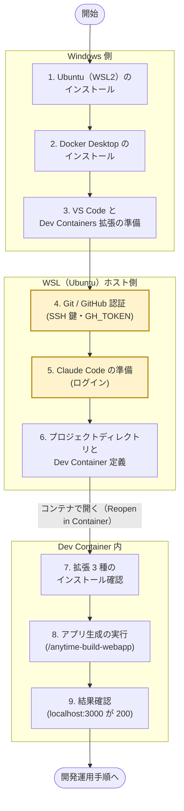

# 新規アプリ開発環境構築手順（anytime-build-webapp）

新規 Web アプリを [anytime-build-webapp](/spec/90.skill/index.ja.md) スキルで生成できる状態まで、開発環境を構築する手順を定義する。

到達点は次の 2 点である。

- VS Code Dev Container 内で Claude Code から `/anytime-build-webapp` を実行できる
- 生成されたアプリが `http://localhost:3000` で HTTP 200 を返す

## 全体フロー

手順 1〜9 を実行場所（Windows 側 / WSL 側 / Dev Container 内）で束ねた図である。手順は上から順に実行し、前の手順の確認コマンドが通ってから次へ進む。



黄色枠の手順 4・5 は認証情報（SSH 鍵・`GH_TOKEN`・Claude Code のログイン）を扱う。値は本書にも生成物にも残さず、環境変数とシークレット管理でのみ扱う。

### 手順のスコープ

再構築時にどこからやり直すかの判断材料である。

| 手順 | スコープ | 再実行が必要になる場面 |
| --- | --- | --- |
| 1〜3 | PC 単位（初回のみ） | PC を新調したとき、WSL を作り直したとき |
| 4〜5 | ユーザー単位（初回のみ） | 鍵・トークンの失効時、Claude Code のログアウト時 |
| 6〜9 | プロジェクト単位 | 新しいアプリを作るたび |

## 前提条件

| 項目 | 要件 |
| --- | --- |
| OS | Windows 10（21H2 以降）または Windows 11。管理者権限があること（WSL2 は手順 1、Docker Desktop は手順 2 で導入する） |
| VS Code | Windows にインストール済み（WSL 連携は手順 3 で確認） |
| Node.js | WSL 側に v20 以上（Claude Code CLI の実行に使用。手順 1 で導入） |
| GitHub アカウント | `anytime-trial/anytime-lab` リポジトリへの読み取りアクセス権 |
| Claude Code | サブスクリプションまたは API キー（手順 5 でログイン） |

> [!IMPORTANT]
> アカウント情報・トークン値は本書にも生成したアプリのリポジトリにも記載しない。トークンは環境変数・シークレット管理でのみ扱う。

## 手順

### 1. Ubuntu（WSL2）のインストール（Windows 側）

既にインストール済みの場合は下記 4. のバージョン確認だけ行い、次へ進む。

1. **管理者権限の PowerShell** で WSL と Ubuntu をインストールする。

   ```powershell
   wsl --install -d Ubuntu
   
   
   ```

2. 案内に従い Windows を再起動する。再起動後に Ubuntu が自動起動するので、UNIX ユーザー名とパスワードを設定する

3. WSL 本体を最新化する。

   ```powershell
   wsl --update
   
   
   ```

4. バージョンを確認する。

   ```powershell
   wsl -l -v
   # Ubuntu の VERSION が 2 であること
   
   
   ```

   VERSION が 1 の場合は WSL2 へ変換する: `wsl --set-version Ubuntu 2`

5. Ubuntu 内に Node.js v20 以上を導入する（Claude Code CLI 用。nvm 等の任意の方法でよい）。

   ```bash
   node --version   # v20 以上であること
   
   
   ```

### 2. Docker Desktop のインストール（Windows 側）

1. [Docker Desktop 公式サイト](https://www.docker.com/products/docker-desktop/)からインストーラをダウンロードして実行する。インストールオプションで **Use WSL 2 instead of Hyper-V** を選択する

2. Docker Desktop を起動し、Settings で WSL 連携を確認する

   - **General**: `Use the WSL 2 based engine` が有効であること
   - **Resources &gt; WSL integration**: `Ubuntu` のトグルを有効にして **Apply & Restart**
3. WSL（Ubuntu）側から連携を確認する。

   ```bash
   docker info   # エラーなく出力されれば連携完了（Docker daemon 稼働）
   
   
   ```

> [!NOTE]
> 一定規模以上の企業（従業員 251 人以上または年間売上 1,000 万ドル超）での商用利用は Docker Desktop の有料サブスクリプション対象である。該当する場合はライセンス条件を確認する。代替として WSL 内に Docker Engine（docker-ce）を直接インストールしても本手順は成立する。

### 3. VS Code と Dev Containers 拡張の準備

WSL（Ubuntu）ターミナルで以下を確認する（Windows 側の VS Code が WSL から起動できること）。

```bash
code --version       # VS Code CLI が使えること
```

Dev Containers 拡張をインストールする。

```bash
code --install-extension ms-vscode-remote.remote-containers
```

### 4. Git / GitHub 認証の設定（WSL ホスト側）

コンテナには WSL ホストの `~/.ssh` をマウントして認証を引き継ぐため、鍵とトークンは**ホスト側**で設定する。

1. **コミット者情報の設定**

   ```bash
   git config --global user.name "<ユーザー名>"
   git config --global user.email "<メールアドレス>"
   
   
   ```

2. **SSH 鍵の生成と GitHub 登録**（anytime-lab のクローンは SSH 経由のため必須）

   ```bash
   ssh-keygen -t ed25519 -C "<メールアドレス>"
   cat ~/.ssh/id_ed25519.pub
   
   
   ```

   公開鍵を GitHub の Settings &gt; SSH and GPG keys &gt; New SSH key に登録し、疎通を確認する。

   ```bash
   ssh -T git@github.com
   # "Hi <ユーザー名>! You've successfully authenticated..." が表示されれば成功
   # （シェルは割り当てられないため終了コードは 1 になる。これが正常）
   
   
   ```

   > [!NOTE]
   > anytime-build-webapp の起動前チェックは `ssh -T git@github.com` の終了コードが 1 であることを確認する。上記メッセージが出ていれば準備完了である。

3. **Personal Access Token（GH_TOKEN）の設定**（gh CLI・GitHub MCP サーバー用）

   GitHub の Settings &gt; Developer settings &gt; Personal access tokens でトークンを発行する（classic の場合はスコープ `repo`）。WSL のシェル初期化ファイルにエクスポートする。

   ```bash
   echo 'export GH_TOKEN=<トークン値>' >> ~/.bashrc
   source ~/.bashrc
   
   
   ```

   Dev Container 定義の `containerEnv` に `"GH_TOKEN": "${localEnv:GH_TOKEN}"` を書くことで、コンテナ内へ自動伝播する（手順 6 のサンプル参照）。

4. **（任意）gh CLI の認証**

   ```bash
   gh auth login
   gh repo view anytime-trial/anytime-lab   # アクセス権の確認
   
   
   ```

### 5. Claude Code の準備（WSL ホスト側）

```bash
npm install -g @anthropic-ai/claude-code
claude    # 初回起動でログイン（サブスクリプションまたは API キー）
```

ログインに成功するとホストに `~/.claude/` が生成される。このディレクトリをコンテナへマウントすることで、認証状態・設定・スキルをコンテナ内の Claude Code と共有する。

### 6. プロジェクトディレクトリと Dev Container 定義

1. **空ディレクトリの作成**

   ```bash
   mkdir -p ~/projects/<app-name>
   
   
   ```

   > [!IMPORTANT]
   > in-place モードではディレクトリ名（CWD の basename）がそのままプロジェクト名になる。kebab-case の英数字で命名する。

2. `.devcontainer/devcontainer.json` **の作成**

   anytime-build-webapp の in-place モードは既存の `.devcontainer/` を温存して動くため、先に最小構成を用意する。以下は必須要素を含むサンプルである。

   ```json
   {
     "name": "<app-name>",
     "image": "mcr.microsoft.com/devcontainers/typescript-node:22",
     "remoteUser": "node",
     "mounts": [
       "source=${localEnv:HOME}/.ssh,target=/home/node/.ssh,type=bind,consistency=cached",
       "source=${localEnv:HOME}/.claude,target=/home/node/.claude,type=bind,consistency=cached"
     ],
     "containerEnv": {
       "GH_TOKEN": "${localEnv:GH_TOKEN}"
     },
     "customizations": {
       "vscode": {
         "extensions": [
           "anytime-trial.anytime-agent",
           "anytime-trial.anytime-trail",
           "anytime-trial.anytime-markdown"
         ]
       }
     },
     "forwardPorts": [3000]
   }
   
   
   ```

   必須要素の役割は次のとおり。

   | 要素 | 役割 |
   | --- | --- |
   | `~/.ssh` マウント | コンテナ内から SSH で `anytime-lab` をクローンするための認証 |
   | `~/.claude` マウント | Claude Code のログイン状態・設定・スキルをコンテナと共有 |
   | `containerEnv.GH_TOKEN` | ホストの `GH_TOKEN` をコンテナへ伝播（gh CLI / GitHub MCP 用） |
   | `customizations.vscode.extensions` | anytime 拡張 3 種の自動インストール（手順 7） |
   | `forwardPorts: [3000]` | 生成アプリの dev サーバーをホストブラウザから閲覧 |

3. **Dev Container の起動**

   VS Code でこのフォルダを開き、コマンドパレット（`Ctrl+Shift+P`）から **Dev Containers: Reopen in Container** を実行する。

### 7. 拡張機能のインストール確認（コンテナ側）

手順 6 の `customizations.vscode.extensions` により、コンテナ初回起動時に以下の 3 拡張が自動インストールされる。手動でインストールする場合は拡張ビューで `anytime-trial` を検索するか、コンテナ内で `code --install-extension <ID>` を実行する。

| 拡張 | ID | 役割 |
| --- | --- | --- |
| Anytime Agent | `anytime-trial.anytime-agent` | セッション一覧（Agent Mapping）・セッション引き継ぎ・AI Note・開発スキル同梱 |
| Anytime Trail | `anytime-trial.anytime-trail` | セッション/コミット記録（Trail Viewer）・C4 構造可視化・トークン予算監視 |
| Anytime Markdown | `anytime-trial.anytime-markdown` | Markdown WYSIWYG エディタ・AI 編集中の自動ロック・変更ハイライト |

拡張の activate 時に以下が自動セットアップされる。

- **Agent 拡張**: ワークスペースの `.claude/skills/` へ同梱スキルを展開する。`anytime-build-webapp` のほか、`anytime-dev-cycle`（開発基本）・`anytime-cross-review`（相互レビュー）・`anytime-impl-test-design`・`anytime-proposal`・`anytime-loop-start` / `anytime-loop-stop`（チケットループ）・`anytime-session-exit`・`anytime-dev-audit`・`anytime-note` が含まれる
- **Trail / Agent 拡張**: `~/.claude/settings.json` へ Claude Code hooks（編集状態・コミット・トークン消費の記録）を登録する

展開結果を確認する。

```bash
ls .claude/skills/
# anytime-build-webapp が含まれていること
```

> [!NOTE]
> 拡張はサイドバーのパネルを開くなどで activate される。スキルが展開されない場合は、Anytime Agent のアイコンをアクティビティバーで一度開く。

### 8. アプリ生成の実行（in-place モード）

コンテナ内ターミナルで Claude Code を起動し、スキルを実行する。

```bash
claude
```

```text
/anytime-build-webapp <1 行の要求> [--no-auth | --auth=email-password | --auth=google] [--design-url <URL> | --design-file <path>]
```

実行の流れは次のとおり。

1. **Phase 1（Interview）**: 目的・エンティティ・認証・スタック・デザインの質問に回答する
2. **要件承認**: 生成された `requirements.md` の要約が表示されるので内容を確認して承認する（What の承認。以後のプラン・実装は自動で進む）
3. **Phase 2〜6**: プラン作成 → anytime-lab のクローンとスキャフォールド → 実装 → 起動検証まで自動実行される

> [!IMPORTANT]
> in-place モードでは既存の `.devcontainer/` が温存され、anytime-lab 側の devcontainer（Postgres 統合済み）は破棄される。データベースが必要なスタック（T3 の Prisma 等）では Postgres を別途用意する。
>
> - 一時的: WSL ホストで `docker compose up -d db`（生成された `docker-compose.yml` を使用）
> - 恒久的: `.devcontainer/devcontainer.json` を docker-compose 連携（`dockerComposeFile` 指定）に書き換えて Rebuild する
>
> \[!NOTE\] 代替として **--new-dir モード**がある。WSL ホスト側（Docker daemon が使える環境）の空ディレクトリで `claude` を起動して `/anytime-build-webapp <要求> --new-dir` を実行すると、anytime-lab の `.devcontainer/` ごとプロジェクトが生成される。生成後に VS Code の **Reopen in Container** でコンテナ開発へ移行する。

### 9. 結果確認

| 確認項目 | コマンド / 操作 | 期待結果 |
| --- | --- | --- |
| アプリ疎通 | `curl -s -o /dev/null -w "%{http_code}" http://localhost:3000` | `200` |
| ブラウザ表示 | ホスト側ブラウザで `http://localhost:3000` を開く | トップページが表示される |
| 初期コミット | `git log --oneline` | `chore: initial scaffold from anytime-lab ...` |
| スキーマ適用（T3） | `.env` の `DATABASE_URL` を確認後 `npx prisma migrate dev --name init` | マイグレーション成功 |
| Trail 拡張 | コマンドパレット → `Anytime Trail: Open Trail Viewer` | `http://localhost:19841` でビューアが開く |
| Agent 拡張 | アクティビティバーの Anytime Agent → Agent Mapping | 現在の Claude Code セッションが一覧に表示される |

環境構築後の日常運用（Trail による可視化・レビュー・セッション管理）は[新規アプリ開発運用手順](../dev-operations/dev-operations.ja.md)を参照する。

## 追加セットアップ（プロダクト連携・必要時のみ）

手順 1〜9 の基本環境に対し、使う機能に応じて追加する設定である。いずれも独立しており、必要なものだけ実施すればよい。

| 追加設定 | 使う機能 | 主な作業場所 |
| --- | --- | --- |
| 10. Google Drive「アプリで開く」 | Drive から web-app エディタを起動 | GCP コンソール・Marketplace |
| 11. Google Drive Reader（サービスアカウント） | Claude Code / チケットループが非公開 Google ドキュメントを読む | GCP コンソール・`.env.local`・許可リスト |
| 12. チケット管理・チケットループ | `.tickets/` 正本のカンバンと AI 自動実行 | `.vscode/settings.json`・チケットリポジトリ |
| 13. Supabase リモート同期 | Trail データのリモート集約 | `.vscode/settings.json` |

### 10. Google Drive「アプリで開く」連携（web-app）

Drive UI のコンテキストメニュー「アプリで開く」および「新規」から web-app の Markdown エディタを起動するための設定である。コード側（`?state=` の解析・読み込み経路・`drive.install` スコープ）は実装済みで、本節が扱うのは**コードだけでは Drive のメニューに項目が出ない**ために必要な GCP コンソールと Google Workspace Marketplace の設定である。GCP プロジェクトのオーナー権限を持つ担当者が操作する。

> [!NOTE]
> GCP コンソールと Marketplace SDK の画面文言・導線は Google 側の更新で変わりうる。本節の項目名は 2026-07 時点のもので、見つからない場合は同義の項目を探す。

**前提**: GCP プロジェクトのオーナー権限 / 本番ホスト名（`https://<host>`。「開く」URL に使う）/ 一般公開する場合はプライバシーポリシー URL とブランド情報。

**設定の順序依存**: スコープ宣言（コード・実装済み）→ Google Auth Platform でのスコープ登録 → Drive API「Drive UI の統合」→ Marketplace SDK 構成・掲載公開 → 実機確認、の順で進める。一般公開は Google のセキュリティ審査（数週間）を伴う。限定公開（同一 Google Workspace 組織内）は組織管理者の承認で足りる。

1. **`drive.install` スコープ（コード・実装済み）**: `packages/web-app/src/lib/githubAuth.ts` の Google プロバイダの `scope` に `https://www.googleapis.com/auth/drive.install` を追加済み。既存の `prompt: consent` により、既存ユーザーは次回サインイン時に再同意画面が出る（追加のコード対応は不要）。

2. **Google Auth Platform でスコープを登録**: Google は旧「OAuth 同意画面」を Google Auth Platform に刷新し、スコープ管理は左メニューの「データアクセス」に移動している。

   1. GCP コンソール → 「APIとサービス」→「Google Auth Platform」を開く（旧「OAuth 同意画面」）
   2. 左メニューの「データアクセス」→「スコープを追加または削除」から `.../auth/drive.install` を追加する（`.../auth/drive.file` は登録済みのはず）
   3. 保存（更新）する

   旧 UI との対応: 「アプリ情報」→「ブランディング」/「スコープ」→「データアクセス」/「テストユーザー・公開ステータス」→「対象（オーディエンス）」。

   > [!IMPORTANT]
   > `drive.install` は Google の制限付きスコープ（restricted scope）であり、**外部公開アプリはアプリ検証（セキュリティ審査）が必要**で数週間かかることがある。動作確認だけなら「対象（オーディエンス）」で公開ステータスを「テスト」にし、自分のアカウントをテストユーザーに追加すれば審査なしで試せる。

3. **Drive API「Drive UI の統合」を設定**: GCP コンソール → 「APIとサービス」→「有効なAPIとサービス」→「Google Drive API」→「Drive UI の統合」タブで以下を設定する。登録した「開く」URL がエディタの読む `?state=` の受け口になり、MIME タイプと拡張子が右クリックメニューに項目を出す条件になる。

   | 項目 | 設定値 |
   | --- | --- |
   | アプリケーション名 | エディタの表示名 |
   | アプリケーションアイコン | 16 / 32 / 128 px の PNG（3 サイズ必須） |
   | 「開く」URL | `https://<host>/markdown` |
   | デフォルトの MIME タイプ | `text/markdown` |
   | デフォルトのファイル拡張子 | `md` |

   「新規」メニューにも出す場合は「Create a document」を有効化し、新規作成 URL とドキュメント名を登録する（コードは `action: "create"` を処理済み）。

4. **Google Workspace Marketplace への公開**: Drive UI 統合は Marketplace に掲載されて初めてメニューに現れる。非公開（自ドメイン限定）でも掲載手続き自体は必須。

   1. 「APIとサービス」→「ライブラリ」で Google Workspace Marketplace SDK を有効化する
   2. Marketplace SDK →「アプリの設定（App Configuration）」で Drive 拡張機能を構成し、OAuth スコープ `drive.install` / `drive.file` を宣言する
   3. 「ストア掲載情報（Store Listing）」でアイコン・説明・スクリーンショット・プライバシーポリシー URL を入力する
   4. 公開範囲を選ぶ: 限定公開（組織管理者の承認・即日〜数日・同一組織内のみ）/ 一般公開（OAuth 検証＋Marketplace 審査・数週間・全ユーザー）

5. **CSP の確認**: web-app の CSP（`proxy.ts` 等）の `script-src` に `https://apis.google.com` が含まれることを確認する。含まれないと Google Picker が常時ブロックされる（本プロジェクトで過去に踏んだ罠）。

**動作確認（実機）**: Drive で Markdown ファイルを右クリック →「アプリで開く」に本エディタが表示される / 選択すると本文が読み込まれ上書き保存が Drive へ反映される / 未サインイン状態から起動しても同意後に同じファイルが開く（`?state=` を sessionStorage 経由で復元する経路）。

> [!NOTE]
> 未実装の関連機能: Drive 側で開いたアカウントと web-app のセッションアカウントが異なると、`drive.file` の許可はアカウント単位のため `files.get` が 404 になる。`state.userId` とセッションの突き合わせ（不一致検出と `login_hint` 付き再認証）は未実装で、別タスクとして扱う。

### 11. Google Drive Reader（`read_google_doc`・サービスアカウント）

Claude Code（対話セッション・ヘッドレスの委譲セッションとも）が**非公開の Google ドキュメントを読む**ための恒久経路である。mcp-cms MCP サーバーの `read_google_doc` ツールがサービスアカウント認証で読み取る。claude.ai の Google Drive MCP は対話セッションの認証に紐づき**ヘッドレスの委譲セッション（チケットループの子）では使えない**ため、委譲で読ませる場合は本経路が唯一の手段になる。

1. **GCP 側**: Drive API を有効化 → サービスアカウントを作成 → JSON 鍵を発行する
2. **鍵の配置**: 鍵ファイルをワークスペース内に置き、`packages/web-app/.env.local` に絶対パスを設定する（mcp-cms は `.mcp.json` の `DOTENV_CONFIG_PATH` でこのファイルを読む）。**鍵ファイルはコミットしない**（`.gitignore` で `*service-account*.json` / `*.pem` を除外済み）

   ```bash
   # packages/web-app/.env.local
   GOOGLE_SERVICE_ACCOUNT_KEY_PATH=/path/to/<service-account-key>.json
   ```

3. **ドキュメントの共有**: 読ませたい Google ドキュメントをサービスアカウントのメールアドレス（鍵 JSON の `client_email`。`xxx@yyy.iam.gserviceaccount.com` 形式）へ**閲覧者権限で共有**する。以後、新しいドキュメントを読ませたいときは**この共有だけ**でよい
4. **ヘッドレス委譲で使う場合**: `.claude/settings.local.json` の `permissions.allow` へ `"mcp__mcp-cms__read_google_doc"` を追加する。ヘッドレスの子は権限プロンプトに応答できないため、許可リストに無いと実行に到達しない（チケットループがここで停止した実例あり）

**確認**: 対話セッションで `read_google_doc` に対象ドキュメントの URL または ID を渡し、本文が返ることを確認する。未設定（`GOOGLE_SERVICE_ACCOUNT_KEY_PATH` なし）の場合はツール自体が登録されない。

### 12. チケット管理・チケットループ（anytime-agent 拡張）

`.tickets/` 配下の Markdown を正本とするチケット管理（web-app `/tickets` ボード）と、担当 `agent` のチケットを AI が自動実行するチケットループの前提設定である。

1. **チケットリポジトリのクローン**: チケット正本リポジトリをローカルへクローンする（コミット・push 権限が必須。ループは着手宣言・進捗・手離しを都度 push する）
2. **ワークスペース設定**（`.vscode/settings.json`）:

   ```json
   {
     "anytimeAgent.tickets.directory": "/path/to/<tickets-repo>",
     "anytimeAgent.tickets.workspace": "anytime-markdown"
   }
   ```

   - `tickets.directory`: チケットリポジトリのルートまたは `.tickets/` 自体（絶対パスまたはワークスペース相対）
   - `tickets.workspace`: チケットの `workspace` と完全一致で照合する自ワークスペース識別子（enum: `anytime-markdown` / `anytime-trade` / `other`）。**worktree 配下や別名クローンではディレクトリ名が enum と一致せず全チケットが対象外になる**ため、明示設定が必須
3. **ループの起動・停止**: Claude Code で `/anytime-loop-start` を 1 回実行すると 20 分間隔の cron が自己確保され、以後自動で tick が回る。停止は `/anytime-loop-stop`。cron はセッション限り（Claude 終了で消え、次回 `/anytime-loop-start` で再確保）
4. **チケット返却通知（任意・LINE）**: 子セッションがチケットを手離した（担当が `user` へ戻った）ことを LINE へ push 通知する。

   1. hooks を配線する: `git -C <tickets-repo> config core.hooksPath <code-workspace>/scripts/ticket-hooks`
   2. `<tickets-repo>/.git/anytime/notify.json` に LINE Messaging API の資格情報を置く（`.git/` 配下＝コミット対象外・worktree 共有）:

      ```json
      { "line": { "channelAccessToken": "<token>", "to": "<userId>" } }
      ```

   通知は best-effort であり、失敗してもコミットは妨げない。設定ファイルが無い場合はスキップされる。

### 13. Supabase リモート同期（Trail 拡張・任意）

Trail のローカルデータ（セッション・トークン消費等）を Supabase へ集約する場合の設定である。`.vscode/settings.json` に以下を設定する（このファイルは git 追跡外に保ち、キーをコミットしない）。

```json
{
  "anytimeTrail.remote.provider": "supabase",
  "anytimeTrail.remote.supabaseUrl": "https://<project>.supabase.co",
  "anytimeTrail.remote.supabaseAnonKey": "<anon key>",
  "anytimeTrail.remote.supabaseServiceRoleKey": "<service role key>"
}
```

`serviceRoleKey` は RLS を迂回できる強権限キーであり、共有リポジトリ・スクリーンショット・ログへ露出させない。スキーマの変更・同期方式は `supabase-schema-sync` スキル（wash-away 同期・`001_schema.sql` 直接編集）に従う。

## トラブルシューティング

| 症状 | 原因 | 対処 |
| --- | --- | --- |
| `Permission denied (publickey)` | SSH 鍵未登録またはマウント漏れ | `ssh -T git@github.com` で確認。コンテナ内で `ls ~/.ssh` を確認し、devcontainer の mounts を見直して Rebuild |
| `docker info` が失敗 | Docker daemon 未起動 | Docker Desktop を起動、または WSL 内の Docker Engine を `sudo service docker start` |
| コンテナ内で `GH_TOKEN` が空 | コンテナ作成後にホストへ export した | ホストの `~/.bashrc` 設定後、VS Code を再起動して **Rebuild Container** |
| `/anytime-build-webapp` がスキル一覧に出ない | Agent 拡張が未 activate | アクティビティバーで Anytime Agent パネルを開き、`ls .claude/skills/` で展開を確認 |
| `Repository not found` | anytime-lab へのアクセス権なし | `gh repo view anytime-trial/anytime-lab` で権限を確認し、管理者に招待を依頼 |
| Claude Code が未ログイン状態 | `~/.claude` マウント漏れ | devcontainer の mounts に `~/.claude` を追加して Rebuild（ホスト側で先にログインしておく） |
