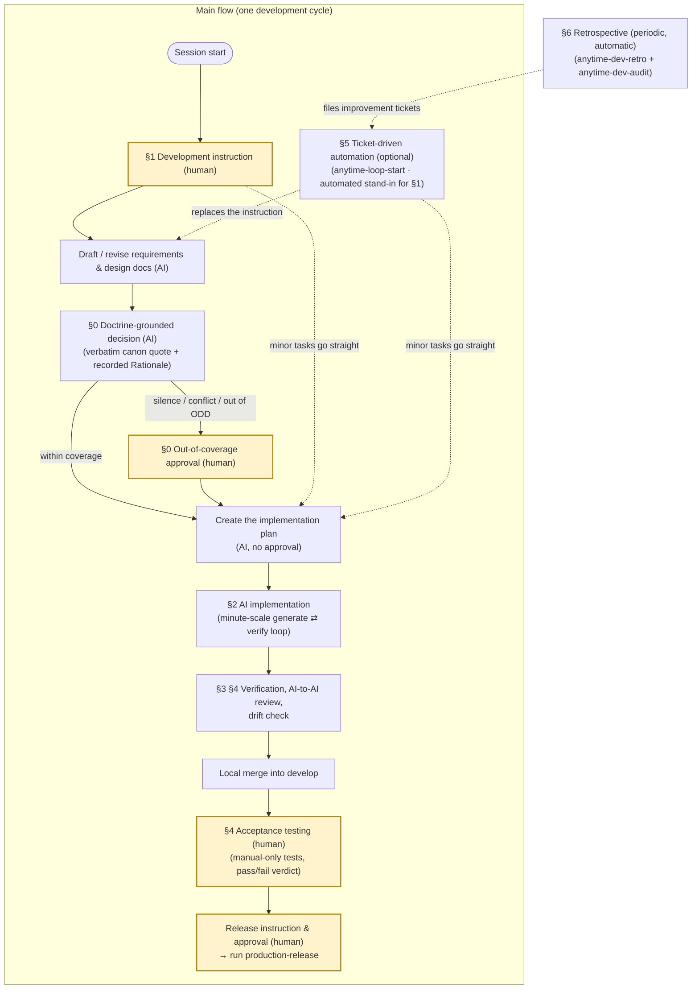

# Development Operations for New Apps (Trail Integration)

Once the [environment setup](../dev-env-setup/dev-env-setup.en.md) is done, the AI implements and the human approves, day after day. The question is where to put that approval. Review every artifact one by one and the AI's throughput is capped by the hours the human has; review nothing and no one carries responsibility for quality. What follows moves approval off the individual artifact and onto the doctrine, ahead of time, so the human is left with a fixed set of moments at the entry and the exit, plus the approval of the doctrine itself.

The operating model has four pillars.

- **The process runs as four nested loops**: spec-driven cycle (Loop A), acceptance testing / release (Loop B), retrospective (Loop C), and phase gates (Loop D). This manual covers the day-to-day operation of Loops A/B/C
- **The What approval is repositioned as an up-front approval of the doctrine**: the human approves the doctrine (codified tacit knowledge) first (making it canon), and requirements/design-doc approvals within its coverage are delegated to the AI's doctrine-grounded decision (a verbatim quote of the approved clause plus a recorded Rationale). Only doctrine silence, clause conflicts, and out-of-ODD inputs are escalated to the human. There is no approval gate on implementation plans (How) or on execution; only package additions, destructive operations, and releases require case-by-case approval. Bootstrapping the doctrine differs between new and existing development (§0)
- **Recording is automatic**: Claude Code hooks record sessions, edits, commits, and token consumption into the Trail DB. No manual bookkeeping
- **Visibility is on demand**: open the C4 viewer (structure/drift) (§3) when needed. Behavior, cost, and quality are confirmed via the retrospective report (§6) (visual Trail Viewer inspection is optional)

## Overall Flow

Each of the four loops turns on a different unit.

| Loop | Unit | Entry → exit |
| --- | --- | --- |
| A: spec-driven cycle | Task | Writing or revising the requirements/design docs (minor instructions start from the implementation plan) → local merge into develop |
| B: acceptance testing / release | Release | An artifact already merged into develop → production deployment. **It starts only on an explicit human instruction**, and completing Loop A is not a sufficient condition for release |
| C: retrospective | On incidents and weekly | Incident detection or the periodic analysis → adopted improvements feed back into Loop A as doc revisions |
| D: phase gate | Monthly | Aggregated metrics → approval of phase completion and promotion or demotion of the autonomy level |

The diagram below maps these four loops to the steps (§N) of this manual. Yellow-framed nodes labeled "(human)" are the human (controller) intervention points; everything else is delegated to AI.

### Human-in-the-Loop points

Human intervention is limited to the four fixed points above (instruction, out-of-coverage approval, acceptance testing, release) plus doctrine approval (canonization, outside the diagram) and case-by-case approvals during implementation; everything else is delegated to AI.

| Situation | What the human decides |
| --- | --- |
| Approving the doctrine (canonization) | Adopting or rejecting extracted/revised doctrine drafts. Only approved doctrine can serve as the basis for delegated What approvals within its coverage (§0) |
| Out-of-coverage approval | Fixing the What on escalations caused by doctrine silence, clause conflicts, or out-of-ODD inputs. Choosing between the two bug-fix options also happens here when needed |
| Case-by-case approvals during implementation | Package additions/updates, destructive operations (`git reset --hard` etc., persistent-data writes), remote push |
| Acceptance testing | Running manual-only tests (real devices, IME, print, subjective quality) and the pass/fail verdict. AI goes only as far as test design |
| Release | Instruction and approval (AI never initiates; completing a develop merge is not sufficient for release) |
| Retrospective | Incident severity and recovery policy; adoption of improvement proposals |

## Prerequisites

- The [environment setup](../dev-env-setup/dev-env-setup.en.md) is complete (three extensions activated, hooks registered)
- The project is under git management (Trail's commit records rely on git)

### Division of roles among the three extensions

| Extension | What it makes visible | Main entry point |
| --- | --- | --- |
| Anytime Trail | Behavior (sessions, prompts, commits) / cost (tokens) / structure (C4, DSM) | `Anytime Trail: Open Trail Viewer` / `Anytime Trail: Analyze Code` |
| Anytime Agent | Concurrent session status, context bloat, visual context sharing | Anytime Agent panel in the Activity Bar |
| Anytime Markdown | Markdown documents generated and edited by AI | Right-click a `.md` file → Open with Anytime Markdown |

## Steps

Steps that use a skill list it under "Skills used" at the top of the section (bundled skills the agent extension deploys into the workspace `.claude/skills/`). Invoke them explicitly with `/<skill name>`; they also fire automatically on the listed phrases.

### 0. Bootstrapping and operating the doctrine (repositioned approval)

**Skills used**: `anytime-reverse-doctrine` — extracts tacit knowledge from code, git history, design docs, and review records into four documents (design philosophy / coding conventions / glossary / process reality); `--delta` produces incremental updates and divergence reports since the last extraction.

This replaces per-item approval of requirements/design docs (the What approval) with an up-front approval of the doctrine. Once the human has approved the doctrine (canonization), individual decisions within its coverage are delegated to the AI's doctrine-grounded decisions, and the human's routine intervention shrinks to two points: the input and the post-completion acceptance review. **The doctrine draws its authority solely from human approval.** The AI never promotes its own decisions or output into the doctrine without approval (the self-reinforcement loop is cut).

Escalation to the human is limited to these cases.

| Condition | Detail |
| --- | --- |
| Doctrine silence | No clause supplies grounds for the decision (the search returns nothing, or the clause is too abstract to settle applicability). Do not fill the gap with plausible generalities |
| Clause conflict | Several clauses imply conflicting decisions. Do not silently pick one — record it as drift and ask for a ruling |
| Out of ODD | Even within coverage, inputs touching other repositories, restricted areas, or production settings fall outside the operational design domain |
| Unapproved doctrine | A decision grounded on a draft that has not been approved is escalated rather than executed autonomously |
| Unresolvable citation | A decision whose quote does not resolve to a real clause is invalid |
| Always human | Destructive operations, writes to persistent data, package additions and updates, remote pushes, and production releases — deliberate friction kept on high-severity, irreversible operations |

#### 0-1. Bootstrapping — new vs. existing development

The doctrine is extracted from an existing track record (code, history, review records), so bootstrapping differs depending on whether such a source exists.

| Aspect | Existing development (a track record exists) | New development (no track record) |
| --- | --- | --- |
| Initial corpus | Extract the four documents in one pass with `anytime-reverse-doctrine`, then have the human review and canonize them | Nearly empty, as there is nothing to extract from. Start by canonizing only generic norms (CLAUDE.md, rules, global skills) and organizational standards |
| What approvals at the start | Within coverage they are delegated to grounded decisions; escalation is the exception | Doctrine silence is the default, so almost every item escalates to the human (effectively the same as conventional per-item approval) |
| Growing coverage | Run `--delta` periodically to detect divergence from reality and canonize the diffs via drafts | Extract and canonize at milestones once a track record (commits, review records, design decisions) has accumulated, widening the delegated range |
| Progress signal | The number of divergence reports (clauses with unaddressed divergence are suspended as decision grounds) | The declining escalation count (the coverage gate doubles as a gauge of doctrine gaps) |

#### 0-2. Day-to-day operation

1. **Extraction (AI)**: for existing development, run `/anytime-reverse-doctrine` once for the initial pass, then `--delta` for incremental updates. Output is always a draft; the AI never promotes its own decisions or artifacts into the doctrine without approval
2. **Canonization (human)**: review the drafts and decide adoption. Only approved doctrine can serve as grounds for delegated What approvals (decisions grounded on unapproved drafts are escalated instead of executed autonomously)
3. **Grounded decisions (AI)**: for inputs within coverage, the AI decides autonomously while recording a verbatim quote of the applicable clause plus a Rationale into Trail. A decision whose quote does not resolve to a real clause is invalid. Silence, conflicts, and out-of-ODD inputs are escalated with decision materials (grounds, rejected alternatives, pre-mortem)
4. **Feedback**: among acceptance-review rejections, those where a correctly grounded decision failed are treated not as decision errors but as doctrine defects (wrong, stale, or under-specified clauses) and fed back as revision drafts

> [!NOTE]
> Within the staged rollout (D0–D3), the current position is the transition to D1 (recording first). During D1 the intermediate approval stays in place while grounded decisions are recorded in parallel, measuring their agreement rate with the human's decisions. Areas whose agreement rate clears the threshold graduate to low-severity delegation (D2) and then to full delegation within the ODD (D3). D2 holds only while the agreement rate stays at or above 0.9; below that it reverts to D1, where the human approves every item.

### 1. At session start

**Skills used**: `anytime-dev-cycle` — the base development flow (plan → implement → verify). Fires automatically on development instructions like "implement X" / "fix Y" / "refactor Z".

Start the Dev Container, then start `claude` in a terminal and give development instructions (driven by the skill above). Concurrent-session conflict detection is automatic via the agent extension's airspace gate, so there is no need to check manually at session start.

- **Concurrent-session conflicts**: if another session is ACTIVE on the same branch, a warning is shown at SessionStart and mutating tools are blocked automatically. When warned, separate into a worktree (`git worktree add .worktrees/<name> -b <branch>`). Only if you are working solo but are wrongly blocked, continue with `ANYTIME_AIRSPACE=off`
- Open **Anytime Agent → Agent Mapping** in the Activity Bar only when you want to see who is touching what (optional). For handing off a context-heavy session, see §2

> [!NOTE]
> After a development instruction, requirements/design-doc approvals (the What) within doctrine coverage are delegated to grounded decisions; the human approves **only out-of-coverage escalations** (§0; during D1 the human still approves as before while grounded decisions are recorded in parallel). The implementation plan (How) is created by AI and needs no approval. Permanent requirements are handled as doc revisions; minor task instructions start directly from the implementation plan.

### 2. During development

**Skills used**: `anytime-note` — has the AI read AI Note pages (images, tables, notes) and act on them (`/anytime-note <page number> <instruction>`).

1. **Viewing and editing Markdown documents**: open generated requirements/design docs via right-click → **Open with Anytime Markdown**

   | Mode | Use |
   | --- | --- |
   | WYSIWYG | Edit with tables, Mermaid, and math rendered |
   | Source | Edit raw Markdown directly |
   | Review | Read-only; good for checking AI output |

   - **Auto-lock while AI edits**: while Claude Code is editing the file, the editor becomes read-only to prevent conflicts (released 3 seconds after the last edit)
   - **Change highlight**: after an AI edit, changed/added blocks are marked in the gutter; press `Escape` to clear once reviewed

2. **Sharing visual context (AI Note)**: to show screenshots, tables, or notes to the AI, add a page in the **AI Note** view of the Anytime Agent panel and run `/anytime-note <page number> <instruction>` in Claude Code (stored under `.anytime/notes/` in the workspace)

3. **Session handoff**: when a session grows too large (⚠️ badge), right-click it in Agent Mapping → **Hand Off to New Session**. A compressed summary of the work is carried over to the fresh session

### 3. Structure visibility (C4 / code graph)

**Skills used**: `anytime-reverse-codegraph` — after code analysis, AI assigns a name and summary to each community.

Get a bird's-eye view of a TypeScript project (requires `tsconfig.json`) and check that AI changes do not drift from the design intent.

1. Command palette → **Anytime Trail: Analyze Code** (if multiple `tsconfig.json` files exist, choose one in the QuickPick; selecting the project root analyzes every package below)

2. Run `/anytime-reverse-codegraph` in Claude Code to have AI assign a human-readable name and summary to each community

   > [!IMPORTANT]
   > This AI summarization sends code structure information such as file paths and module names to an external API (Anthropic). Confirm this is acceptable before using it on confidential repositories.

3. Check the C4 tab in **Anytime Trail: Open Trail Viewer**

   - Drill down from L1 (system context) to L4 (file dependencies)
   - Circular dependencies are highlighted in red; deleted elements are struck through
   - Files currently edited by Claude Code appear on the C4 graph in real time
4. To link design documents to the structure, set `anytimeTrail.workspace.docsPath` to your documentation directory and add `c4Scope` (an array of C4 element IDs) to the Markdown frontmatter. Related documents then appear when an element is selected in the C4 viewer

Re-run the analysis after structural changes (new packages, large refactorings) and review the diff.

### 4. Reviews and quality gates

AI completes everything up to the local merge into develop; acceptance testing and release beyond that are human decisions.

1. **Test design (prepare the verification means before generating)**: secure an observable exit for each task (tests, type check, build, real device/E2E) before implementing. Use `anytime-impl-test-design` to decide which tests to write (closing detection gaps in wiring, mount, and i18n). A task whose verification means cannot be decided is not implemented — decompose it again
2. **Pre-merge review**: before merging a work branch into develop, run the bundled `anytime-cross-review` skill. Claude and Codex review the same diff independently and adopt the cross-verified findings (so that implementation and verification are not completed by the same model; without the Codex CLI, run a Claude-only code review). Address error/warn findings before merging. Each finding carries a checklist key (a chapter number `§N` from the global `code-review-checklist` skill, or `none` when no chapter applies); `none` findings feed the promotion-candidate aggregation of the weekly retrospective (step 6) as checklist gaps
3. **Acceptance testing (human)**: against the artifacts merged into develop, run the manual-only tests (real devices, IME, print, subjective quality) and give the pass/fail verdict. AI goes only as far as test design (execution and verdict columns are filled by the human). Failures go back to the development cycle (Loop A)
4. **Release (only on explicit human instruction)**: only candidates that passed acceptance testing proceed to the production release (version bump, publishing, deploy) after the human's release instruction and approval. AI never initiates remote pushes or publishing on its own

### 5. Ticket-driven automation (optional)

**Skills used**: `anytime-loop-start` (starts the ticket loop; subsequent firings self-scheduled via cron), `anytime-loop-stop` (stops it).

Use this to let the AI consume the backlog automatically.

1. File tickets as one Markdown file per ticket (YAML frontmatter) under `.tickets/`. Set the **assignee (**`assignee`**) to** `agent` **and the workspace (**`workspace`**) to the target project** — only tickets with both are eligible for execution
2. Trigger `/anytime-loop-start` once; each tick then re-schedules its own next firing via cron (`/loop` is not needed). It selects tickets whose assignee is `agent` and whose workspace matches its own, one at a time, and drives them through execution and state-transition commits
3. Each time the AI releases a ticket, the assignee returns to `user` and the actual effort (`actual`, in minutes) is accumulated. The AI does not pick up tickets assigned to `user`, so review the content and set the assignee back to `agent` to let it continue
4. Questions and approval requests from the AI arrive as ticket Comments (the assignee returning to `user` is the signal). Append your answer, set the assignee back to `agent`, and work resumes on the next tick

### 6. Retrospective (weekly + incidents)

**Skills used** (the periodic-review group: Trail-record analysis + environment/settings diagnosis): `anytime-dev-retro` (cross-cutting health analysis / retrospective over the Trail 3DB; covers behavior/quality plus the session-level cost analysis absorbed from the former `anytime-token-budget` — Opus share, cache_read blowup, session hygiene; escalated signals file both a proposal and a ticket), `anytime-dev-audit` (read-only diagnosis of the PC environment and Claude Code settings — CLAUDE.md / rules / skills / hooks / settings / MCP; the environment/settings side rather than development activity; presents an impact × effort matrix and an optimization plan), `anytime-proposal` (drafting improvement/recurrence-prevention proposals), `anytime-session-exit` (session completion report, ingested into Trail flight reviews as self-assessment).

This is the operation of Loop C, feeding improvements back from actual results and incidents. **Behavior, cost, and quality are confirmed here — through this section's periodic, automatic analysis (the retrospective report) — rather than by on-demand Trail Viewer inspection.** `anytime-dev-retro` cross-analyzes the Trail data (behavior, cost, quality) and escalates only signals above the threshold.

1. **Closing a session**: when wrapping up, run `anytime-session-exit` to output achievement, open items, and next concerns in structured form (this becomes retrospective input)
2. **When an incident occurs**: the human decides severity and recovery policy → AI drafts the root-cause analysis (why-why-why, 3 levels or more) and prevention measures with `anytime-proposal` → the human decides adoption
3. **Weekly (development activity)**: `anytime-dev-retro` cross-analyzes the Trail records (behavior, cost, quality, review findings, drift), outputs a health report plus cost detail, promotes only signals above the threshold into improvement proposals via `anytime-proposal`, and **files one ticket per proposal** (`backlog` / assignee `user` / workspace `anytime-markdown`). The human decides whether to adopt each ticket and switches the assignee to `agent` to start work. As an exception, a **checklist-gap cluster** ticket (similar `none`-key review findings persisting across two consecutive retrospectives) lands, once approved, not in requirements/design documents but as a **new clause in the global `code-review-checklist` skill** (with the source finding_id inlined; the clause's effect is observed in later reports via per-chapter 30-day finding counts)
4. **Environment/settings check**: use `anytime-dev-audit` to read-only diagnose drift in the PC environment and Claude Code settings (CLAUDE.md / rules / skills / hooks / settings / MCP). It is a periodic check on a different layer from dev-retro (development activity), yielding an impact × effort matrix and a phased optimization plan (improvements can likewise become proposals and tickets)
5. **Adopted proposals are reflected as requirements/design doc revisions** (fed back into the development cycle; technology and design decisions are likewise recorded with `anytime-proposal`)

### 7. Data management

| Item | Details |
| --- | --- |
| Trail DB location | Defaults to `.vscode/activity.db` in the workspace (change via `anytimeTrail.database.storagePath`) |
| Backups | gzip generation backups `.bak.N.gz` next to `activity.db` (setting `backupGenerations`, 1–10 generations) |
| Team integration | Sync the local SQLite to Supabase / PostgreSQL to consolidate data across developers |
| git management | `activity.db` and `.anytime/` are local records — add them to the repository's `.gitignore` |

## Verification (checklist that operations are running)

- [ ] Agent Mapping shows the current session with commits/branch on hover
- [ ] The Sessions tab of the Trail Viewer records today's sessions and commits
- [ ] The C4 tab renders the code graph and highlights files being edited
- [ ] What decisions carry a doctrine-grounding record (quoted clause + Rationale) or an escalation reason (from D1 onward)
- [ ] Pre-merge review findings are kept as review documents
- [ ] Acceptance testing (manual-only tests) and its verdict are recorded before release
- [ ] Token consumption appears on the tab bar (when a budget is set)

## Troubleshooting

| Symptom | Cause | Fix |
| --- | --- | --- |
| No sessions in Agent Mapping | Hooks not registered, or the session has not performed any action yet | Check hooks in `~/.claude/settings.json`; the session appears after Claude Code performs an edit, command, or commit |
| Recent data missing in Trail Viewer | JSONL import lag | Wait for import (tens of minutes) or reload VS Code |
| Extension update has no effect | Old Extension Host still running | Command palette → **Developer: Restart Extension Host** (restart the window if that is not enough) |
| Trail Viewer port conflict | Another process uses 19841 | Change `anytimeTrail.viewer.port` |
| C4 analysis fails | Missing `tsconfig.json` or wrong target | Check the project root `tsconfig.json`; pin the target with `anytimeTrail.workspace.path` |
| Markdown editor stays locked | Claude Code crashed | Auto-unlocks after 30 seconds; reopen the editor if it does not |
