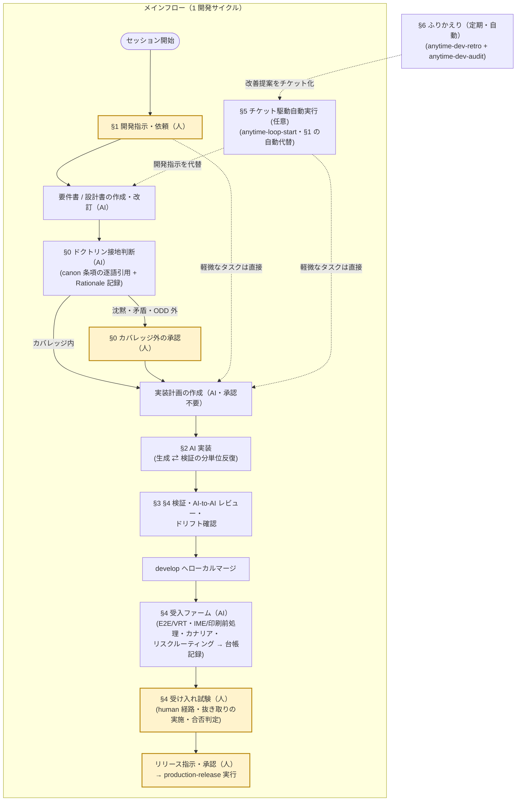

# 新規アプリ開発運用手順（Trail 連携）

[開発環境構築](../dev-env-setup/dev-env-setup.ja.md)を終えると、AI が実装し人が承認する日々が始まる。問題は、その承認をどこへ置くかである。生成物を 1 件ずつ人が見れば AI の速度は人の可処分時間で頭打ちになり、逆に何も見なければ品質の責任を負う者がいなくなる。ここでは承認を個々の成果物から先にドクトリンへ移し、人の介在を入口と出口の決まった場面とドクトリンの承認に絞る。

運用の骨子は次の 4 点である。

- **プロセスは 4 重ループで回す**: 仕様駆動サイクル（ループ A）・受け入れ試験/リリース（ループ B）・ふりかえり（ループ C）・Phase ゲート（ループ D）。本書はその日常運用（ループ A/B/C の操作手順）を扱う
- **What 承認はドクトリンへの先行承認へ再配置する**: 人はドクトリン（明文化された暗黙知）を先に承認し（canon 化）、カバレッジ内の要件書・設計書承認は AI のドクトリン接地判断（承認済み条項の逐語引用 + Rationale 記録）が代行する。ドクトリンの沈黙・条項矛盾・ODD 外のみ人へエスカレーションする。実装計画（How）と実施内容に承認ゲートを置かず、パッケージ追加・破壊的操作・リリースのみ都度承認。ドクトリンの立ち上げ方は新規開発と既開発で異なる（§0）
- **記録は自動**: Claude Code hooks がセッション・編集・コミット・トークン消費を Trail DB へ自動記録する。開発者の手作業は不要
- **可視化はオンデマンド**: 構造・ドリフトは C4 ビューア（§3）を必要な時に開く。行動・コスト・品質はふりかえりレポート（§6）で確認する（Trail Viewer の目視は任意）

## 全体フロー

4 重ループはそれぞれ回す単位が違う。

| ループ | 単位 | 入口 → 出口 |
| --- | --- | --- |
| A: 仕様駆動サイクル | タスク | 要件書・設計書の作成/改訂（軽微な指示なら実装計画から）→ develop へのローカルマージ |
| B: 受け入れ試験・リリース | リリース | develop マージ済みの成果物 → 本番デプロイ。**起動は人の明示指示のみ**で、ループ A の完了はリリースの十分条件ではない |
| C: ふりかえり | 事故発生時と週次 | インシデント検知または定期分析 → 採択した改善を要件書・設計書の改訂としてループ A へ還流 |
| D: Phase ゲート | 月 | 集計したメトリクス → Phase 完了の承認と自律レベルの昇格・降格の判断 |

次の図は、この 4 重ループを本書の手順（§N）へ対応付けた運用視点の図である。「（人）」付きの黄色枠ノードが人（管制官）の介在点で、それ以外は AI に委任される。



### 人の介在点（HITL）

介在点は上図の固定 4 点（開発指示・カバレッジ外の承認・受け入れ試験・リリース）に、図外のドクトリン承認（canon 化）と実装中の都度承認を加えた範囲に限定し、それ以外は AI に委任する。

| 場面 | 人が判断すること |
| --- | --- |
| ドクトリンの承認（canon 化） | 抽出・改訂されたドクトリン draft の採否。承認済みドクトリンだけが以後のカバレッジ内 What 承認を代行する根拠になる（§0） |
| カバレッジ外の承認 | ドクトリンの沈黙・条項矛盾・ODD 外のエスカレーションに対する What の確定。バグ修正の 2 案選択が要る場合もここで行う |
| 実装中の都度承認 | パッケージ追加・更新、破壊的操作（`git reset --hard` 等・永続データ書込）、リモート push |
| 受け入れ試験 | 受入ファーム（§4-3）の機械判定を前提に、`human` 経路と抜き取り分のみ人手試験を実施して合否判定。`auto` 経路の有効化判断（machine 実績 30 件 + 見逃し率の確認）と Level Gate 閾値の校正も人が行う |
| リリース | 指示・承認（AI は自発しない。develop マージ完了はリリースの十分条件ではない） |
| ふりかえり | インシデントの重大度・復旧方針の決定、改善提案の採否 |

## 前提条件

- [開発環境構築手順](../dev-env-setup/dev-env-setup.ja.md)が完了している（拡張 3 種 activate 済み・hooks 登録済み）
- 対象プロジェクトが git 管理されている（Trail のコミット記録が git を参照するため）

### 拡張 3 種の役割分担

| 拡張 | 可視化の対象 | 主な入口 |
| --- | --- | --- |
| Anytime Trail | 行動（セッション・プロンプト・コミット）/ コスト（トークン）/ 構造（C4・DSM） | `Anytime Trail: Open Trail Viewer` / `Anytime Trail: Analyze Code` |
| Anytime Agent | 並行セッションの状況・コンテキスト肥大・視覚コンテキスト共有 | アクティビティバーの Anytime Agent パネル |
| Anytime Markdown | AI が生成・編集する Markdown ドキュメント | `.md` 右クリック → Open with Anytime Markdown |

## 手順

スキルを使う手順では、利用スキル（agent 拡張がワークスペースの `.claude/skills/` へ展開する同梱スキル）を節冒頭の「利用スキル」行に記す。`/<スキル名>` で明示起動できるほか、記載の発話でも自動発火する。

### 0. ドクトリンの立ち上げと運用（承認の再配置）

**利用スキル**: `anytime-dev-retro` の doctrine 抽出モード（旧 `anytime-reverse-doctrine`。2026-08-22 に統合） — コード・git 履歴・設計書・レビュー記録から暗黙知を 4 文書（設計哲学 / コーディング規約 / 用語 / プロセス実態）として抽出する（`--delta` で前回抽出時点からの差分更新・乖離報告）。

要件書・設計書の都度承認（What 承認）を、ドクトリンへの先行承認で置き換える運用である。人がドクトリンを一度承認（canon 化）すれば、そのカバレッジ内の個別判断は AI のドクトリン接地判断が代行し、人の定常介在は「入力」と「完了後の受け入れ確認」の 2 点へ縮小する。**ドクトリンの権威は人の承認だけに由来する。** AI が自らの判断や生成物を無承認でドクトリンへ昇格させることはない（自己強化ループの遮断）。

人へ回すのは次の場合に限る。

| 条件 | 内容 |
| --- | --- |
| ドクトリンの沈黙 | 判断根拠になる条項が無い（検索が条項を返さない、条項が抽象的で適用可否を決められない）。もっともらしい一般論で補完しない |
| 条項の矛盾 | 複数の条項が食い違う判断を与える。片方を暗黙に選ばず、drift として記録して裁定を仰ぐ |
| ODD 外 | カバレッジ内であっても、他リポジトリ・制限領域・本番設定など運用設計領域の外にある入力 |
| 未承認ドクトリンの参照 | 承認前の draft を根拠にした判断は自律実行しない |
| 引用が解決しない | 実在しない条項を引いた判断（幻覚引用）は無効とする |
| 常に人へ回す操作 | 破壊的操作・永続データ書込・パッケージ追加更新・リモート push・本番リリース。高重大度かつ不可逆な操作へ意図的に摩擦を残す |

#### 0-1. 立ち上げ — 新規開発と既開発の違い

ドクトリンは実績（コード・履歴・レビュー記録）から抽出するため、抽出元の有無で立ち上げ手順が分かれる。

| 観点 | 既開発（抽出元の実績がある） | 新規開発（実績がない） |
| --- | --- | --- |
| 初期コーパス | doctrine 抽出モードで 4 文書を一括抽出し、人がレビューして canon 化する | 抽出元がなく空に近い。汎用規範（CLAUDE.md・rules・グローバルスキル）と組織標準だけを canon 化して始める |
| 開始直後の What 承認 | カバレッジ内は接地判断が代行し、エスカレーションは例外 | ドクトリンの沈黙が既定のため、ほぼ全件が人へエスカレーションされる（実質、従来の都度承認と同じ） |
| カバレッジの拡大 | `--delta` の定期実行で実態との乖離を検知し、差分を draft → canon 化する | 実績（コミット・レビュー記録・設計判断）が貯まった節目で抽出 → canon 化を繰り返し、代行範囲を広げる |
| 進捗の観測 | 乖離報告の件数（乖離が放置された条項は判断根拠としての使用を保留する） | エスカレーション件数の減少（カバレッジゲートはドクトリン欠落の計測器を兼ねる） |

#### 0-2. 日常運用

1. **抽出（AI）**: 既開発の初回は `/anytime-dev-retro` の doctrine 抽出モードで一括抽出、以後は `--delta` で差分更新する。出力は必ず draft であり、AI は自らの判断・生成物を無承認でドクトリンへ昇格させない
2. **canon 化（人）**: draft をレビューして採否を決める。承認済みドクトリンだけが What 承認の代行根拠になる（未承認 draft を根拠にした判断は自律実行せずエスカレーション）
3. **接地判断（AI）**: カバレッジ内の input は、該当条項の逐語引用 + Rationale を Trail に記録して自律判断する。引用が実在の条項へ解決しない判断は無効。沈黙・矛盾・ODD 外は判断材料（決定根拠・却下した代替案・pre-mortem）を添えて人へエスカレーションする
4. **還流**: 受け入れ確認の差し戻しのうち「ドクトリンに正しく接地した判断が不合格」だったものは、判断ミスでなくドクトリンの欠陥（条項の誤り・陳腐化・粒度不足）として扱い、改訂 draft へ還流する

> [!NOTE]
> 段階導入（D0〜D3）の現在地は D1（記録先行）への移行中である。D1 の間は中間承認を存置したまま接地判断を並走記録し、人の判断との一致率を計測する。一致率が閾値を満たした領域から低重大度の代行（D2）→ ODD 内の全面代行（D3）へ広げる。D2 の維持条件は一致率 0.9 以上で、下回ったら D1（全件を人が承認）へ差し戻す。

### 1. セッション開始時の運用

**利用スキル**: `anytime-dev-cycle` — 開発の基本フロー（計画 → 実装 → 検証）。「実装して」「直して」「リファクタして」等の開発指示で自動発火する。

Dev Container を起動し、ターミナルで `claude` を起動して開発指示を行う（上記スキルが基点になる）。並行セッションの衝突検知は agent 拡張の airspace ゲートが自動で行うため、開始時に手動で確認する必要はない。

- **並行セッションの衝突**: 別セッションが同じブランチで ACTIVE な場合、SessionStart で警告が出て変更系ツールは自動でブロックされる。警告が出たら worktree へ分離する（`git worktree add .worktrees/<name> -b <branch>`）。単独作業なのに誤ってブロックされる場合のみ `ANYTIME_AIRSPACE=off` を付けて継続する
- **誰がどこを触っているか**を目視で把握したいときのみ、アクティビティバーの **Anytime Agent → Agent Mapping** を開く（任意）。コンテキスト肥大セッションの引き継ぎは §2 を参照

> [!NOTE]
> 開発指示のあと、カバレッジ内の要件書・設計書承認（What）はドクトリン接地判断が代行し、人が承認するのは**カバレッジ外のエスカレーションだけ**である（§0。D1 の間は従来どおり人が承認し、接地判断は並走記録される）。実装計画（How）は AI が作成し承認不要。恒久的な要求は要件書・設計書の改訂として扱い、軽微なタスク指示は実装計画から直接始まる。

### 2. 開発中の運用

**利用スキル**: `anytime-note` — AI Note のページ（画像・表・メモ）を読ませて指示を実行する（`/anytime-note <ページ番号> <対応内容>`）。

1. **Markdown ドキュメントの閲覧・編集**: 生成された要件書・設計書は右クリック → **Open with Anytime Markdown** で開く

   | モード | 用途 |
   | --- | --- |
   | WYSIWYG | 表・Mermaid・数式を描画しながら編集 |
   | Source | 素の Markdown を直接編集 |
   | Review | 読み取り専用。AI 出力の確認に使う |

   - **AI 編集中の自動ロック**: Claude Code がそのファイルを編集している間はエディタが読み取り専用になり、競合を防ぐ（編集終了の 3 秒後に解除）
   - **変更ハイライト**: AI の編集後、変更・追加ブロックがガターにマークされる。確認したら `Escape` でクリアする

2. **視覚コンテキストの共有（AI Note）**: スクリーンショット・表・メモを AI に見せたい時は Anytime Agent パネルの **AI Note** にページを追加し、Claude Code で `/anytime-note <ページ番号> <対応内容>` を実行する（保存先はワークスペースの `.anytime/notes/`）

3. **セッションの引き継ぎ**: セッションが肥大したら（⚠️ バッジ）、Agent Mapping で右クリック → **Hand Off to New Session** を選ぶ。作業内容の圧縮サマリが新セッションへ引き継がれる

### 3. 構造の可視化（C4 / コードグラフ）

**利用スキル**: `anytime-reverse-codegraph` — コード解析後、各コミュニティへ AI が名前と要約を付与する。

TypeScript プロジェクト（`tsconfig.json` 必須）のアーキテクチャを俯瞰し、AI の変更が設計意図から逸れていないかを確認する。

1. コマンドパレット → **Anytime Trail: Analyze Code** を実行する（複数の `tsconfig.json` がある場合は QuickPick で選択。ルートを選ぶと配下の全パッケージを解析）

2. Claude Code で `/anytime-reverse-codegraph` を実行すると、各コミュニティに AI が名前と要約を付与する

   > [!IMPORTANT]
   > この AI 要約はファイルパス・モジュール名などのコード構造情報を外部 API（Anthropic）へ送信する。機密リポジトリでは送信可否を事前に確認する。

3. **Anytime Trail: Open Trail Viewer** の C4 タブで確認する

   - L1（システムコンテキスト）〜 L4（ファイル依存）のドリルダウン
   - 循環依存は赤でハイライト、削除済み要素は取り消し線
   - Claude Code が編集中のファイルは C4 グラフ上にリアルタイム表示
4. 設計書と構造をリンクする場合は、設定 `anytimeTrail.workspace.docsPath` にドキュメントディレクトリを指定し、Markdown の frontmatter に `c4Scope`（C4 要素 ID 配列）を付与する。C4 ビューアで要素選択時に関連ドキュメントが表示される

コード構成を変えたら（パッケージ追加・大規模リファクタリング後）再解析して差分を確認する。

### 4. レビュー・品質ゲート

develop へのローカルマージまでは AI が完結し、その先の受け入れ試験・リリースは人が判断する。

1. **テスト設計（検証手段は生成の前に用意する）**: 各タスクの出口を観測できる手段（テスト・型チェック・ビルド・実機/E2E）を実装前に確保する。`anytime-doc-authoring` §6（実装後テスト設計。旧 `anytime-impl-test-design`）で「どのテストを書くか」を決める（配線・mount・i18n の検知ギャップを塞ぐ）。検証手段を決められないタスクは実装に入らず分解し直す

2. **マージ前レビュー**: 作業ブランチを develop へマージする前に、同梱スキル `anytime-cross-review` を実行する。Claude と Codex が同一 diff を独立レビューし、相互検証した合意指摘を採用する（実装と検証を同一モデルで完結させないため。Codex CLI 未導入なら Claude 単独のコードレビューを実施）。error / warn を対処してからマージする。レビュー指摘には観点キー（global スキル `code-review-checklist` の章番号 `§N`、該当章が無ければ `none`）を付す。`none` は観点の穴として週次ふりかえりの昇格候補集計（手順 6）の入力になる

3. **受入ファーム（機械受入・AI）**: develop マージ後に `npm run accept:farm -- --commit <マージコミット SHA>` を実行する。次を機械判定し、結果を受入台帳（caravan-book.db `caravan_acceptance_records`。2026-08-07 に activity.db から移設）へ記録する。台帳へ記録できない pass は成功扱いにしない（exit 2 = not_run・スプール再送）

   - **E2E / VRT ファーム**: Playwright の受入シナリオとダーク/ライト両モードの視覚回帰。flaky は隔離（quarantine.json）+ 再現チケット自動起票
   - **人手枠の機械前処理**: IME 合成 composition・印刷 PDF の画素比較・差分駆動のローカル VLM 前処理（ollama 未導入時は skip 縮退。合否権限なし）
   - **ローカルカナリア + vsix スモーク**: ループ系機能に触れるマージのみ、sandbox で N tick のカナリア実行と vsix の Extension Host スモークを追加実施
   - **リスクルーティング**: 変更セットの決定論スコア（bug 履歴密度・中心性・cochange・カテゴリ）で受入経路を自動振り分けする。高重大度カテゴリ（永続データ・スキーマ・セキュリティ）と高スコアは `human` 経路 — 受入チケットが自動起票され（`ACCEPTANCE_TICKETS_DIR` 設定時）、台帳には `pending` で記録される（合否は人が同 PK へ記録）。それ以外は `machine` 経路（green + 人の抜き取り確認）。`auto` 経路（green のみで合格）は既定無効。経路別見逃し率が閾値を超えた経路は自動で `human` へ降格する（Level Gate）

   > [!NOTE]
   > 現状注記（2026-07-19）: 基盤 S1〜S5 は実装済みだが、farm の本番初回実行（本番 activity.db への記録・`ACCEPTANCE_TICKETS_DIR` の指定）は承認待ち、各スライスの実機受入も未実施である。ollama 未導入のため VLM 前処理は skip 縮退で動作する。

4. **受け入れ試験（人）**: ファームが `human` 経路へ振り分けた変更と抜き取り対象について、人手のみ試験（実 IME・実プリンタ・主観品質・実機回帰）を実施し、合否を台帳（`caravan_acceptance_records` の commit × human）へ記録する。ファーム green でも VRT 差分あり画面は目視確認する。AI はテスト設計まで（実施・判定は人）。不合格は開発サイクル（ループ A）へ差し戻す

5. **リリース（人の明示指示のみ）**: 受け入れ試験に合格した候補のみ、人のリリース指示・承認を経て本番リリース（バージョン bump・公開・デプロイ）を実行する。AI はリモート push・公開を自発しない

### 5. チケット駆動の自動実行（任意）

**利用スキル**: `anytime-loop-start`（チケットループ開始。以後 cron 自己確保）・`anytime-loop-stop`（停止）。

バックログを AI に自動消化させる場合に使う。

1. `.tickets/` 配下に 1 チケット 1 ファイルの Markdown（YAML frontmatter）でチケットを起票する。**担当（**`assignee`**）を** `agent`**、ワークスペース（**`workspace`**）を対象プロジェクト**にする。この 2 つが揃ったチケットだけが実行対象になる
2. `/anytime-loop-start` を 1 回起動すると、以後の発火は tick 自身が cron へ自己確保する（`/loop` は不要）。担当が `agent` かつワークスペースが自分と一致するチケットを 1 件ずつ選定・実行・状態遷移コミットまで自動で進める
3. AI がチケットから手を離すたびに**担当が** `user` **へ戻り、実施工数（**`actual`**・分）が加算される**。担当が `user` のチケットは AI が拾わないため、内容を確認して続行させたいときは担当を `agent` に戻す
4. AI からの質問・承認依頼はチケットの Comments に届く（担当が `user` に戻っているのが目印）。回答を追記してから担当を `agent` へ戻すと、次の tick で作業が再開される

#### 5-1. 返却の push 通知（AL-7・任意）

担当が `user` へ戻ったことをチャットサービスへ片方向 webhook で通知する（要件 AL-7 / UR-11。採択提案 `proposal/20260719-ticket-notification-channel.ja.md`）。チケット一覧をポーリングしなくても回答待ちに気づける。

- **仕組み**: チケットリポジトリのローカルクローンの post-commit hook が、直前のコミットで `assignee` が `user` へ遷移したチケットを検知し、`NotificationChannel`（設定で切替。初期実装は LINE Messaging API push）へ送信する。通知は best-effort で、失敗してもコミット・ループは止まらない。本文はチケット id・タイトル・コミット件名・ボードリンクのみ（チケット本文は外部へ送らない）

- **セットアップ**（クローンごとに 1 回）:

  1. hook 配線: `git -C <ticketRepo> config core.hooksPath <コードリポジトリ>/scripts/ticket-hooks`

  2. 設定ファイル: `<ticketRepo>/.git/anytime/notify.json` を作成する（`.git/` 配下のためコミットされない。webhook URL・トークン等の秘密はここにのみ置く）:

     ```json
     {
       "channel": "line",
       "line": { "channelAccessToken": "<LINE チャネルアクセストークン>", "to": "<送信先 userId>" },
       "ticketsBoardUrl": "https://<web-app>/tickets"
     }
     
     ```

  3. LINE 側の準備: LINE Developers で Messaging API チャネルを作成し、長期チャネルアクセストークンを発行、通知先の userId（自分の LINE アカウントがチャネルを友だち追加した際の Webhook もしくはチャネルコンソールで確認）を取得する
- **制約**: hook を配線したクローンでの返却コミットしか通知されない（web-app / GitHub 上の直接編集、未配線のクローンは対象外）。設定不在時は skip ログのみで無通知

### 6. ふりかえり（週次定期 + インシデント）

**利用スキル**（定期の点検一群: Trail 記録の分析 + 環境・設定の診断）: `anytime-dev-retro`（Trail 3DB 横断の健全性分析・ふりかえり。行動・品質に加え、旧 `anytime-token-budget` を統合したセッション粒度のコスト分析＝Opus 比率・cache_read 膨張・セッション衛生も担う。閾値超シグナルは提案書＋チケットを起票）・`anytime-dev-audit`（PC 環境・Claude Code 設定＝CLAUDE.md / rules / skills / hooks / settings / MCP の read-only 診断。開発活動でなく環境・設定側の点検。影響度×工数マトリクスと最適化プランを提示）・`anytime-proposal`（改善提案・再発防止策の提案書起草）・`anytime-session-exit`（セッション完了報告。Trail の運航後レビューへ自己評価として取込）。

**行動・コスト・品質の確認は、Trail Viewer の随時目視ではなく定期・自動の分析で行う。** `anytime-dev-retro` が Trail の記録を横断分析し、閾値を超えたシグナルだけを改善へつなぐ。事故から出た再発防止策も、週次分析から出た改善も、要件書・設計書の改訂としてループ A へ戻る。

1. **セッションの締め**: 作業を締める時に `anytime-session-exit` で達成度・未解決事項・次回の懸念点を構造化出力する（ふりかえりの入力になる）
2. **インシデント発生時**: 人が重大度と復旧方針を決定 → AI が原因分析（why-why-why 3 段以上）と再発防止策を `anytime-proposal` で起草 → 人が採否を判断する
3. **週次定期（開発活動）**: `anytime-dev-retro` が Trail の記録（行動・コスト・品質・レビュー指摘・ドリフト）を横断分析して健全性レポート＋コスト詳細を出力し、受入台帳の経路別見逃し率（`caravan_acceptance_records` / miss-rate API）を昇格シグナルへ加える（この retro 側の配線は S5 残件で未実装。現状は farm のリスクルーティングが Level Gate として直接参照している）。閾値を超えるシグナルのみ `anytime-proposal` で改善提案へ昇格させ、**提案 1 件につきチケットを 1 件起票する**（`backlog` / 担当 `user` / ワークスペース `anytime-markdown`）。人はチケットの採否を判断し、着手させるときに担当を `agent` へ変える。例外として**観点の穴クラスタ**（観点 `none` の同種レビュー指摘が 2 回連続のレトロで残存）の昇格チケットは、承認後の反映先が要件書・設計書でなく global スキル `code-review-checklist` への**条文追加**になる（出典 finding_id をインライン記載。条文の効果は次回以降のレポートの章別 30 日窓件数で観測される）
4. **環境・設定の点検**: `anytime-dev-audit` で PC 環境・Claude Code 設定（CLAUDE.md / rules / skills / hooks / settings / MCP）のドリフトを read-only 診断する。dev-retro（開発活動）とは別レイヤーの定期点検で、影響度×工数マトリクスと段階的最適化プランを得る（改善は同様に提案・チケット化できる）
5. **採択した提案は要件書・設計書の改訂として反映する**（開発サイクルの入力へ戻す。技術選定・設計判断も同様に `anytime-proposal` で記録を残す）

### 7. データ管理

| 項目 | 内容 |
| --- | --- |
| Trail DB の場所 | 既定はワークスペースの `.anytime/trail/db/activity.db`（`lep.json` の `database.storagePath` で変更可。旧設定 `anytimeTrail.database.storagePath` は廃止）。同じディレクトリに知識グラフの `caravan-book.db` が並ぶ |
| バックアップ | `activity.db` と同じ場所に gzip 世代バックアップ `.bak.N.gz` を保持（設定 `anytimeDatabase.backup.generations`、既定 1・最大 10 世代）。2 GiB を超える DB は圧縮に失敗するため非圧縮の `.bak.N` で残る |
| チーム統合 | ローカル SQLite を Supabase / PostgreSQL へ同期し、複数開発者のデータを統合できる |
| git 管理 | `activity.db` と `.anytime/` はローカル記録のため、リポジトリの `.gitignore` に含める |

> [!WARNING]
> Supabase Free プランの下り転送（egress）は月 5GB で、超過するとプロジェクト全体がサービス制限され trail 系 API が停止する。web-app の trail 系 API は既定 10 分のサーバー内 TTL キャッシュで転送量を抑制しており、環境変数 `TRAIL_API_CACHE_TTL_MS`（ミリ秒）で調整、`0` で無効化できる。このため Supabase 同期直後の反映は最大 TTL 分遅れる。使用量はダッシュボードの Usage（EGRESS / DATABASE SIZE）で定期確認する。

## 結果確認（運用が回っているかのチェックリスト）

- [ ] Agent Mapping に現在のセッションが表示され、コミット・ブランチが hover で確認できる
- [ ] Trail Viewer の Sessions タブに当日のセッションとコミットが記録されている
- [ ] C4 タブにコードグラフが描画され、編集中ファイルがハイライトされる
- [ ] What 判断にドクトリン接地の記録（引用条項 + Rationale）またはエスカレーション理由が残っている（D1 以降）
- [ ] マージ前レビューの指摘が review ドキュメントとして残っている
- [ ] develop マージごとに受入台帳（`caravan_acceptance_records`）へファーム結果と経路が記録されている（ファーム運用開始後）
- [ ] リリース前に受け入れ試験（`human` 経路・抜き取り分の人手試験）の実施・合否が記録されている
- [ ] トークン消費がタブバーに表示されている（予算設定時）

## トラブルシューティング

| 症状 | 原因 | 対処 |
| --- | --- | --- |
| Agent Mapping にセッションが出ない | hooks 未登録、またはセッションがまだ何も実行していない | `~/.claude/settings.json` の hooks を確認。Claude Code で編集・コマンド・コミットのいずれかを実行すると表示される |
| Trail Viewer に直近データがない | JSONL 取込ラグ | 取込待ち（数十分）または VS Code リロード |
| 拡張更新後に挙動が変わらない | 旧 Extension Host が残存 | コマンドパレット → **Developer: Restart Extension Host**（それでも不足ならウィンドウ再起動） |
| Trail Viewer のポート衝突 | 19841 を他プロセスが使用 | 設定 `anytimeTrail.viewer.port` を変更 |
| C4 解析が失敗する | `tsconfig.json` がない・解析対象の指定ミス | プロジェクトルートの `tsconfig.json` を確認。対象を固定するなら `anytimeTrail.workspace.path` を設定 |
| web-app の trail ページが全て空・`Service ... restricted due to ... exceed_egress_quota` | Supabase の egress クォータ超過によるサービス制限 | ダッシュボードの Usage を確認し、課金サイクル更新を待つかプランを変更する。制限への遷移期は原因を示さない `TypeError: fetch failed` になることがある |
| Supabase 同期直後の変更が web-app に反映されない | trail 系 API のサーバー内 TTL キャッシュ（既定 10 分） | TTL 経過を待つ。即時反映が必要な環境のみ `TRAIL_API_CACHE_TTL_MS=0` を設定してサーバーを再起動する |
| Markdown エディタがロックされたまま | Claude Code の異常終了 | 30 秒で自動解除される。解除されない場合はエディタを開き直す |
| 受入ファームが exit 2（not_run）で終わる | 環境要因（viewer ビルド失敗・Playwright レポート欠落・台帳不達）。fail-open にしない設計で合格でも不合格でもない | 原因解消後に再実行する。台帳不達分はローカルスプールから次回実行時に自動再送される。解消できない間の受入判定は人手経路で行う |
| カナリア / vsix スモークが not_run | claude CLI 不在・テスト用 VS Code の取得不可・ハング（timeout kill） | 環境を整えて再実行するか、当該マージを人手経路で受け入れる |
