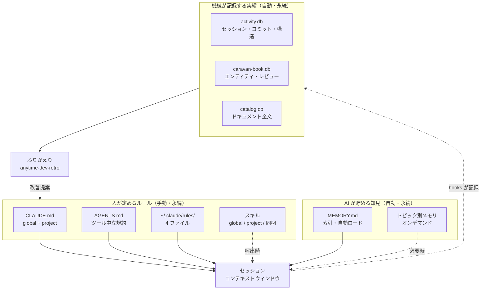

# メモリ運用手順（Claude メモリ層と開発保存データ一覧）

本書は 2 つの問いに答える。**「この知識をどこに書けばよいか」**（§2〜§4）と、**「あのデータはどこに保存されているか」**（§5〜§7）である。

前者は Claude Code のメモリ層の使い分け、後者は開発活動で自動的に蓄積される保存データの所在一覧を指す。ふりかえり（`anytime-dev-retro`）が何を読んで結論を出しているかも §7 で引ける。

Claude Code 側のメモリ機構そのものの一般解説は [Claude Code のメモリを理解する](/tech/claude-code/claude-code-memory-architecture.ja.md) にある。本書はそれを前提に、**本プロジェクトでの運用**だけを扱う。

## 1. 記憶の 3 系統

本プロジェクトの「記憶」は、書き手と寿命の違いで 3 系統に分かれる。混同すると「書いたのに読まれない」が起きるため、まずこの区別を押さえる。

| 系統 | 誰が書くか | 読まれ方 | 代表 |
| --- | --- | --- | --- |
| **人が定めるルール** | 人（と AI の提案） | セッション開始時に自動ロード、またはスキル呼出時に展開 | `CLAUDE.md` / `AGENTS.md` / `~/.claude/rules/` / スキル |
| **AI が貯める知見** | Claude が自律判断 | `MEMORY.md` の索引が自動ロード、詳細はオンデマンド | `~/.claude/projects/-anytime-markdown/memory/` |
| **機械が記録する実績** | hooks・拡張機能が自動 | 人・AI が分析時に明示的にクエリ | Trail 系 DB（`.anytime/trail/db/`） |



図の実線はセッション開始時の自動ロード、点線はオンデマンドの読み書きを示す。**L3 は自動ロードされない**。分析するときに明示的にクエリして初めて読まれる。

## 2. 知識をどこに書くか

新しく分かったことを残すとき、以下の順で判断する。上ほど確実に読まれるが、コンテキストを常時消費する。

| 残したい内容 | 置き場所 | 根拠 |
| --- | --- | --- |
| 全プロジェクト共通の作業スタイル・Git 哲学・セキュリティ方針 | `~/.claude/CLAUDE.md` | 全セッションで自動ロード |
| Claude / Codex 双方が従う規約（リポジトリ構成・出力先・検証コマンド） | `/anytime-markdown/AGENTS.md` | ツール中立規約の単一の正 |
| 本プロジェクト固有の Claude 補足（discovery 手順・Trail DB・並行検知） | `/anytime-markdown/CLAUDE.md` | 上記 2 つを補完 |
| 常時適用の品質原則・Git 手続き・外部コンテンツの扱い | `~/.claude/rules/*.md` | CLAUDE.md 肥大化の受け皿 |
| 特定作業でだけ必要な手順（リリース・レビュー・i18n・UI） | スキル | 呼出時のみ展開しコンテキストを消費しない |
| 踏んだ罠・失敗パターン・機能の実装経緯 | Auto Memory | Claude が自律的に書き、次セッションで自動想起 |
| 設計判断・仕様・計画・レビュー結果 | docsRoot 配下のドキュメント | 人が読む正本。§6 |

判断に迷う典型は「ルールに書くかスキルに書くか」である。**常時守らせたいなら rules、特定作業でだけ参照させたいならスキル**が原則となる。`~/.claude/rules/code-quality.md` はこの原則に従い、レビュー観点チェックリストを `code-review-checklist` スキルへ移設して常時ロード分を削っている。

### 2.1. 現在のルール・スキル構成

| 層 | 場所 | 実測（2026-07-19） |
| --- | --- | --- |
| global CLAUDE.md | `~/.claude/CLAUDE.md` | 1 ファイル |
| global rules | `~/.claude/rules/` | `code-quality.md` / `git-workflow.md` / `pre-merge-review.md` / `untrusted-content.md` |
| global skills | `~/.claude/skills/` | `code-review-checklist` / `design-md` / `sqlite-table-definition` |
| project CLAUDE.md | `/anytime-markdown/CLAUDE.md` | 1 ファイル（docsRoot 定義を含む） |
| project skills | `/anytime-markdown/.claude/skills/` | 31 スキル |
| 同梱スキル | `packages/vscode-agent-extension/skills/` | 10 スキル + `manifest.json` |

同梱スキルは anytime-agent 拡張が配布・管理する。**手で編集せず**、変更時は `manifest.json` の版数を必ず上げる（同一サイクル内の再変更でも都度）。

## 3. Auto Memory の運用

Auto Memory は Claude がセッション中に自律的に書く知見の蓄積である。本プロジェクトでは主に「踏んだ罠」「実装した機能の経緯と未完了事項」を記録している。

- **保存先**: `~/.claude/projects/-anytime-markdown/memory/`
- **実測（2026-07-19）**: 226 ファイル、索引 `MEMORY.md` は 72 行
- **同一リポジトリの全 worktree で共有される**。worktree ごとに分かれない

### 3.1. 運用上の制約

Auto Memory には、知らないと「書いたのに読まれない」を招く制約が 3 つある。

1. **索引未登録は認識されない**: メモリファイルを作っても `MEMORY.md` に 1 行追加しなければ、次セッションで存在に気づかれない。作成と索引登録は必ず同時に行う。
2. **並行セッションには反映されない**: セッション A で追加したメモリは、既に開始済みのセッション B には届かない。新規セッションを開始して初めて読まれる。
3. **索引には行数とバイト数の二重上限がある**: `MEMORY.md` は**先頭 200 行、または 25KB のいずれか早い方**までが自動ロードされる。行数に余裕があってもバイト数超過で末尾が切り詰められる。完了済み・対応不要になったエントリは `archived-entries-index.md` へ退避し、索引本体を短く保つ。

> **現状の警告（2026-07-19 実測）**: 本プロジェクトの `MEMORY.md` は 72 行 / 27,047 バイト（約 26.4KB）で、**25KB 上限を超過している**。行数は十分余裕があるため気づきにくいが、現行仕様では末尾のエントリが自動ロードされていない可能性がある。1 行あたりの記述が長いことが原因であり、退避（§3.2）と 1 行の短縮が必要である。

重要な設計決定を Auto Memory だけに預けない。**設計判断は docsRoot の設計書へ、常時守らせたい制約は CLAUDE.md か rules へ**二重化する。

### 3.2. 棚卸しの手順

索引が長くなったら次を行う。

1. `MEMORY.md` を読み、完了済み機能・公開済みリリース・対応不要になった罠のエントリを特定する。
2. 該当行を `archived-entries-index.md` の索引へ移す（個別ファイルは削除せず残す。詳細が要るときに辿れるようにする）。
3. 誤りと判明したメモリは、退避でなく削除する。

## 4. 保存データ一覧: Claude Code 側

ここから所在一覧に入る。まず Claude Code が生成するデータである。**いずれもマシンローカルで、Git 管理外**である。

| データ | パス | 内容 | 実測サイズ（2026-07-19） |
| --- | --- | --- | --- |
| セッション記録 | `~/.claude/projects/-anytime-markdown/*.jsonl` | 全会話・ツール呼出の生ログ。Trail の取り込み元 | 230 ファイル / 655MB |
| Auto Memory | `~/.claude/projects/-anytime-markdown/memory/` | 索引 + トピック別メモリ | 226 ファイル |
| worktree 別セッション記録 | `~/.claude/projects/-anytime-markdown--claude-worktrees-*/` | worktree ごとに別ディレクトリへ分離される | 9 ディレクトリ |
| global 設定 | `~/.claude/settings.json` | hooks・環境変数・statusLine | — |
| project 設定 | `/anytime-markdown/.claude/settings.local.json` | プロジェクト固有の権限等 | — |

> **注意**: セッション記録 `*.jsonl` は会話全文を含む。共有・外部送信の対象にしない。

### 4.1. 記録を駆動する hooks

保存データの多くは `~/.claude/settings.json` の hooks が自動生成する。何がいつ記録されるかはここで決まる。

| イベント | スクリプト | 記録・作用 |
| --- | --- | --- |
| `SessionStart` | `verify-settings-wiring.sh` / `agent-status-report.mjs session-start` | 設定配線の検証、セッション開始の記録 |
| `UserPromptSubmit` | `session-guard.sh` / `handoff-inject.sh` / `user-feedback.sh` | 並行セッション検知、引き継ぎ注入、ユーザー評価の記録 |
| `PreToolUse` | `destructive-guard.sh` / `agent-status-report.mjs` | 破壊的操作のブロック、編集・実行の開始記録 |
| `PostToolUse` | `agent-status-report.mjs` / `commit-tracker.sh` | 編集・実行の終了記録、コミット追跡 |
| `Stop` | `token-budget.sh` / `safe-point.sh` / `flight-review.sh` | トークン消費の集計、セーフポイント記録、運航後レビュー |

`destructive-guard.sh` だけは記録でなく**ブロック**として働く。`git reset --hard` 等を検知して exit 2 で止める。承認済みの操作は `ANYTIME_ALLOW_DESTRUCTIVE=1` を付けて再実行し、承認の証跡をコマンド列に残す。

## 5. 保存データ一覧: アプリ側（Trail 系 DB）

自アプリ（anytime 拡張群）が蓄積する実績データである。保存先は Trail 拡張の設定に依存するため**固定パスを前提にしない**。`lep.json` の `database.storagePath`（既定 `.anytime/trail/db`）を、`anytimeTrail.workspace.path` が決めるワークスペースルート起点で解決する。

既定構成での実体は `/anytime-markdown/.anytime/trail/db/` である。

| DB | 主なテーブル | 何が入るか | 実測サイズ |
| --- | --- | --- | --- |
| `activity.db` | `sessions` / `messages` / `activity_session_costs` / `activity_session_commits` / `activity_commit_files` / `activity_current_code_graphs` / `activity_daily_counts` / `activity_dora_metrics` | セッション・メッセージ・コスト・コミット・コードグラフ | 2.3GB |
| `caravan-book.db` | `caravan_entities` / `caravan_episodes` / `caravan_edges` / `caravan_reviews` / `caravan_review_findings` / `caravan_drift_events` / `caravan_spec_documents` / `caravan_flight_reviews` / `instructions` / `caravan_instruction_sessions` / `caravan_acceptance_records` / `caravan_doctrine_judgments` | エンティティ・エピソード・関係・レビュー指摘・ドリフト・運航後レビュー・指示台帳・受入台帳・接地判断（Flight Record / 受入台帳 / caravan_doctrine_judgments は 2026-08-07 に activity.db から移設。PR レビューは caravan_reviews の source_kind='pr_comment' へ統合）。FTS 索引を併設 | 690MB |
| `catalog.db` | `doc` / `catalog_doc_embedding` / `catalog_doc_fts` / `catalog_doc_relation` | ドキュメント本文・埋め込み・全文索引・関係 | 110MB |
| `activity.db` | `activity_verification_runs` | 検証実行の記録（2026-08-05 に `verification.db` から移設。指示へ `session_id` で結合する） | — |
| `extension-logs.db` | `extension_logs` | 拡張機能のログ | 4.0MB |
| `agent-status.db` | `agent_sessions` / `git_activity` | エージェントセッション状態と Git 活動（`.anytime/agent/` 配下） | — |

`activity.db` と `caravan-book.db` には `.bak` / `.kb` 系のバックアップが並置される。実測で `activity.db` 系だけで約 9GB を占めるため、ディスク逼迫時はここを確認する。**削除は必ずユーザー確認を取る**。

### 5.1. 参照の作法

`activity_current_code_graphs.graph_json` の丸読みは約 43 万トークンに達するため禁止する。構造探索は mcp-trail の discovery ツール（`get_important_files` → `get_code_dependencies` / `query_code_graph` / `find_code_path`）を使う。詳細は [`/anytime-markdown/CLAUDE.md`](/anytime-markdown/CLAUDE.md) の discovery 順序に従う。

Trail 拡張には取り込みラグ（数十分〜VS Code リロード）がある。**直近のセッション・コミットは未取込の場合がある**ため、「DB に無い＝起きていない」と判断しない。

## 6. 保存データ一覧: ファイル・ドキュメント・クラウド

DB 以外の保存データである。制御用の状態ファイルと、人が読む正本のドキュメントに分かれる。

### 6.1. 制御・状態ファイル

| パス | 内容 | Git 管理 |
| --- | --- | --- |
| `.anytime/trail/lep.json` | Trail の DB 保存先・パイプライン設定。**パス解決の起点** | 対象 |
| `.anytime/trail/pipeline-status.json` / `*-runner.json` | 解析パイプラインの進捗・実行状態 | 対象外 |
| `.anytime/agent/claude-session-guard.json` / `agent-worker.json` | セッションガード・ワーカーの状態 | 対象外 |
| `.anytime/markdown/catalog.db` | markdown 側のドキュメント DB | 対象外 |
| `.anytime/notes/anytime-note-*.md` + `images/` | Agent Note（人が貼る画像・メモ。`anytime-note` スキルが読む） | 対象 |
| `.anytime/dev-cycle-preflight.json` | 開発サイクルのプリフライト結果 | 対象外 |
| `.git/anytime/claims/` | 並行セッションのクレーム台帳（airspace）。**全 worktree で共有** | 対象外 |
| `.git/anytime/loop-state/` | チケットループの実行状態 | 対象外 |
| `.vscode/claude-code-status-*.json` | セッションごとの稼働状況。並行検知に使う | 対象外 |

`.git/anytime/` 配下は Git のオブジェクトではなく**共有ディレクトリを間借りした状態置き場**である。worktree をまたいで 1 つを共有する性質を利用しており、worktree ごとに分かれない。

### 6.2. ドキュメント（docsRoot）

`/Shared/anytime-markdown-docs`（コード repo とは別リポジトリ）に置く。

| フォルダ | type | 内容 |
| --- | --- | --- |
| `spec/` | spec / test / manual | 設計書・要件・テスト・マニュアル（本書もここ） |
| `plan/` | plan | 実装計画。3 ファイル以上変更する機能で作成 |
| `proposal/` | proposal | RFC / ADR / 改善提案 |
| `review/` | review | レビュー記録。memory-core が ingest する |
| `report/` | report | 日次・週次調査、分析レポート |
| `tech/` | tech | 技術解説記事 |
| `skills/` | — | スキル関連ドキュメント |

各フォルダの `index.[lang].md` は `scripts/gen-spec-index.mjs` が frontmatter から自動生成する。**手で編集せず**、ドキュメントを追加・更新・改名・削除したら再生成する（spec は `npm run spec:index`）。

> **横断制約**: `check_alignment` は別リポジトリ（docsRoot）の docs 更新を検知できない。docs 側の更新確認は docsRoot の `git log` で実測する。

### 6.3. チケット

チケット正本は Git リポジトリ `/Shared/anytime-ticket` の `.tickets/` 配下に 1 チケット 1 Markdown（YAML フロントマター）で置く。解決順は VS Code 設定 `anytimeAgent.tickets.directory` → ワークスペース直下の `.tickets/` → 環境変数 `ANYTIME_TICKETS_DIR` である。

人への質問・確認・承認は、チャットでなくチケット（Comments 追記 + 担当を `user` へ返却）で管理する。チャットの発言はセッションが終われば探しにくくなるが、チケットは残るためである。

### 6.4. クラウド同期（Supabase）

拡張機能の SyncService が `activity.db` の内容を Supabase の `trail_*` テーブルへ**洗い替え（wash-away）**で同期する。同期対象は `trail_sessions` / `trail_messages` / `trail_session_costs` / `trail_commit_files` / `trail_daily_counts` / `trail_releases` / `trail_current_code_graphs` などである。

洗い替え方式のため、**ローカル側が空や欠損の状態で同期するとクラウド側も失われる**。スキーマは `supabase/migrations/001_schema.sql` を直接編集する運用で、マイグレーションファイルを新規追加しない（`supabase-schema-sync` スキル）。

## 7. ふりかえりが読むデータ

`anytime-dev-retro`（ふりかえり）が結論の根拠にするのは、以下の read-only 参照である。「レポートの数値がどこから来たか」を追うときはここを見る。

| 分析対象 | データ源 |
| --- | --- |
| セッション実績・コンテキスト・サブエージェント数 | `activity.db` の `sessions`（`message_count` / `peak_context_tokens` / `compact_count` / `sub_agent_count` / `git_branch`） |
| LLM コスト（セッション×モデル別） | `activity.db` の `activity_session_costs`（`estimated_cost_usd`）。`grounding.token-budget.cjs` が集計 |
| コミット・変更ファイル | `activity.db` の `activity_session_commits` / `activity_commit_files` |
| レビュー指摘と対処・バグ化の因果 | `caravan-book.db` の `caravan_reviews` / `caravan_review_findings` |
| 設計と実装のドリフト | `caravan-book.db` の `caravan_drift_events` / `caravan_spec_documents` |
| ドキュメントの整合 | `catalog.db` の `doc` / `catalog_doc_relation` |

コスト grounding が cwd 相対で DB を見つけられない場合は、引数でパスを明示する。

```bash
node .claude/skills/anytime-dev-retro/grounding.token-budget.cjs /anytime-markdown/.anytime/trail/db
```

レビュー指摘が `caravan_reviews` へ取り込まれるのは、`code-reviewer` subagent 経由か、取込 allowlist に載るスキル経由で実施した場合に限る。素の `/code-review` は記録に残らない（`~/.claude/rules/pre-merge-review.md`）。**記録を残したいレビューでは `superpowers:requesting-code-review` を使う。**

## 8. 運用上の注意

- **永続データ領域へ書き込むのは、その領域を管理する本番アプリケーションのみ**とする。`~/.claude/**`・`~/.config/**`・`~/.local/share/**` へ作業の副産物を書かない。
- **Trail の解析 API を `tsconfig` 明示なしで叩かない**。ルート `tsconfig` はソリューション形式のため空プログラムとなり、解析結果が空で洗い替えられてデータを失う実例がある。
- **DB のバックアップ削除は必ずユーザー確認を取る**。`.bak` / `.kb` 系だけで数 GB を占めるが、無断削除はしない。
- **Auto Memory と DB は別物**である。Auto Memory は Claude の判断で書かれる要約、DB は hooks と拡張が記録する実績である。片方に無いことを他方の不在の根拠にしない。
