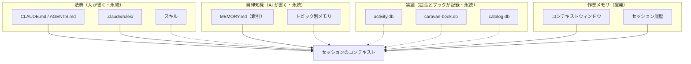

# 記憶管理マニュアル（Claude Code / Codex と anytime 拡張）

コーディングエージェントは毎回まっさらな状態から始まる。前回教えたことを次のセッションへ引き継ぐには、知識を「どこに書けばいつ読まれるか」を知ったうえで置き場所を選ぶ必要がある。本書はその置き場所と、置いたものを読ませる・確かめる・捨てる操作手順を扱う。

対象は、**Claude Code または Codex をエージェントとして使い、Anytime Agent / Anytime Markdown / Anytime Trail の 3 拡張を導入した VS Code ワークスペース**である。拡張を導入していない場合も §4・§5 は使える。

本書は、エージェント側のメモリ機構そのもの（§2・§4・§5）と、3 拡張を組み合わせたときの運用手順（§6〜§8）の両方を扱う。外部の資料を引かずに読めるようにしてある。

## 1. 前提条件

- Claude Code v2.1 以降、または Codex CLI が導入済みであること。
- 記憶に関わる機能を使うには 3 拡張の役割分担を満たすこと。**セッション・編集・コミット・トークン消費を記録するフックを配るのは Anytime Agent 拡張だけ**であり、Anytime Trail 拡張は記録されたデータを見せる側に回る。Trail の行動可視化を使うなら Agent の併用が要る。
- Anytime Markdown 拡張のドキュメント検索を使うなら、設定 `anytimeMarkdown.docsRoot` にドキュメントリポジトリの絶対パスを入れておくこと（未設定だと検索インデックスが無効になる）。
- ワークスペースが Git リポジトリであること。並行セッション検知と Auto Memory のプロジェクト識別が Git リポジトリを基点にする。

## 2. 記憶の 4 層

記憶は、**誰が書くか**と**いつ読まれるか**で 4 層に分かれる。混同すると「書いたのに読まれない」が起きるため、まずこの区別を押さえる。

| 層 | 誰が書くか | いつ読まれるか | 実体 |
| --- | --- | --- | --- |
| **作業メモリ** | セッションそのもの | 常時（セッション終了・圧縮で消える） | コンテキストウィンドウ、セッション履歴 |
| **法典** | 人 | セッション開始時に自動 / パスマッチ時 / 呼び出し時 | `CLAUDE.md`、`AGENTS.md`、`.claude/rules/`、スキル |
| **自律知見** | エージェント | 索引が自動ロード、詳細はオンデマンド | `~/.claude/projects/<project>/memory/` |
| **実績** | 拡張とフック | 人・AI が明示的にクエリしたときだけ | `activity.db`、`caravan-book.db`、`catalog.db` |

上 3 層は Claude Code が持つ機構で、最下層の**実績**が anytime 拡張の追加分である。実績層は自動ではロードされない。**問い合わせて初めて読まれる**という点が上 3 層と決定的に違い、ここを取り違えると「Trail に記録されているのだから AI は知っているはずだ」という誤解を招く。



> 実線はセッション開始時に自動でロードされるもの、点線は要求したときだけロードされるものを示す。

## 3. 層を選ぶ

新しく分かったことを残すとき、次の順で置き場所を判断する。上ほど確実に読まれるが、その分コンテキストを常時消費する。

| 残したい内容 | 置き場所 | 読まれ方 |
| --- | --- | --- |
| 全プロジェクト共通の作業スタイル・方針 | `~/.claude/CLAUDE.md` | 全セッションで自動ロード |
| Claude と Codex の双方に守らせたい規約 | ワークスペース直下の `AGENTS.md` | 両エージェントが読む唯一の共通経路 |
| プロジェクト固有で Claude だけに要る補足 | ワークスペース直下の `CLAUDE.md` | Claude のセッション開始時に自動ロード |
| 特定のファイル種別にだけ効かせたい規約 | `.claude/rules/*.md`（`paths` フロントマター付き） | 該当ファイルを読んだときにロード |
| 特定作業でだけ要る手順（リリース・レビュー等） | スキル | 呼び出したときだけ展開される |
| 踏んだ罠・失敗パターン・経緯 | Auto Memory | 索引が自動ロードされ、詳細はオンデマンド |
| 設計判断・仕様・計画・レビュー結果 | ドキュメント（`docsRoot` 配下の Markdown） | 検索または明示的な参照で読まれる |

判断に迷う典型は「ルールに書くかスキルに書くか」である。**常時守らせたいならルール、特定作業でだけ参照させたいならスキル**が原則になる。常時ロードされるルールが肥大化すると、そこに書いた全部の遵守率が下がるため、作業限定の手順はスキルへ逃がす。

**Codex は** `CLAUDE.md` **を読まない。** 両方のエージェントに効かせたい規約は `AGENTS.md` に置き、`CLAUDE.md` からはそれを参照する形にする。この分担を崩すと、Codex に委譲した作業だけが規約を外れる。

## 4. Claude Code の記憶を管理する

### 4.1. 何がロードされたか確かめる

1. セッションを開始する。
2. `/memory` を実行する。

**結果確認**: ロード中のメモリファイルの一覧が表示される。意図したファイルが並んでいなければ、配置場所か `claudeMdExcludes` 設定を見直す。

### 4.2. コンテキストを管理する

| やりたいこと | コマンド | 使いどき |
| --- | --- | --- |
| 使用量を確認する | `/context` | 残量が気になるとき |
| 会話を圧縮する | `/compact [残したい内容]` | 使用率が 80% を超えたとき |
| 会話履歴を消す | `/clear` | 無関係なタスクへ移るとき |

コンテキストが上限に達すると、古いメッセージは自動で圧縮されて要約に置き換わる。自動圧縮はバッファが約 33,000 トークン（16.5%）まで縮んだ時点で走るため、`/compact` を明示的に打たなくてもいずれ圧縮は起きる。

圧縮しても `CLAUDE.md` はディスクから読み直されるので消えない。**消えるのは会話の中だけで伝えた指示**である。残したい指示は会話に留めず `CLAUDE.md` か `.claude/rules/` へ書く。

Anytime Agent 拡張を導入していれば、サイドバーの Agent Mapping ビューがセッションごとのコンテキスト量を表示し、`anytimeAgent.contextWarnTokens`（既定 160,000）を超えたセッションに警告バッジを付ける。バッジが出たら §4.5 の引き継ぎに移る。

### 4.3. 恒久ルールを書く

`CLAUDE.md` は複数の場所に置け、**スコープが狭いほど優先される**。

| スコープ | 場所 | 共有範囲 |
| --- | --- | --- |
| 組織ポリシー | Linux / WSL は `/etc/claude-code/CLAUDE.md`、macOS は `/Library/Application Support/ClaudeCode/CLAUDE.md` | 組織内の全ユーザー。除外設定で外せない |
| プロジェクト | ワークスペース直下の `CLAUDE.md` または `.claude/CLAUDE.md` | ソース管理を通じてチーム全員 |
| ユーザー | `~/.claude/CLAUDE.md` | 自分だけ（全プロジェクト共通） |

ロードは作業ディレクトリから上へディレクトリツリーを辿り、各階層の `CLAUDE.md` を読む形で行われる。サブディレクトリの `CLAUDE.md` は、その中のファイルを読んだときに初めてロードされる。**ファイルの長さに関係なく全文が読まれる**ため、長さの管理は書き手の責任になる。

**手順**

1. 対象を決める。全プロジェクト共通なら `~/.claude/CLAUDE.md`、プロジェクト固有なら直下の `CLAUDE.md`、両エージェント共通なら `AGENTS.md`。
2. **箇条書きで、具体的に書く。** 「コードを整形する」ではなく「2 スペースインデントを使う」のように、機械的に判定できる粒度にする。箇条書きは段落文より遵守率が高い。
3. **200 行以下に保つ。** 200 行以下なら指示の遵守率は 9 割を超えるが、400 行を超えると 7 割程度まで落ちる。超えたら §4.3.1 でルールを分割するか、作業限定の手順をスキルへ移す。
4. 複数の `CLAUDE.md` の間で矛盾を作らない。矛盾があるとどちらが採られるか決まらない。

> **`CLAUDE.md` は強制ではない。** その内容はシステムプロンプトの一部ではなく、セッション開始時に利用者からの発言として届けられる。エージェントはそれを読んで従おうとするが、機構として強制されるわけではない。守らせたい指示ほど、具体的・簡潔・無矛盾に書く必要がある。

**結果確認**: `/memory` で対象ファイルがロードされていること。次のセッションで指示どおりに動くこと。

#### 4.3.1. ルールを分割する

`CLAUDE.md` が長くなったら、トピックごとに `.claude/rules/*.md` へ切り出す。フロントマターに `paths` を書くと、該当ファイルを読んだときにだけロードされる。

```markdown
---
paths:
  - "src/api/**/*.ts"
---

# API 開発ルール

- 全エンドポイントで入力バリデーションを行う
```

`paths` を持たないルールは起動時に常時ロードされる。**常時適用でないものには必ず** `paths` **を付ける**。`~/.claude/rules/` へ置けば全プロジェクトで個人ルールが効き、プロジェクト側のルールが優先されるため、チーム規約と個人設定が衝突しても壊れない。

別のファイルを本文へ取り込みたい場合は `@path/to/file` と書く。取り込まれた内容は `CLAUDE.md` 本文と同等に扱われ、入れ子の取り込みは 5 段まで辿られる。逆に、モノレポで他チームの `CLAUDE.md` まで読まれてしまう場合は、`.claude/settings.local.json` の `claudeMdExcludes` にパターンを書いて外す（組織ポリシーの `CLAUDE.md` だけは外せない）。

#### 4.3.2. 作業限定の手順をスキルにする

スキルは `.claude/skills/<name>/SKILL.md` に置き、`/name` で呼び出したときだけ展開される。呼ばれない限りコンテキストを消費しないため、リリース手順・レビュー観点・生成テンプレートのような「特定作業でだけ要る長い手順」はここへ置く。

3 拡張はそれぞれ自分のスキルをワークスペースへ配布する（§6.1）。**配布されたスキルを手で編集しない。** 編集しても拡張の更新で上書きされるか、逆に版数ゲートに阻まれて恒久的に古いままになる。

### 4.4. Auto Memory を運用する

Auto Memory は、エージェントが「次のセッションで役立つ」と判断した内容を自分で書き残す仕組みである。保存先は `~/.claude/projects/<project>/memory/` で、`<project>` は Git リポジトリから導出される。**同一リポジトリの全 worktree で 1 つのメモリを共有する**（worktree ごとに分かれない）。

知らないと「書いたのに読まれない」を招く制約が 3 つある。

1. **索引に登録しないと認識されない。** メモリファイルを作っても、`MEMORY.md` に 1 行足さなければ次のセッションで存在に気づかれない。作成と索引登録は必ず同時に行う。
2. **開始済みの並行セッションには届かない。** セッション A で足したメモリは、既に走っているセッション B には反映されない。新しいセッションを始めて初めて読まれる。
3. **索引は先頭 200 行までしかロードされない。** `MEMORY.md` が 200 行を超えると、超えた分は読まれない。この上限は行数で決まるため、**1 行を短くしても上限には効かない**。減らす手段は退避・統合・削除だけである。

| やりたいこと | 方法 |
| --- | --- |
| 保存内容を見る | `/memory` でフォルダを開く |
| オン・オフを切り替える | `/memory` でトグル |
| 自動化環境で止める | 環境変数 `CLAUDE_CODE_DISABLE_AUTO_MEMORY=1` |
| 特定のメモを消す | 該当ファイルを削除し、`MEMORY.md` の該当行も消す |

**重要な設計判断を Auto Memory だけに預けない。** Auto Memory はエージェントの判断で書かれる要約であって、人が承認した記録ではない。設計判断はドキュメントへ、常時守らせたい制約は `CLAUDE.md` かルールへ二重化する。

### 4.5. セッションを跨いで引き継ぐ

| 方法 | 確実性 | 適した用途 |
| --- | --- | --- |
| `CLAUDE.md` / `AGENTS.md` に書く | 最高 | 規約・手順・重要な設計決定 |
| `.claude/rules/` に書く | 高 | ファイル種別ごとの規約 |
| Auto Memory に残す | 中 | 学習した知見・踏んだ罠 |
| `claude -c` / `/resume` | — | 中断した作業をそのまま再開する |
| プランファイル | 中 | 複数セッションにまたがる実装作業 |
| ドキュメント | 低 | 設計書・仕様書（読みに行かせる指示が要る） |

確実性が「中」以下のものは、エージェントが能動的に読みに行かない限り参照されない。

セッションそのものを操作する手段は次のとおり。

| やりたいこと | 操作 |
| --- | --- |
| 直前の会話を再開する | `claude -c` または `/resume` |
| 特定のセッションを再開する | `claude -r "<セッション名または ID>"` |
| 会話を分岐させる | `/fork [名前]` または `claude --fork-session` |
| 会話を書き出す | `/export [ファイル名]` |
| コードを過去の状態へ戻す | `/rewind` |
| 分離した worktree で始める | `claude -w <名前>` |

引き継ぎ用の文書（`HANDOFF.md` など）に「どこまで進んだか・次に何をするか・未解決は何か」を書き、次のセッションの冒頭で読ませる運用もある。ただし**この種の文書は自動ではロードされない**ため、読ませる指示かフックが要る。プランファイルで同じことができているなら不要である。

Anytime Agent 拡張を使う場合は、Agent Mapping ビューでセッションを右クリックし **Hand Off to New Session** を選ぶと引き継ぎができる。コンテキストが警告しきい値を超えたセッションを、状態を持ったまま新しいセッションへ渡すための操作である。引き継ぎ文書は保留領域へ置かれ、次のセッションの最初のプロンプトへ一度だけ差し込まれて消費される（14 日を過ぎたものは自動で消える）。

## 5. Codex の記憶を管理する

Codex は Claude Code とは別の記憶機構を持つ。共通するのは `AGENTS.md` だけである。

| 対象 | 所在 | 備考 |
| --- | --- | --- |
| プロジェクト規約 | ワークスペース直下の `AGENTS.md` | Claude と共有する唯一の経路 |
| 設定・信頼済みプロジェクト | `~/.codex/config.toml` | `[projects."<path>"] trust_level` |
| セッション履歴 | `~/.codex/sessions/` | 過去セッションの記録 |
| スキル | `~/.codex/skills/` | Claude Code のスキルとは別系統 |

**手順**

1. 両エージェントに守らせたい規約を `AGENTS.md` に書く。Codex 専用の追記が要る場合も同じファイルに置き、`CLAUDE.md` からは重複させず参照する。
2. Codex へ作業を委譲するときは、委譲プロンプトに規約の参照を明示する。**委譲先は** `CLAUDE.md` **も** `.claude/rules/` **も継承しない**ため、暗黙に守られることを期待しない。
3. 委譲先が返した成果は、委譲元が実測で裏取りしてから統合する。「完了しました」という報告は完了の根拠にならない。

**結果確認**: Anytime Agent 拡張の Agent Mapping ビューに Codex セッションが読み取り専用で並ぶ（設定 `anytimeAgent.showCodexSessions`、既定は有効）。表示対象の期間は `anytimeAgent.sessionRetentionDays`（既定 7 日）に従う。

> Codex 側にも自律メモリのストアが用意されているが、環境によっては空のまま蓄積されない。運用の前に実際の中身を確認し、蓄積されていないなら `AGENTS.md` とセッション履歴だけが引き継ぎ経路だと考える。

## 6. Anytime Agent 拡張: セッションと配布物を管理する

Agent 拡張は、**スキルとフックを配る側**であり、**セッションの衝突と暴走を止める側**でもある。記憶の観点では、実績層へデータを流し込む入口を担う。

### 6.1. 同梱スキルの配布と版数ゲート

拡張は起動時に、同梱スキルをワークスペースの `.claude/skills/` へ展開する。展開の可否は `skills/manifest.json` の整数版数と、配置先に記録された版数の比較で決まる。

- 配置先のファイルに手を入れていると、既定では**上書きせず保持する**。
- 同梱の版数が配置済み版数を上回ったときだけ、差分を破って上書きする。

この性質から、**スキルの内容を変えても manifest の版数を上げなければ、配布済みのワークスペースには永久に届かない**。値が一見ファイル数のような整数なので据え置きやすい点に注意する。

**結果確認**: ワークスペースの `.claude/skills/<name>/SKILL.md` を開き、意図した内容になっていること。

### 6.2. フックが自動で記録すること

拡張はフックスクリプトを `~/.claude/scripts/` へ配置し、Claude Code の設定へ登録する。利用者から見た挙動は次のとおり。

| タイミング | 起きること |
| --- | --- |
| セッション開始 | 同じ worktree に他の生存セッションがいれば分離を助言する |
| 編集ツールの前後 | 編集の開始・終了を記録する（どのセッションがどのファイルを触っているか） |
| シェル実行の前後 | 実行中の作業ディレクトリを記録する |
| 全ツールの前 | 緊急停止が発動中ならツール実行を止める |
| 全ツールの後 | 同じ操作の繰り返し（ループ）を検知して警告する |
| シェル実行の後 | コミットを検出して記録する |
| プロンプト送信時 | 経過時間・ターン数の超過を警告し、引き継ぎ文書があれば注入する |
| セッション終了時 | トークン消費を集計し、HEAD をセーフポイントとして記録する |

**Claude Code が未インストールなら登録自体が行われない。** 記録が一切残らないときは、まずフックが登録されているかを疑う。

### 6.3. 並行セッションの衝突を避ける

同じリポジトリで複数のセッションが動くと、Git のインデックスや作業ツリーを共有して互いの変更を壊す。拡張はセッションごとにクレームファイルを Git の共通ディレクトリ配下へ置き、衝突を検知する。

- **生存判定はプロセスの実在で行う。** クレームの更新時刻が数時間古くても、プロセスが生きていれば衝突相手である。アイドル中のセッションを終了済みと誤判定しない。
- 判定の単位は **worktree** であり、ブランチ名ではない。別 worktree なら衝突しない。

**手順**

1. 長時間の作業や worktree の作成前に、他セッションの生存を確認する。
2. 自分以外の生存セッションが同じ worktree を持っていたら、相手の終了を待つか、`git worktree add .worktrees/<name> -b <branch>` で作業領域を分ける。
3. 危険な Git 操作（作業ツリーの破棄・ブランチの強制削除など）が拒否された場合、拒否理由に相手のセッション ID とブランチが出る。分離してから再実行する。

**既知の落とし穴**: 会話履歴をクリアしてもプロセスは生き続けるため、セッション ID だけが変わって自分の古いクレームと衝突することがある。単独作業なのに恒久的に拒否されるときはこれを疑う。

### 6.4. 画面から確認する

| ビュー | 見えるもの |
| --- | --- |
| Agent Mapping | Claude Code / Codex セッションの一覧、コンテキスト量、引き継ぎ操作 |
| Git Activity | エージェントが実行した Git 操作の履歴（破壊操作の抽出・復旧コマンドのコピー） |
| Worktree Ownership | どのセッションがどの worktree を使っているか |
| Work Snapshots | 未コミット作業の非破壊バックアップ（コマンドパレットから開く） |

保持期間は設定で決まる（Git 操作の記録は既定 90 日、スナップショットは既定 7 日）。トークン上限の監視を使う場合は `anytimeAgent.budget.*` に上限値を入れる。

## 7. Anytime Markdown 拡張: 知識の正本を書き、探す

このプロジェクト群は「**知識の正本はベンダー中立な Markdown であり、データベースはそこから導出される検索インデックスにすぎない**」という原則を採る。Markdown 拡張はその正本を書く側と探す側を担う。

### 7.1. 検索インデックスを用意する

1. 設定 `anytimeMarkdown.docsRoot` にドキュメントリポジトリの絶対パスを入れる。ワークスペースの外（共有リポジトリなど）でもよい。
2. コマンドパレットから `Anytime Markdown: Rebuild Doc Search Index` を実行する。
3. 以後は `anytimeMarkdown.docSearch.intervalMinutes`（既定 30 分）ごとに自動で再インデックスされる。`0` にすると定期実行が止まり、手動実行だけになる。

インデックスの実体は `catalog.db` で、既定の保存先はワークスペース配下の `.anytime/markdown/` である。保存先は設定で変えられるが、**ワークスペースの外は指定できない**（外を指すと既定へ戻り警告が出る）。

**結果確認**: 検索ツールがエラーにならず結果を返すこと。DB が未生成のうちは、先に再構築を促すエラーが返る。

### 7.2. 探す・読む・書く

拡張は MCP サーバー経由で次の道具を提供する。

| 目的 | 道具 |
| --- | --- |
| 全文とメタデータで文書を探す | `search_docs`（キーワード＋種別・言語・カテゴリで絞り込み） |
| 見出し単位で探す | `search_sections` |
| 文書の構造だけ取る | `get_outline` / `get_frontmatter` |
| 必要な節だけ読む | `get_section` |
| 節やフロントマターを書き換える | `update_section` / `update_frontmatter` |
| 関連文書をたどる | `doc_backlinks` / `doc_neighbors` |
| 整形する | `format_markdown` |

**大きな文書を丸ごと読ませない。** 検索で当たりを付け、必要な節だけ取り出す。文書全体を読ませるとコンテキストを浪費し、他の情報が押し出される。

**書き込みには範囲の制約がある。** 検索系はワークスペースの外にある `docsRoot` まで届くが、**書き込み・整形系はワークスペース配下しか触れない**。検索で見つけたパスをそのまま編集ツールへ渡すと拒否されることがある。ワークスペース外の文書は通常のファイル編集で扱う。

### 7.3. フロントマターと索引

フロントマターは表示のための飾りではなく、検索と関連付けの入力である。

| キー | 使われ方 |
| --- | --- |
| `type` / `lang` / `category` | 検索の絞り込み条件 |
| `excerpt` | 検索結果に出る要約。開かずに関連度を判断させる |
| `related`（型付き） | 関連文書グラフの元データ |

各フォルダの索引 `index.[lang].md` は自動生成物なので手で書かない。文書を追加・更新・改名・削除したら索引を再生成する（コマンドパレットの `Anytime Markdown: Regenerate Doc Folder Indexes`、または索引生成スクリプトの npm scripts）。生成は冪等で、内容が変わらなければ書き込まれない。

## 8. Anytime Trail 拡張: 実績を記録し、引き出す

Trail 拡張は、**エージェントが実際に何をしたか**を記録し、後から引けるようにする。記録の入口はフック（Agent 拡張が配る）、出口は Trail Viewer と MCP の問い合わせツールである。

### 8.1. 何が記録されるか

| 種類 | 中身 |
| --- | --- |
| セッションとメッセージ | プロンプト、ツール呼び出し、使ったスキル、時刻 |
| コミット | セッションとコミット・変更ファイルの対応 |
| コード構造 | 解析で得た依存グラフ・C4 モデル・コミュニティ |
| レビュー | レビュー指摘と、それを対処したコミットの対応 |
| 承認と判断 | 人の承認・AI の判断・指示の単位（どの依頼に属する作業か） |

記録先は 2 つのデータベース（行動と構造を持つもの、知識グラフとレビューを持つもの）で、保存先は拡張の設定で決まる。**固定パスを前提にせず、参照する前に実在を確かめる。**

### 8.2. 過去を引き出す

記録は自動ではロードされない。**問い合わせて初めて読まれる。**

| 知りたいこと | 使う道具 |
| --- | --- |
| この件について過去に何が決まったか | 知識グラフの検索（`search_caravan_book`） |
| このファイルを変えると何に影響するか | 依存の問い合わせ（`get_code_dependencies`） |
| どこから読み始めるべきか | 重要ファイルの抽出（`get_important_files`） |
| このファイルと一緒に変わるのはどれか | 共変更の問い合わせ（`get_cochange_partners`） |
| 未対処のレビュー指摘が残っていないか | 指摘の一覧（`list_unaddressed_review_findings`） |
| いま継続中の依頼はどれか | 指示の一覧（`list_open_instructions`） |

**手順（バグ修正や調査に着手するとき）**

1. 対象ファイル名・症状のキーワードで知識グラフを検索し、過去の決定・同種の不具合と接続する。
2. 対象ファイルに未対処のレビュー指摘が残っていないか確認する。
3. 依存の問い合わせで影響範囲を把握してから、必要な箇所だけソースを読む。

**構造の探索でコードグラフ全体を読み込ませない。** 数十万トークン規模になり、コンテキストを使い切る。

### 8.3. 画面から確認する

`Anytime Trail: Trail ビューアを開く` でブラウザのビューアが開き、セッション一覧・分析・プロンプトの各タブから記録を辿れる。コード構造を見るには先に `Anytime Trail: コード解析` を実行する。

### 8.4. 記録が残らない条件

- **フックが未登録**: Agent 拡張が入っていない、または Claude Code 未インストールの環境では行動が一切記録されない。
- **取り込みの遅れ**: ログの取り込みには時間差がある。直近の作業がまだ入っていないことがある。
- **レビューの経路**: レビュー指摘が記録されるのは、記録対象として登録された経路で実施した場合に限る。記録に残したいレビューでは、その経路を使う。

## 9. 定期メンテナンス

| 周期 | 作業 | 判断基準 |
| --- | --- | --- |
| セッション終了時 | 無関係なタスクへ移る前に会話履歴をクリアする | 文脈を持ち越すと再読込のコストが乗る |
| 週次 | `MEMORY.md` の行数を数える | 200 行に近づいたら退避・統合・削除 |
| 月次 | `CLAUDE.md` の行数を数える | 200 行を超えたらルールかスキルへ分割 |
| 文書の更新後 | 索引を再生成する | 追加・更新・改名・削除のいずれでも索引は変わる |
| スキルの変更後 | manifest の版数を上げる | 上げないと配布先へ届かない |

`MEMORY.md` **の棚卸し手順**

1. `MEMORY.md` を読み、完了済み・対応不要になったエントリを特定する。
2. 該当行を退避用の索引ファイルへ移す（個別ファイルは消さず残し、詳細が要るときに辿れるようにする）。
3. 誤りと判明したメモリは、退避ではなく削除する。

## 10. トラブルシューティング

| 症状 | 原因 | 対処 |
| --- | --- | --- |
| 規約が守られない | 指示が抽象的、ファイルが長い、複数ファイルで矛盾 | `/memory` でロードを確認し、具体化・分割・矛盾の解消を行う |
| 圧縮したら指示が消えた | 会話の中だけで伝えた指示だった | `CLAUDE.md` かルールへ書き直す |
| 別セッションで保存したメモリが認識されない | 索引未登録、開始済みセッションには届かない、索引が 200 行超 | 索引登録を確認し、新しいセッションを開始する |
| Codex だけ規約を外れる | Codex は `CLAUDE.md` を読まない | 規約を `AGENTS.md` へ移す |
| スキルを直したのに反映されない | manifest の版数が据え置き | 版数を上げて再配布する |
| 文書検索が使えない | `docsRoot` 未設定、または索引が未生成 | 設定を入れて索引を再構築する |
| 検索で見つけたファイルを編集できない | ワークスペース外は書き込み対象外 | 通常のファイル編集で扱う |
| 行動が何も記録されない | フックが未登録 | Agent 拡張の導入と Claude Code の実在を確認する |
| 直近の作業が記録に出てこない | 取り込みの遅れ | 時間を置くか、取り込みを促してから再確認する |
| 並行セッションでないのに操作が拒否される | 会話クリアで古いクレームが残った | 自分の古いクレームファイルの削除を検討する |

> **記録の層を取り違えない。** Auto Memory はエージェントが判断して書いた要約、実績のデータベースはフックと拡張が機械的に記録した事実である。**片方に無いことを、もう片方に無い根拠にしない。**
