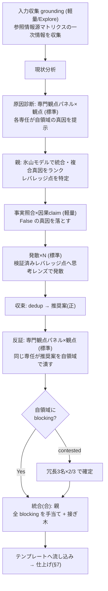

# 深掘りモードの実行手順（anytime-analysis SKILL.md §8 の外部化）

本ファイルは `anytime-analysis` スキル深掘りモードの実行詳細（起動前チェック・役割と並列構成・発散レンズプール・専門観点パネル・出力形式・判定ルール・フロー・出力要件）。\
SKILL.md §8 から外部化した（progressive disclosure）。起動条件と参照情報源マトリクスは SKILL.md §8 に残る。\
文中の「§n」参照は SKILL.md の節番号を指す。

起動前チェック（global `CLAUDE.md`）:

- `free -h` で利用可能メモリを確認し並行数を決める（通常 4〜6。逼迫時は絞る）
- サブエージェント起動時は `model` を必ず明示する。**モデル名は本スキルに固定しない** — 下表の「モデル階層」（軽量 / 標準）を、正本 `anytime-dev-cycle` §3.1「モデル・effort 階層」の表で解決する（`.claude/skills/anytime-dev-cycle/SKILL.md` を全文 Read せず、Grep で §3.1 の表のみ抽出する）。表を取得できない場合の安全既定は 軽量=haiku / 標準=sonnet（親モデル継承によるコスト超過を防ぐ）
- サブエージェントは `CLAUDE.md` を継承しないため、プロンプトに「## コンテキスト・ツール効率」ルール（専用ツール優先・`offset`/`limit` 読み）と対象スコープ・変更禁止範囲を明記する

役割と並列構成:

| 役割 | モデル階層 | 並列 | 多様化軸 | 指示 |
| --- | --- | --- | --- | --- |
| 入力収集（grounding・最初） | 軽量主体（コード探索は Explore） | 情報源別に並列 | — | 参照情報源マトリクス（SKILL.md §8 の表）の**一次情報を収集**し、現状分析・診断・発散へ供給する |
| 発散（起案・正） | 標準 | レンズ別に N 並列 | 思考レンズ（下のプールから提案タイプで 4〜5 個選ぶ） | 各レンズで候補案を独立生成。互いの案は見せない |
| 原因診断（専門観点パネル・前） | 標準 | 観点別に 1 名ずつ | **専門観点（ドメイン）** | 現状分析を受け、各専任が**自領域から見た真因を 1 つ**提示する（鑑別診断） |
| 反証（専門観点パネル・後） | 標準 | 観点別に 1 名ずつ | **専門観点（ドメイン）** | **同じ専任**が推奨案・根本原因を自領域で潰しにかかる |
| 事実照合（検証） | 軽量 | claim 数だけ並列 | — | 現状分析・**因果 claim** を Trail DB 等の一次データと突合し `True` / `False` を判定。2 値で割り切れない claim は**証拠の階層・ベイズ確度**（§2.2）で確度を付す |
| 統合（合） | 親（メイン） | 逐次 | — | 全 blocking を手当てし、生存案 + 良案を接ぎ木。改善案を**恒久対策（レバレッジ点）/ 暫定対策**に分類して統合提案を作る |


発散レンズのプール（提案タイプ別に 4〜5 個選ぶ。対象に無関係なレンズは外す）:

| 提案タイプ | 発散レンズ |
| --- | --- |
| bug / 品質 | ゼロベース・アナロジー・逆説・IF・SCAMPER |
| 改良 / 最適化 | SCAMPER・制約思考・アナロジー・逆説 |
| トレードオフ判断 | TRIZ（矛盾解決）・制約思考・弁証法・IF |
| UX / 機能 | デザイン思考・アナロジー・IF・ラテラル |

レンズの一行定義（発散プロンプトに同梱する）: ラテラル=前提を外し自由発想 / アナロジー=他分野の借用 / ゼロベース=白紙から / 逆説=常識の逆 / IF=「もし～なら」 / SCAMPER=置換・結合・応用・修正・転用・削除・逆転 / TRIZ=矛盾を妥協せず両取り / 制約思考=あえてキツい制約で最小手を生む / デザイン思考=利用者への共感起点 / 形態分析=属性×選択肢の組合せ網羅。\
出典は `business-thinking-methods.ja.md`。

専門観点パネルの観点セット（提案タイプ別。対象に無関係な観点は外し、3〜6 個に絞る）:

| 提案タイプ | 反証パネルの観点 |
| --- | --- |
| bug / 品質 | 正しさ・セキュリティ・性能・保守性・運用/コスト・リスク |
| 技術選定 | コスト・性能・エコシステム成熟度・移行リスク・チーム習熟 |
| アーキ / 設計 | 整合性・拡張性・性能・運用/障害・移行リスク |
| 再発防止 | 検出網羅性・回帰リスク・運用継続性・コスト |

専門観点パネルは「原因診断（前）」と「反証（後）」の**二役を同じ専任が担う**。観点セットは上表を共用する。

原因診断（前・鑑別診断）:

- 現状分析を渡し、各専任が**自領域から見た最も妥当な真因を 1 つ**挙げる（観測根拠つき）。多数決はしない（全候補を俎上に載せる＝鑑別診断）
- 親が**氷山モデル**（できごと→パターン→構造→メンタルモデル）で統合し、複合真因を**エビデンス順にランク**。各真因に**レバレッジ点**（最小介入で断つ一点）を対応づける
- **事実照合**で各因果 claim を一次データと突合し、`False` の真因候補は落とす
- この検証済み真因が、続く**発散のターゲット**になる（レバレッジ点に発散を集中させ、的外れな案の量産を防ぐ）

各診断者の出力形式（行頭固定）:

```text
観点: <観点名>
真因: <自領域から見た最も妥当な真因を 1 つ>
観測根拠: <なぜそう言えるか・データ / 事実>
レバレッジ点: <その真因を最小介入で断つ一点>
```

各反証者の出力形式（行頭固定）:

```text
観点: <観点名>
blocking: true/false — 自領域の致命傷があれば 1 行、なければ「なし」
要修正点: <箇条書き>
contested: <確度を争点化したい主張があれば記載、なければ空>
```

判定ルール（2 層）:

- **専門ブロック（単独で有効）**: ある観点の専任が**自領域で** `blocking: true`**（致命傷）を 1 つでも提示**したら、その提案は要修正。\
多数決で覆さない（専門家を多数決で黙らせない）。統合フェーズで必ず手当てする
- **争点の冗長検証**: `contested` に挙がった主張、または blocking の真偽が割れる争点のみ、その観点に**冗長 3 名 × 2/3** の二段検証をかけ、2 名以上が refute なら棄却確定
- **事実照合**: `False` 判定の claim は提案から削除する（根拠の薄い断定を残さない）
- blocking でない指摘（nit / info）は記録し、統合フェーズで取捨する

フロー:



出力要件（深掘りモードで生成した提案には必ず付与）:

深掘りモードでは並列サブエージェントの過程が見えなくなるため、提案ファイルの**末尾に別見出しで以下を収録する**（追跡性・再現性の確保）。

- **`## 深掘り検証ログ`**: 各フェーズの構成（**原因診断パネルの観点別の真因とレバレッジ点**・発散レンズ数・事実照合の claim 判定・反証パネルの観点別 `blocking`）と、専門観点パネルの判定表（**診断・反証の両方**）。**各フェーズが参照した一次情報源**も記録する（入力の薄い提案を可視化）
- **`## 付録: 発散フェーズの各レンズの提案（生データ）`**: 各思考レンズ（ゼロベース / アナロジー / 逆説 / IF 等）のサブエージェントが**独立生成した原案をそのまま**レンズ別小見出しで列挙する（互いの案を見せず生成しているため重複・対立を含む）。末尾に**収束の判断**（どの案に収束し、どの案をなぜ主案から外したか）を 1 段落で添える

> 本文「改善案」は収束後の主案のみを載せ、棄却・不採用の原案は付録に退避する。読み手は本文で結論を、付録で発散の全体像と採否理由を追える。

