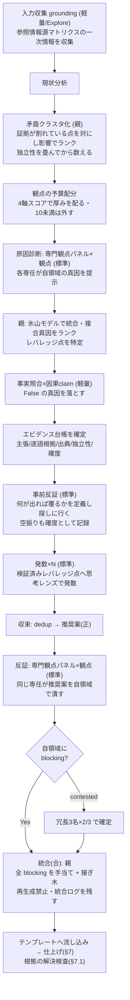

# 深掘りモードの実行手順（anytime-analysis SKILL.md §8 の外部化）

本ファイルは `anytime-analysis` スキル深掘りモードの実行詳細（起動前チェック・委譲の 3 点契約・役割と並列構成・矛盾クラスタ化・観点の予算配分・エビデンス台帳・事前反証・発散レンズプール・専門観点パネル・出力形式・判定ルール・統合の不変条件・フロー・出力要件）。\
SKILL.md §8 から外部化した（progressive disclosure）。起動条件と参照情報源マトリクスは SKILL.md §8 に残る。\
文中の「§n」参照は SKILL.md の節番号を指す。

起動前チェック（global `CLAUDE.md`）:

- `free -h` で利用可能メモリを確認し並行数を決める（通常 4〜6。逼迫時は絞る）
- サブエージェント起動時は `model` を必ず明示する。**モデル名は本スキルに固定しない** — 下表の「モデル階層」（軽量 / 標準）を、正本 `anytime-dev-cycle` §3.1「モデル・effort 階層」の表で解決する（`.claude/skills/anytime-dev-cycle/SKILL.md` を全文 Read せず、Grep で §3.1 の表のみ抽出する）。表を取得できない場合の安全既定は 軽量=haiku / 標準=sonnet（親モデル継承によるコスト超過を防ぐ）
- サブエージェントは `CLAUDE.md` を継承しないため、プロンプトに「## コンテキスト・ツール効率」ルール（専用ツール優先・`offset`/`limit` 読み）と対象スコープ・変更禁止範囲を明記する

委譲の 3 点契約（すべての委任プロンプト冒頭に置く。欠けたら手順違反）:

1. **論点を逐語で渡す**。§3 で言語化した論点の 1 文を**要約せずそのまま**引用する。各サブエージェントは自分の観点で論点を言い換えがちで、言い換えた瞬間に別の問いを解き始める
2. **工程上の位置を 1 文で渡す**。「あなたは原因診断フェーズの〈保守性〉担当。前工程の grounding が一次情報を集め、あなたの後で発散フェーズがレバレッジ点を叩く」。前後が分かると出力の粒度が揃う
3. **入力と出力の形を渡す**。参照すべき一次情報（パス・DB・findings ID）と、後述の**出力形式（行頭固定）**をそのまま貼る

役割と並列構成:

| 役割 | モデル階層 | 並列 | 多様化軸 | 指示 |
| --- | --- | --- | --- | --- |
| 入力収集（grounding・最初） | 軽量主体（コード探索は Explore） | 情報源別に並列 | — | 参照情報源マトリクス（SKILL.md §8 の表）の**一次情報を収集**し、現状分析・診断・発散へ供給する |
| 発散（起案・正） | 標準 | レンズ別に N 並列 | 思考レンズ（下のプールから提案タイプで 4〜5 個選ぶ） | 各レンズで候補案を独立生成。互いの案は見せない |
| 原因診断（専門観点パネル・前） | 標準 | 観点別に 1 名ずつ | **専門観点（ドメイン）** | 現状分析を受け、各専任が**自領域から見た真因を 1 つ**提示する（鑑別診断） |
| 反証（専門観点パネル・後） | 標準 | 観点別に 1 名ずつ | **専門観点（ドメイン）** | **同じ専任**が推奨案・根本原因を自領域で潰しにかかる |
| 事実照合（検証） | 軽量 | claim 数だけ並列 | — | 現状分析・**因果 claim** を Trail DB 等の一次データと突合し `True` / `False` を判定。2 値で割り切れない claim は**証拠の階層・ベイズ確度**（§2.2）で確度を付す |
| 事前反証（発散の前） | 標準 | 真因ごとに 1 名 | — | 「**何が観測されたらこの真因は覆るか**」を先に定義し、その観測を**探しに行く**（下記「事前反証」） |
| 統合（合） | 親（メイン） | 逐次 | — | 全 blocking を手当てし、生存案 + 良案を接ぎ木。改善案を**恒久対策（レバレッジ点）/ 暫定対策**に分類して統合提案を作る（下記「統合の不変条件」に従う） |


矛盾クラスタ化（原因診断の前段。観点を直観で選ばない）:

grounding が集めた一次情報のうち、**食い違っている点**を先に対にしてクラスタ化する。原因診断の観点セットとレバレッジ点の候補は、このクラスタから導く。

- **対にする軸**: 同じ対象への相反する結論 / 同じ範囲で食い違う数値 / 同じ現象への別々の説明 / 一方が使っているデータを他方が無視している
- 各クラスタに `意思決定への影響（高 / 中 / 低）` を付け、高いものから原因診断に載せる。**低しか無い＝争点が無い**なら深掘りモードは過剰で、軽量モードへ落とす
- **合意の数え方は「独立した情報源の数」**（§2.2 レンズ 10）。同一コミット・同一レビュー実行・同一ドキュメントに由来する指摘は**まとめて 1 票**。転載を別勘定にすると 1 つの主張が 3 つの根拠に化ける

観点の予算配分（どこに厚く張るかを定量で決める）:

矛盾クラスタと論点ごとに 4 軸を各 0〜10 で採点し、合計（最大 40）で調査の厚みを配る。全観点に均等配分すると、決着済みの論点に反証者を貼り付けて予算を溶かす。

| 軸 | 問い |
| --- | --- |
| 重要度 | 論点そのものにどれだけ中心的か |
| 不確実性 | 現在の証拠でどれだけ決まっていないか（両側が同程度に強ければ高い） |
| 不一致 | 独立した情報源が何件割れているか（§2.2 レンズ 10 で畳んだ後の数） |
| 意思決定影響 | ここが決まると推奨が変わるか（変わらないなら低い） |

- 30〜40: 専任 + 冗長検証（3 名 × 2/3）まで張る
- 20〜29: 専任 1 名で標準
- 10〜19: 浅く 1 回だけ触れる
- 10 未満: **観点から外す**（外したこと自体を検証ログに記録する）

エビデンス台帳（本文を書く前に作る中間成果物）:

grounding と事実照合の結果を 1 つの表に集約し、**提案本文はこの台帳にある主張だけで書く**。台帳に無い主張を本文に書かない（§7.1 の解決検査は、この台帳が在れば機械的に通る）。

| 列 | 中身 |
| --- | --- |
| 主張 | 提案が依拠する 1 文 |
| 逐語根拠 | コード片・ログ行・レビュー指摘文・実測値を**コピーしたまま**（要約しない） |
| 出典 | `path:line` / テーブル.列 / コミットハッシュ / findings ID / URL |
| 独立性 | この根拠は他の行と独立か（同一出所なら畳んだ先の行を書く） |
| 確度 | `True` / `False` / ベイズ確度（§2.2 レンズ 5） |

事前反証（発散の前に、自分の真因を殺しに行く）:

反証パネル（後）は**案が出てから叩く**ため、真因そのものが間違っていた場合の手戻りが最大になる。発散の前に一度、真因を殺しに行く。

1. ランク上位の真因ごとに「**どんな観測が出たら、この真因は覆るか**」を 1 つ書く（書けない真因は反証不能＝主張として弱い。そのこと自体を記録する）
2. その観測を**実際に探す**（SKILL.md §8 マトリクスの「事前反証」行の情報源）
3. 結果で分岐する:
   - **覆す証拠が見つかった**: 真因の確度を下げる／落とす。発散のターゲットを差し替える（ここで直せば本文の書き直しが要らない）
   - **探したが見つからなかった**: **確度を上げ、「反証探索は空振りだった」と検証ログに明記する**。空振りも証拠であり、記録しないと後続セッションが同じ探索を繰り返す

統合の不変条件（反証の指摘が書き直しの過程で消えるのを防ぐ）:

統合フェーズは**接ぎ木であって再生成ではない**。反証で `blocking: true` が付いた指摘が、本文を書き直す流れの中で無言で消える経路を塞ぐ。

- **本文の全面書き直しをしない**。統合は「blocking を手当てする最小の差し替え」を積む作業で、章まるごとの再生成は禁止（再生成すると、どの指摘が反映されたのか追跡不能になる）
- **統合ログを残す**（提案末尾の検証ログに収録）。1 指摘 1 行で `適用 / 棄却 / 対立（複数観点が非両立）/ 保留` を記録する
- **`blocking` の棄却には理由を必須とする**。「案が変わったので不要になった」も理由として書く。理由なしの棄却は不可
- 指摘が**構造の作り直し**（節の分割・論点の再設定）を要求する場合は、その場で書き換えず**論点設定へ差し戻す**。パッチに収まらない指摘をパッチの体裁で押し込まない


発散レンズのプール（提案タイプ別に 4〜5 個選ぶ。対象に無関係なレンズは外す）:

| 提案タイプ | 発散レンズ |
| --- | --- |
| bug / 品質 | ゼロベース・アナロジー・逆説・IF・SCAMPER |
| 改良 / 最適化 | SCAMPER・制約思考・アナロジー・逆説 |
| トレードオフ判断 | TRIZ（矛盾解決）・制約思考・弁証法・IF |
| UX / 機能 | デザイン思考・アナロジー・IF・ラテラル |

レンズの一行定義（発散プロンプトに同梱する）: ラテラル=前提を外し自由発想 / アナロジー=他分野の借用 / ゼロベース=白紙から / 逆説=常識の逆 / IF=「もし～なら」 / SCAMPER=置換・結合・応用・修正・転用・削除・逆転 / TRIZ=矛盾を妥協せず両取り / 制約思考=あえてキツい制約で最小手を生む / デザイン思考=利用者への共感起点 / 形態分析=属性×選択肢の組合せ網羅。\
出典は `business-thinking-methods.ja.md`。

専門観点パネルの観点セット（提案タイプ別。対象に無関係な観点は外し、3〜6 個に絞る）:

| 提案タイプ | 反証パネルの観点 |
| --- | --- |
| bug / 品質 | 正しさ・セキュリティ・性能・保守性・運用/コスト・リスク |
| 技術選定 | コスト・性能・エコシステム成熟度・移行リスク・チーム習熟 |
| アーキ / 設計 | 整合性・拡張性・性能・運用/障害・移行リスク |
| 再発防止 | 検出網羅性・回帰リスク・運用継続性・コスト |

専門観点パネルは「原因診断（前）」と「反証（後）」の**二役を同じ専任が担う**。観点セットは上表を共用する。

原因診断（前・鑑別診断）:

- 現状分析を渡し、各専任が**自領域から見た最も妥当な真因を 1 つ**挙げる（観測根拠つき）。多数決はしない（全候補を俎上に載せる＝鑑別診断）
- 親が**氷山モデル**（できごと→パターン→構造→メンタルモデル）で統合し、複合真因を**エビデンス順にランク**。各真因に**レバレッジ点**（最小介入で断つ一点）を対応づける
- **事実照合**で各因果 claim を一次データと突合し、`False` の真因候補は落とす
- この検証済み真因が、続く**発散のターゲット**になる（レバレッジ点に発散を集中させ、的外れな案の量産を防ぐ）

**診断者・親ともに SKILL.md §2.3（因果分解の規律）に従う。** 委任プロンプトへ §2.3 の該当行を貼る（サブエージェントは SKILL.md 全文を読まない）。診断者には (3) ノード書式・(5) 軸の宣言・(7) 停止判定を課し、親は統合時に (4) 粒度合わせ・(6) 兄弟点検（粒度 / 重複 / 十分性）・(8) 採点を行う。観点が違っても軸と粒度が揃っていないと、統合時に「組織文化」と「先週の誤送信」が同じ表へ並ぶ。

各診断者の出力形式（行頭固定）:

```text
観点: <観点名>
軸: <この観点で原因を分解する軸>（<値1> / <値2> / ...）
真因: <自領域から見た最も妥当な真因を 1 つ。主語と時制を明示した一文>
観測根拠: <なぜそう言えるか・データ / 事実>
分類: ●対策可 | ◐要検証 | ○所与 | △要調査
検証方法: <分類が ◐ のときのみ。方法と判定基準を両方書く>
レバレッジ点: <その真因を最小介入で断つ一点>
```

各反証者の出力形式（行頭固定）:

```text
観点: <観点名>
blocking: true/false — 自領域の致命傷があれば 1 行、なければ「なし」
要修正点: <箇条書き>
contested: <確度を争点化したい主張があれば記載、なければ空>
```

判定ルール（2 層）:

- **専門ブロック（単独で有効）**: ある観点の専任が**自領域で** `blocking: true`**（致命傷）を 1 つでも提示**したら、その提案は要修正。\
多数決で覆さない（専門家を多数決で黙らせない）。統合フェーズで必ず手当てする
- **争点の冗長検証**: `contested` に挙がった主張、または blocking の真偽が割れる争点のみ、その観点に**冗長 3 名 × 2/3** の二段検証をかけ、2 名以上が refute なら棄却確定
- **事実照合**: `False` 判定の claim は提案から削除する（根拠の薄い断定を残さない）
- blocking でない指摘（nit / info）は記録し、統合フェーズで取捨する

フロー:



出力要件（深掘りモードで生成した提案には必ず付与）:

深掘りモードでは並列サブエージェントの過程が見えなくなるため、提案ファイルの**末尾に別見出しで以下を収録する**（追跡性・再現性の確保）。

- **`## 深掘り検証ログ`**: 各フェーズの構成（**原因診断パネルの観点別の真因とレバレッジ点**・発散レンズ数・事実照合の claim 判定・反証パネルの観点別 `blocking`）と、専門観点パネルの判定表（**診断・反証の両方**）。**各フェーズが参照した一次情報源**も記録する（入力の薄い提案を可視化）。加えて次の 4 点を含める:
  - **矛盾クラスタと予算配分**: 何が争点で、どの観点に厚く張り、**どの観点をスコア 10 未満で外したか**
  - **エビデンス台帳**: 主張 / 逐語根拠 / 出典 / 独立性 / 確度の表（本文の主張はここに載っているものだけ）
  - **事前反証の結果**: 真因ごとの「覆す観測」と、探した結果（覆った / **空振り＝確度上昇**）。空振りを省略しない
  - **統合ログ**: 反証の指摘 1 件 1 行で `適用 / 棄却 / 対立 / 保留`。`blocking` の棄却には理由を書く
- **`## 付録: 発散フェーズの各レンズの提案（生データ）`**: 各思考レンズ（ゼロベース / アナロジー / 逆説 / IF 等）のサブエージェントが**独立生成した原案をそのまま**レンズ別小見出しで列挙する（互いの案を見せず生成しているため重複・対立を含む）。末尾に**収束の判断**（どの案に収束し、どの案をなぜ主案から外したか）を 1 段落で添える

> 本文「改善案」は収束後の主案のみを載せ、棄却・不採用の原案は付録に退避する。読み手は本文で結論を、付録で発散の全体像と採否理由を追える。

