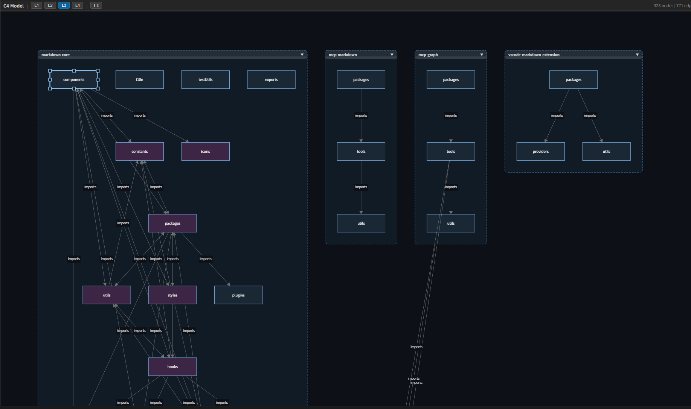

# Anytime Trail

**コードを書きながら、アーキテクチャを見る。**

TypeScript プロジェクトを解析して C4 アーキテクチャ図と DSM（依存構造マトリクス）を自動生成。\
ブラウザのライブビューアで、コードの変更がリアルタイムに構造図へ反映されます。


## C4 アーキテクチャ図 & DSM

1コマンドで、TypeScript プロジェクト全体の構造を4段階の詳細度で可視化します。

| レベル | 見えるもの |
| --- | --- |
| L1 System Context | システム全体と外部との関係 |
| L2 Container | アプリ・API・DB などの構成要素 |
| L3 Component | パッケージ・モジュール間の依存 |
| L4 Code | ファイル単位のすべての依存関係 |

**ライブビューア** (`http://localhost:19840`)

- C4 グラフ、DSM マトリクス、要素ツリーの3ペイン構成
- L1 〜 L4 のレベル切替でドリルダウン
- DSM のクラスタリングで関連モジュールをグルーピング
- 循環依存を赤枠でハイライト
- VS Code での再解析・インポートが即座に反映（WebSocket 接続）
- **F-C Map**: Feature-Component 対応マトリクスを表示（DSM パネル内で切り替え）
- **削除要素表示**: 解析で消失した要素に削除フラグを付与し、取り消し線と半透明で表示

**インポート / エクスポート**

- Mermaid C4 形式（`.mmd`）のインポートに対応
- JSON / Mermaid 形式でエクスポート可能


## Claude Code 連携

拡張機能のインストール時に、Claude Code スキル `anytime-fcmap` が `~/.claude/skills/` に自動配置される。\
`/anytime-fcmap` コマンドでソースコード解析から Feature-Component Map（`featureMatrix`）を生成・更新できる。

- **新規生成**: `trail-core` CLI で C4 モデルを解析し、featureMatrix 全体を自動生成
- **差分更新**: 前回リビジョンからの変更ファイルのみ再解析して効率的に更新

> アンインストール時にスキルファイルは自動削除される。


## Git 管理

サイドバーから Git リポジトリの日常操作をワンストップで。

- **リポジトリ** — フォルダーを開く / クローン / ブランチ切替。\
ドラッグ&ドロップ対応のファイルツリー
- **変更** — ステージ / アンステージ / 破棄 / コミット / プッシュをインライン操作。\
サイドバーバッジで変更数を常時表示
- **グラフ** — ASCII コミットグラフでブランチの流れを一覧
- **タイムライン** — ファイルごとのコミット履歴と差分比較

> [Anytime Markdown](https://marketplace.visualstudio.com/items?itemName=anytime-trial.anytime-markdown) と組み合わせると、Markdown の差分をリッチな比較モードで表示できます。


## セットアップ


### 1. C4 データサーバーを有効化

VS Code の `settings.json` に以下を追加:

```json
{
  "anytimeTrail.server.enabled": true
}
```

### 2. VS Code をリロード

`Ctrl+Shift+P` → `Developer: Reload Window`\
ステータスバー右側に `C4 Server: :19840` が表示されればOK。

### 3. 解析を実行

`Ctrl+Shift+P` → `Anytime Trail: Analyze C4`

ブラウザが自動的に開き、プロジェクトの構造図が表示されます。\
2回目以降は既に開いているブラウザにリアルタイム反映されるため、新しいタブは開きません。

> Mermaid C4 ファイルをインポートする場合は `Anytime Trail: Import C4` を使用します。

​
## 設定一覧

| 設定キー | デフォルト | 説明 |
| --- | --- | --- |
| `anytimeTrail.server.enabled` | `false` | C4 データサーバーの有効 / 無効 |
| `anytimeTrail.server.port` | `19840` | データサーバーのポート番号 |
| `anytimeTrail.c4.modelPath` | `.vscode/c4-model.json` | C4 モデルの保存先 |
| `anytimeTrail.c4.analyzeExcludePatterns` | `[".worktrees", ...]` | 解析から除外するパターン |


## ライセンス

[MIT](https://github.com/anytime-trial/anytime-markdown/blob/master/LICENSE)
