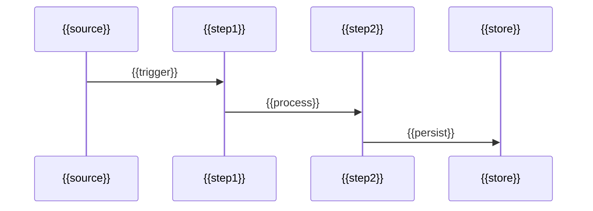

# データフロー


## 1. 概要

<!--
ガイダンス: 画面（章 6）→ I/F（章 5）→ 機能（章 3）→ DB（章 4）の連結を集約する目的を 1〜2 段落で記述する。
- 個別ノード数が多くなる場合は Container 単位に集約する判断基準を明示
- 機能 ≤ 30 件・I/F ≤ 30 件・テーブル ≤ 30 件なら個別ノードでも可。それ以上は集約版を主とする
-->

> [!NOTE]
> 本章は画面（章 6）→ 外部 I/F（章 5）→ 機能（章 3）→ DB（章 4）の連結を集約表示する。\
> ノード数（機能 {{F}} + I/F {{I}} + テーブル {{T}}）の合計が過密になるため、Container 単位の俯瞰図を主とし、機能単位の詳細リンクを併記する。


## 2. Container 単位の俯瞰図

<!--
ガイダンス: flowchart LR で「外部 I/F → アプリ層 → ドメイン層 → 永続化層」の 4 段構造を描く。
- subgraph: IF / App / Domain / Data
- エッジは集約済み（pkg→pkg レベル）
- ノード数 15 個以内
- 描画幅 900px 以内
-->

```mermaid
flowchart LR
    subgraph IF["外部 I/F"]
        {{ifNodes}}
    end

    subgraph App["アプリ層"]
        {{appNodes}}
    end

    subgraph Domain["ドメイン層"]
        {{domainNodes}}
    end

    subgraph Data["永続化層"]
        {{dataNodes}}
    end

    {{edges}}
```


## 3. 機能 → DB テーブルのマッピング

<!--
ガイダンス: 章 3 の各機能設計書「## 6.1 関連 DB テーブル」を逆引きして集約する。
「主に書く DB」「主に読む DB」の 2 列に分けると性能観点でわかりやすい。
-->

> [!NOTE]
> 詳細は章 3 の各機能設計書「## 6.1 関連 DB テーブル」セクションを参照。本章では集約のみ示す。

| 機能カテゴリ | 主に書く DB | 主に読む DB |
| --- | --- | --- |
| {{カテゴリ}} | `{{table_write}}` | `{{table_read}}` |


## 4. 外部 I/F → 機能のマッピング

<!--
ガイダンス: 章 3 の各機能設計書「## 6.2 関連 API / MCP」を逆引きして集約する。
I/F 系統（mcp-cms / mcp-graph / REST 等）→ 主な対応機能 のマッピング表。
-->

> [!NOTE]
> 詳細は章 3 の各機能設計書「## 6.2 関連 API / MCP」セクションを参照。

| I/F 系統 | 主な対応機能 |
| --- | --- |
| `{{ifKind}}` | {{機能一覧}} |


## 5. 画面 → I/F → 機能 → DB の縦断（画面層がある場合）

<!--
ガイダンス: 画面検出が 0 件のプロジェクトでは本章を省略する。
画面ファイル内の fetch / axios / tRPC client から章 5 の I/F を逆引きし、
画面 → I/F → 機能 → DB の 4 段マッピング表を作る。
-->

| 画面 ID | 呼ぶ I/F | 経由する機能 | 触る DB |
| --- | --- | --- | --- |
| `screen.{{slug}}` | [{{I/F}}](05-interface.ja.md#{{anchor}}) | [{{機能}}](03.feature-detail/feature-{{slug}}.ja.md) | `{{table}}` |


## 6. 主要なエンドツーエンドシナリオ

<!--
ガイダンス: 検出された I/F + 機能 + DB の組み合わせから「典型的な利用フロー」を 2〜4 件、sequenceDiagram で記述する。
- 名前は「インポート → 集計 → 閲覧」のように動詞連鎖で
- 参加者は最大 6 個まで
- 各シナリオは 1 つの subsection
-->


### 6.1 {{シナリオ1: 主要なエンドツーエンドシナリオ名}}




### 6.2 {{シナリオ2}}

{{同様の sequenceDiagram}}


## 7. 注記

- 章 3 の各機能設計書には「関連 DB テーブル」「関連 API / MCP」セクションがあり、機能とテーブル / I/F の接続は機能ファイル側で詳細化される
- 本章の集約図は俯瞰用途。個別機能のフロー詳細は機能設計書側を正とする
